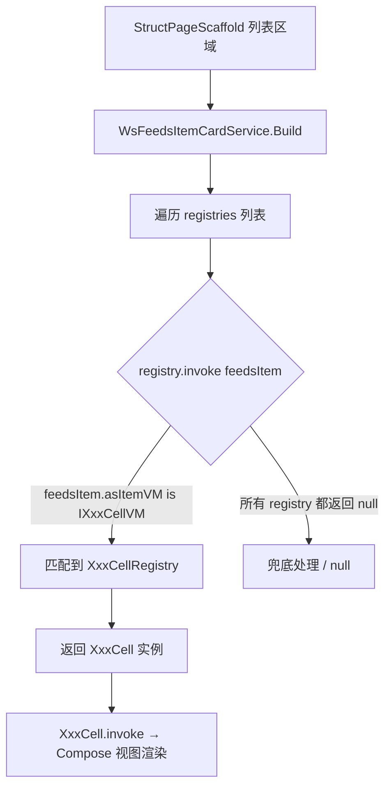
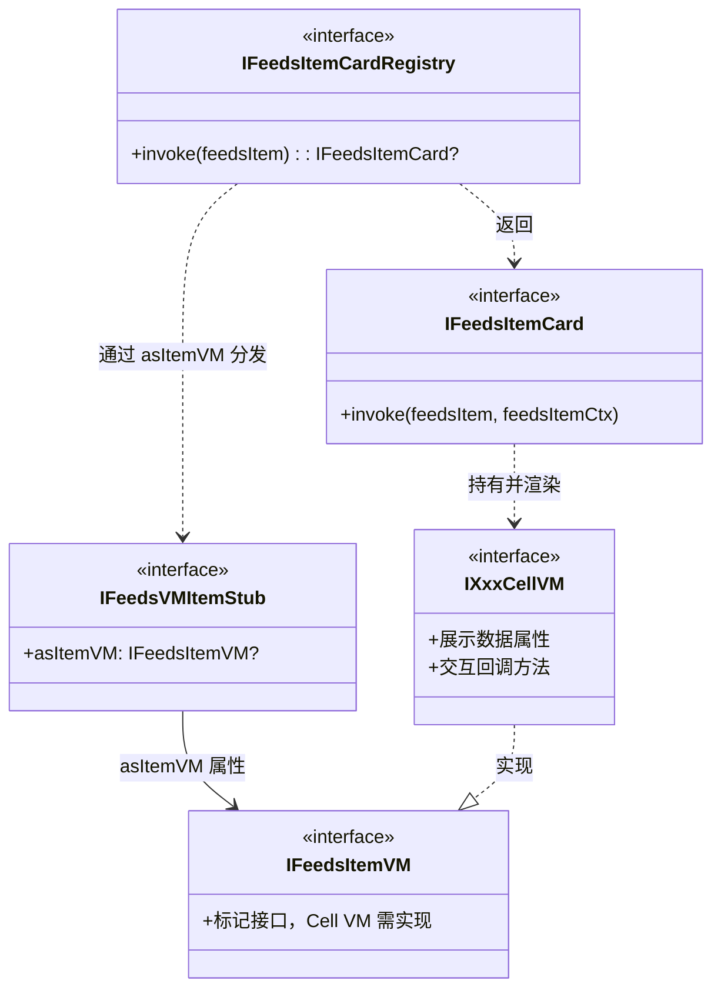

# Skill: Struct Cell（信息流卡片）开发指南

## 目标

指导开发者在 Struct 品字形页面中新增自定义 Cell（信息流卡片），涵盖 Cell VM 接口定义、
FeedsVMItem 封装、Cell 类实现、Compose 视图编写、CellRegistry 注册和全局注册流程。

---

## 架构概览

Cell 是 Struct 品字形页面中列表区域的基本渲染单元。框架通过 `WsFeedsItemCardService` 遍历已注册的
`CellRegistry` 列表，根据 `IFeedsVMItem` 上的 `asItemVM` 类型分发到对应的 Composable 渲染。

### 分层架构

```
qnFramework（框架层）
├── vm/ModelToBizStub.kt                    # IFeedsVMItemStub.asItemVM / IFeedsItemVM 定义

wsCore（契约层）
├── {业务域}/vm/IXxxCellVM.kt            # Cell VM 接口（定义卡片展示数据和交互回调，需继承 IFeedsItemVM）

业务模块（逻辑实现层，如 wsDrama / wsUser / wsFeeds）
├── {业务域}/vm/XxxCellVM.kt             # Cell VM 实现类

wsCompose（UI 层）
├── {业务域}/cell/XxxCellRegistry.kt     # CellRegistry（根据 asItemVM 类型分发到具体 Cell）
├── {业务域}/cell/XxxCell.kt             # Cell 类（实现 IFeedsItemCard，持有 VM 并调用 Compose 视图）
├── {业务域}/view/XxxCellView.kt         # Compose 视图（@Composable 函数，入参为 VM 接口）
├── setup/WsFeedsItemCardService.kt      # 全局注册（在 registries 列表中添加新的 CellRegistry）
```

### 运行时分发流程



### 核心接口关系



---

## 开发步骤

### Step 1：定义 Cell VM 接口（wsCore）

在 `wsCore` 模块中定义 Cell VM 接口，描述卡片的展示数据和交互回调。
**Cell VM 接口必须继承 `IFeedsItemVM` 标记接口**。

**文件位置**：`wsCore/src/commonMain/kotlin/com/tencent/weishi/core/{业务域}/vm/IXxxCellVM.kt`

```kotlin
package com.tencent.weishi.core.{业务域}.vm

import com.tencent.news.core.vm.IFeedsItemVM
import kotlinx.coroutines.flow.StateFlow

/**
 * {业务名} Cell VM 接口
 * 驱动 {业务名} 卡片的展示与交互
 */
interface IXxxCellVM : IFeedsItemVM {
    /** 标题 */
    val title: String

    /** 封面图 URL */
    val coverUrl: String

    /** 描述文案 */
    val description: String

    // 如果有动态状态，使用 StateFlow：
    // val followStatus: StateFlow<Int>

    /** 点击卡片 */
    fun onClick()

    // 根据业务需要添加其他交互回调
    // fun onLikeClick()
    // fun onShareClick()
}
```

**设计要点**：

- 接口必须继承 `IFeedsItemVM`（来自 `com.tencent.news.core.vm.IFeedsItemVM`）
- 接口只定义展示数据和交互回调，不包含实现细节
- 静态数据使用普通属性（`val title: String`）
- 动态状态使用 `StateFlow`（如关注状态、点赞数等需要实时更新的数据）
- 交互回调使用无返回值方法，命名体现动作语义（`onClick()`、`onFollowClick()`）
- 如果有默认值，可使用 `get() = xxx` 提供默认实现

**参考示例**：

- 简单场景：`IMineProfileWorksCellVM`（封面 + 标题 + 播放量）
- 复杂场景：`IProfileFansCellVM`（头像 + 昵称 + 关注状态 StateFlow + 批量操作）
- 多子 VM 场景：`IShortVideoFeedCellVM`（视频 + 互动栏 + 信息区 + 合集条）

---

### Step 2：实现 Cell VM（业务模块）

在业务模块中实现 Cell VM 接口。

**文件位置**：`ws{业务模块}/src/commonMain/kotlin/com/tencent/weishi/core/{业务域}/vm/XxxCellVM.kt`

```kotlin
package com.tencent.weishi.core.{业务域}.vm

import kotlinx.coroutines.flow.MutableStateFlow
import kotlinx.coroutines.flow.StateFlow

/**
 * {业务名} Cell VM 实现
 * 持有原始数据模型，提供展示数据和交互回调
 */
class XxxCellVM(
    private val data: XxxDataModel,  // 原始数据模型
) : IXxxCellVM {

    override val title: String get() = data.title
    override val coverUrl: String get() = data.coverUrl
    override val description: String get() = data.description

    // 动态状态示例：
    // override val followStatus = MutableStateFlow(data.followStatus)

    override fun onClick() {
        // 路由跳转等逻辑直接在 VM 实现类内部完成
        reportCardClick()

        AppRouterEx.toComposePage(
          pageName = ComposeViewKey.Drama.PLAY_PAGE,
          pageArgs = DramaPlayPageArgs(
            dramaId = drama.drama_id,
            feedId = "",
          )
        )
    }
}
```

**设计要点**：

- VM 实现类持有原始数据模型，通过属性访问器转换为展示数据
- 交互回调（如点击跳转）直接在 VM 实现类内部完成，不通过构造函数注入回调
- 动态状态使用 `MutableStateFlow` 内部持有，对外暴露只读 `StateFlow`
- 如果需要乐观更新（如点赞、关注），在回调方法中先更新本地状态，再发起网络请求

---

### Step 3：构造 FeedsVMItem

使用框架提供的 `WsVMItem` 将 Cell VM 包装为列表项。

#### 简单场景：直接使用 WsVMItem

```kotlin
import com.tencent.weishi.core.list.model.WsVMItem

// 在 DataRepo 的数据解析中：
fun parseItems(rawData: List<XxxRawData>): List<IKmmFeedsItem> {
    return rawData.map { data ->
        WsVMItem(
            idStr = data.id,
            vm = XxxCellVM(data = data)
        )
    }
}
```

#### 复杂场景：继承 WsVMItem 进行扩展

当数据结构复杂（如需要根据条件选择不同的 Cell VM、携带额外元信息）时，
可以继承 `WsVMItem` 封装构造逻辑：

```kotlin
import com.tencent.weishi.core.list.model.WsVMItem

class XxxFeedVMItem(
    rawData: XxxRawData,
) : WsVMItem(
    idStr = rawData.id,
    title = rawData.title,
    vm = if (rawData.isTypeA()) {
        XxxTypaACellVM(rawData)
    } else {
        XxxTypeBCellVM(rawData)
    }
) {
    init {
        // 可在此设置额外元信息，如类型标记等
        flexDto.articleType = rawData.type.toString()
    }
}
```

**实际参考**（`DramaFeedVMItem`）：

```kotlin
class DramaFeedVMItem(
    dramaFeed: DramaFeed,
    drama: stDrama?,
) : WsVMItem(
    idStr = dramaFeed.feed?.id ?: "drama_play_${dramaFeed.num}",
    title = dramaFeed.feed?.feed_desc?.replace("\n", " ").orEmpty(),
    vm = if (dramaFeed.isAd()) {
        DramaPlayAdCellVM(dramaFeed, drama, reserve = dramaFeed.getAdJson())
    } else {
        DramaPlayCellVM(dramaFeed, drama)
    }
)
```

**设计要点**：

- `WsVMItem` 会自动将 VM 赋值到 `asItemVM` 属性，CellRegistry 通过 `feedsItem.asItemVM` 即可获取
- `idStr` 必须唯一（用于列表 diff 和曝光排重）
- 可选传入 `title` 参数用于调试
- 当需要根据数据条件分发不同 Cell VM 或携带额外元信息时，继承 `WsVMItem` 封装构造逻辑

---

### Step 4：创建 Cell 类（wsCompose）

实现 `IFeedsItemCard` 接口，持有 VM 并调用 Compose 视图。

**文件位置**：`wsCompose/src/commonMain/kotlin/com/tencent/weishi/compose/{业务域}/cell/XxxCell.kt`

```kotlin
package com.tencent.weishi.compose.{业务域}.cell

import androidx.compose.runtime.Composable
import com.tencent.news.core.compose.scaffold.card.FeedsItemCtx
import com.tencent.weishi.compose.{业务域}.view.XxxCellView
import com.tencent.weishi.compose.setup.IFeedsItemCard
import com.tencent.weishi.core.{业务域}.vm.IXxxCellVM
import com.tencent.weishi.core.list.model.IFeedsVMItem

/**
 * {业务名} 卡片
 * 持有 [IXxxCellVM]，在 invoke 中调用 Compose 视图渲染
 */
internal class XxxCell(private val vm: IXxxCellVM) : IFeedsItemCard {

    @Composable
    override fun invoke(feedsItem: IFeedsVMItem, feedsItemCtx: FeedsItemCtx) {
        XxxCellView(vm)
    }
}
```

**设计要点**：

- Cell 类是 VM 和 Compose 视图之间的桥梁，职责单一
- 构造函数接收 VM 接口类型（非实现类）
- `invoke` 方法中直接调用对应的 Compose 视图函数
- 如果需要传递 `feedsItemCtx`（如曝光上报），可以将其传入 Compose 视图

**简化写法**：对于简单场景，Cell 类和 Compose 视图可以合并在同一个文件中：

```kotlin
internal class XxxCell(private val vm: IXxxCellVM) : IFeedsItemCard {

    @Composable
    override fun invoke(feedsItem: IFeedsVMItem, feedsItemCtx: FeedsItemCtx) {
        // 直接在这里编写 Compose UI
        Row(modifier = Modifier.fillMaxWidth().padding(16.dp)) {
            // ...
        }
    }
}
```

---

### Step 5：编写 Compose 视图（wsCompose）

创建 `@Composable` 函数，入参为 VM 接口类型。

**文件位置**：`wsCompose/src/commonMain/kotlin/com/tencent/weishi/compose/{业务域}/view/XxxCellView.kt`

```kotlin
package com.tencent.weishi.compose.{业务域}.view

import androidx.compose.runtime.Composable
import com.tencent.kuikly.compose.foundation.clickable
import com.tencent.kuikly.compose.foundation.layout.Column
import com.tencent.kuikly.compose.foundation.layout.Row
import com.tencent.kuikly.compose.foundation.layout.fillMaxWidth
import com.tencent.kuikly.compose.foundation.layout.padding
import com.tencent.kuikly.compose.foundation.layout.size
import com.tencent.kuikly.compose.foundation.shape.RoundedCornerShape
import com.tencent.kuikly.compose.ui.Alignment
import com.tencent.kuikly.compose.ui.Modifier
import com.tencent.kuikly.compose.ui.draw.clip
import com.tencent.kuikly.compose.ui.layout.ContentScale
import com.tencent.kuikly.compose.ui.text.font.FontWeight
import com.tencent.kuikly.compose.ui.unit.dp
import com.tencent.kuikly.compose.ui.unit.sp
import com.tencent.news.core.compose.scaffold.theme.QNTheme
import com.tencent.news.core.compose.view.QnImage
import com.tencent.news.core.compose.view.QnText
import com.tencent.weishi.core.{业务域}.vm.IXxxCellVM

/**
 * {业务名} 卡片视图
 */
@Composable
internal fun XxxCellView(vm: IXxxCellVM) {
    Row(
        modifier = Modifier
            .fillMaxWidth()
            .clickable { vm.onClick() }
            .padding(horizontal = 16.dp, vertical = 12.dp),
        verticalAlignment = Alignment.CenterVertically
    ) {
        // 封面图
        QnImage(
            painter = rememberAsyncImagePainter(model = vm.coverUrl),
            modifier = Modifier
                .size(80.dp)
                .clip(RoundedCornerShape(8.dp)),
            contentScale = ContentScale.Crop
        )

        // 文字区域
        Column(
            modifier = Modifier
                .weight(1f)
                .padding(start = 12.dp)
        ) {
            QnText(
                text = vm.title,
                fontSize = 16.sp,
                lineHeight = 22f,
                color = QNTheme.colorScheme.t1,
                fontWeight = FontWeight.W500,
                maxLines = 2
            )

            QnText(
                text = vm.description,
                fontSize = 13.sp,
                lineHeight = 18f,
                color = QNTheme.colorScheme.t3,
                maxLines = 1,
                modifier = Modifier.padding(top = 4.dp)
            )
        }
    }
}
```

**布局要点**：

- 使用 Kuikly 包导入（`com.tencent.kuikly.compose.*`），非 `androidx.compose.*`
- 文本使用 `QnText`，`fontSize` 用 `.sp`，`lineHeight` 用浮点数
- 颜色使用 `QNTheme.colorScheme.xxx` 或 `QnColor.xxx`
- 图片使用 `QnImage` + `rememberAsyncImagePainter`
- 点击使用 `Modifier.clickable {}` 或 `Modifier.preciseClickable {}`

---

### Step 6：创建 CellRegistry（wsCompose）

创建 `IFeedsItemCardRegistry` 实现，通过 `feedsItem.asItemVM` + `when`/`is` 类型检查分发到具体 Cell。

**文件位置**：
`wsCompose/src/commonMain/kotlin/com/tencent/weishi/compose/{业务域}/cell/XxxCellRegistry.kt`

```kotlin
package com.tencent.weishi.compose.{业务域}.cell

import com.tencent.weishi.compose.setup.IFeedsItemCard
import com.tencent.weishi.compose.setup.IFeedsItemCardRegistry
import com.tencent.weishi.core.{业务域}.vm.IXxxCellVM
import com.tencent.weishi.core.{业务域}.vm.IYyyCellVM
import com.tencent.weishi.core.list.model.IFeedsVMItem

/**
 * {业务名} Cell 注册器
 * 通过 asItemVM 的类型判断分发到对应 Cell。
 */
internal object XxxCellRegistry : IFeedsItemCardRegistry {

    override fun invoke(feedsItem: IFeedsVMItem): IFeedsItemCard? {
        return when (val it = feedsItem.asItemVM) {
            is IXxxCellVM -> XxxCell(it)
            is IYyyCellVM -> YyyCell(it)
            else -> null
        }
    }
}
```

**设计要点**：

- 使用 `internal object` 单例
- 通过 `feedsItem.asItemVM` 获取 VM 实例，用 `when` + `is` 做类型分发
- `else -> null` 表示不匹配，交给下一个 Registry 处理
- 同一业务域的多种 Cell 类型在同一个 `when` 中匹配即可

**实际参考**（`DramaCellRegistry`）：

```kotlin
internal object DramaCellRegistry : IFeedsItemCardRegistry {
    override fun invoke(feedsItem: IFeedsVMItem): IFeedsItemCard? {
        return when (val it = feedsItem.asItemVM) {
            is IDramaPlayCellVM -> DramaPlayCell(it)
            is IDramaPlayAdCellVM -> DramaPlayAdCell(it)
            is IActorAggregateCellVM -> ActorAggregateCell(it)
            else -> null
        }
    }
}
```

---

### Step 7：注册到 WsFeedsItemCardService（wsCompose）

在 `WsFeedsItemCardService` 的 `registries` 列表中添加新的 CellRegistry。

**文件位置**：
`wsCompose/src/commonMain/kotlin/com/tencent/weishi/compose/setup/WsFeedsItemCardService.kt`

```kotlin
private val registries = listOf(
    // 按cellVM类型注册的，放在这里：
    RecommendCellRegistry,
    HotCellRegistry,

    // 建议按一级业务模块分类：
    CommentCellRegistry,
    DramaCellRegistry,
    // ... 已有注册

    XxxCellRegistry,            // 新增：{业务名} 业务

    DefaultFeedsItemRegistry,   // 基础卡片样式（放最后）
)
```

**注意事项**：

- `DefaultFeedsItemRegistry` 必须放在最后，作为兜底
- 新增的 Registry 放在 `DefaultFeedsItemRegistry` 之前
- 按业务模块分类，添加注释说明
- 需要在文件顶部添加 import

---

## 完整示例：短剧播放页卡片

以下是一个完整的 Cell 开发示例（asItemVM 模式），展示从接口定义到注册的全流程。

### 1. Cell VM 接口（wsCore）

```kotlin
// wsCore/.../drama/play/vm/IDramaPlayCellVM.kt
import com.tencent.news.core.vm.IFeedsItemVM

interface IDramaPlayCellVM : IFeedsItemVM {
    val title: String
    val coverUrl: String
    val episodeText: String
    val isPlaying: StateFlow<Boolean>

    fun onClick()
    fun onMoreClick()
}
```

### 2. Cell VM 实现（业务模块）

```kotlin
// wsDrama/.../drama/play/vm/DramaPlayCellVM.kt
class DramaPlayCellVM(
    private val dramaFeed: DramaFeed,
    private val drama: stDrama?,
) : IDramaPlayCellVM {
    override val title: String get() = dramaFeed.feed?.feed_desc.orEmpty()
    override val coverUrl: String get() = dramaFeed.feed?.coverUrl.orEmpty()
    override val episodeText: String get() = "第${dramaFeed.num}集"

    private val _isPlaying = MutableStateFlow(false)
    override val isPlaying: StateFlow<Boolean> = _isPlaying

    override fun onClick() {
        // 路由跳转逻辑直接在 VM 内部实现
        Router.navigate("drama/play/${dramaFeed.feed?.id}")
    }
    override fun onMoreClick() { /* ... */ }
}
```

### 3. 构造 FeedsVMItem

```kotlin
// 简单场景：直接使用 WsVMItem
fun buildItems(list: List<DramaPlayData>): List<IKmmFeedsItem> {
    return list.map { data ->
        WsVMItem(idStr = "drama_play_${data.id}", vm = DramaPlayCellVM(data))
    }
}

// 复杂场景：继承 WsVMItem 封装条件分发逻辑（参考 DramaFeedVMItem）
class DramaFeedVMItem(
    dramaFeed: DramaFeed,
    drama: stDrama?,
) : WsVMItem(
    idStr = dramaFeed.feed?.id ?: "drama_play_${dramaFeed.num}",
    title = dramaFeed.feed?.feed_desc?.replace("\n", " ").orEmpty(),
    vm = if (dramaFeed.isAd()) {
        DramaPlayAdCellVM(dramaFeed, drama, reserve = dramaFeed.getAdJson())
    } else {
        DramaPlayCellVM(dramaFeed, drama)
    }
)
```

### 4. CellRegistry（wsCompose）

```kotlin
// wsCompose/.../drama/cell/DramaCellRegistry.kt
internal object DramaCellRegistry : IFeedsItemCardRegistry {
    override fun invoke(feedsItem: IFeedsVMItem): IFeedsItemCard? {
        return when (val it = feedsItem.asItemVM) {
            is IDramaPlayCellVM -> DramaPlayCell(it)
            is IDramaPlayAdCellVM -> DramaPlayAdCell(it)
            is IActorAggregateCellVM -> ActorAggregateCell(it)
            else -> null
        }
    }
}
```

### 5. Cell 类 + Compose 视图（wsCompose）

```kotlin
// wsCompose/.../drama/play/DramaPlayCell.kt
internal class DramaPlayCell(private val vm: IDramaPlayCellVM) : IFeedsItemCard {
    @Composable
    override fun invoke(feedsItem: IFeedsVMItem, feedsItemCtx: FeedsItemCtx) {
        DramaPlayCellView(vm)
    }
}

// wsCompose/.../drama/play/DramaPlayCellView.kt
@Composable
internal fun DramaPlayCellView(vm: IDramaPlayCellVM) {
    val isPlaying by vm.isPlaying.collectAsState()

    Row(
        modifier = Modifier
            .fillMaxWidth()
            .clickable { vm.onClick() }
            .padding(horizontal = 16.dp, vertical = 12.dp),
        verticalAlignment = Alignment.CenterVertically
    ) {
        QnImage(
            painter = rememberAsyncImagePainter(model = vm.coverUrl),
            modifier = Modifier.size(80.dp).clip(RoundedCornerShape(8.dp)),
            contentScale = ContentScale.Crop
        )

        Column(modifier = Modifier.weight(1f).padding(start = 12.dp)) {
            QnText(
                text = vm.title,
                fontSize = 16.sp,
                lineHeight = 22f,
                color = QNTheme.colorScheme.t1,
                fontWeight = FontWeight.W500
            )
            QnText(
                text = vm.episodeText,
                fontSize = 13.sp,
                lineHeight = 18f,
                color = if (isPlaying) QNTheme.colorScheme.brand else QNTheme.colorScheme.t3
            )
        }
    }
}
```

### 6. 全局注册（wsCompose）

```kotlin
// WsFeedsItemCardService.kt 中 registries 列表添加：
DramaCellRegistry,    // 短剧业务
```

---

## 常用工具组件

编写 Cell Compose 视图时常用的工具组件：

| 组件                                   | 来源       | 说明                                        |
|--------------------------------------|----------|-------------------------------------------|
| `QnText`                             | `qnView` | 文本组件，`fontSize` 用 `.sp`，`lineHeight` 用浮点数 |
| `QnImage`                            | `qnView` | 图片组件，支持 `colorFilter`                     |
| `QnIconFont`                         | `qnView` | 字体图标组件                                    |
| `QnT1Text` / `QnT2Text` / `QnT3Text` | `qnView` | 预设样式文本                                    |
| `SpacerHeight` / `SpacerWidth`       | `qnView` | 间距占位                                      |
| `rememberAsyncImagePainter`          | `qnView` | 网络图片加载                                    |
| `QNTheme.colorScheme`                | `qnView` | 主题颜色（自动适配日夜间）                             |
| `Modifier.preciseClickable {}`       | `qnView` | 精确点击（避免滚动误触）                              |
| `Modifier.margin()`                  | `qnView` | 外边距（Kuikly 扩展）                            |

preciseClickable 需要 import com.tencent.news.core.compose.view.extension.preciseClickable

---

## Checklist

开发完成后，对照以下清单检查：

- [ ] Cell VM 接口定义在 `wsCore`，继承了 `IFeedsItemVM` 标记接口
- [ ] Cell VM 接口只包含展示数据和交互回调
- [ ] Cell VM 实现在业务模块（wsDrama / wsUser / wsFeeds 等）
- [ ] FeedsVMItem 使用 `WsVMItem(idStr, vm)` 或继承 `WsVMItem` 构造
- [ ] `idStr` 保证唯一性（用于列表 diff 和曝光排重）
- [ ] Cell 类实现 `IFeedsItemCard`，构造函数接收 VM 接口类型（非实现类）
- [ ] Compose 视图入参为 VM 接口类型（非实现类）
- [ ] Compose 视图使用 Kuikly 包导入（`com.tencent.kuikly.compose.*`），非 `androidx.compose.*`
- [ ] 文本使用 `QnText`，`fontSize` 用 `.sp`，`lineHeight` 用浮点数
- [ ] 颜色使用 `QNTheme.colorScheme.xxx` 或 `QnColor.xxx`
- [ ] CellRegistry 实现 `IFeedsItemCardRegistry`，通过 `feedsItem.asItemVM` + `when`/`is` 分发
- [ ] 已在 `WsFeedsItemCardService.registries` 中注册新的 CellRegistry
- [ ] CellRegistry 放在 `DefaultFeedsItemRegistry` 之前
- [ ] DataRepo 或页面 VM 中正确构造 `WsVMItem` 并挂载到列表
