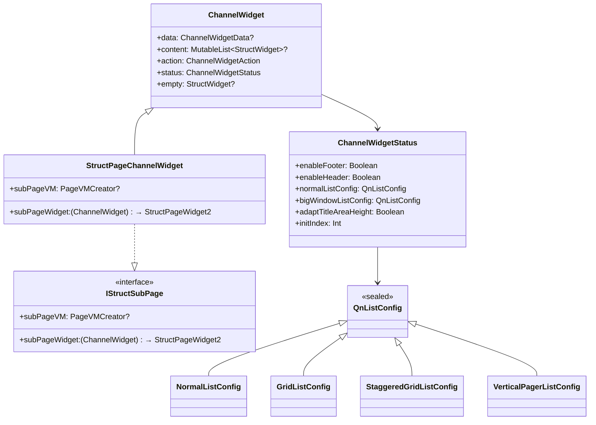
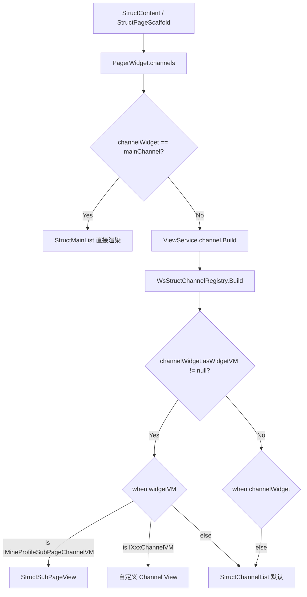

# Skill: Struct ChannelWidget 开发指南

## 目标
指导开发者在 Struct 品字形页面中新增自定义 ChannelWidget（频道/子 Tab），涵盖 ChannelWidget 创建、SubPageWidget 配置、DataRepo 绑定、列表配置、VM 模式注册和多 Tab 拼装流程。

---

## 架构概览

ChannelWidget 是 Struct 品字形页面中 **频道/子 Tab** 的核心组件，位于 `PagerWidget.channels` 槽位。每个 ChannelWidget 对应一个独立的列表页面，拥有独立的 DataRepo、列表配置和 ViewModel。

### 核心类关系



### 分层架构

```
业务模块（逻辑实现层，如 wsDrama / wsUser / wsFeeds）
├── page/XxxChannelWidget.kt             # ChannelWidget 类（继承 StructPageChannelWidget）
├── page/XxxSubPageWidget.kt             # SubPageWidget（继承 StructPageWidget2，配置 DataRepo）
├── page/XxxDataRepo.kt                  # DataRepo（实现 IStructDataRepo，负责网络请求）
├── vm/IXxxChannelVM.kt                  # （可选）Channel VM 接口（定义在 wsCore 契约层）

wsCompose（UI 层）
├── setup/WsStructChannelRegistry.kt     # 注册分发（when 分支添加 VM 类型映射）
```

### 运行时分发流程



---

## 两种开发模式

### 模式一：StructPageChannelWidget 模式（推荐）

适用于子 Tab 需要独立 DataRepo、独立数据解析的场景。这是最常用的模式。

**优势**：每个子 Tab 拥有独立的 `StructPageWidget2` + `DataRepo`，数据源完全解耦，支持不同 Tab 使用不同接口。

### 模式二：普通 ChannelWidget + ChannelWidgetAction 模式

适用于所有 Tab 共用同一个接口（如 `channel_feed`），仅通过 `channelKey` 区分数据的场景。

**优势**：无需自定义 Widget 子类，直接使用 `IChannelInfo.createChannelWidget()` 工厂方法即可。

---

## StructPageChannelWidget 模式开发步骤（推荐）

### Step 1：创建 ChannelWidget（业务模块）

继承 `StructPageChannelWidget`，通过 `subPageWidget` 绑定子页面。

**文件位置**：`ws{业务模块}/src/commonMain/kotlin/com/tencent/weishi/core/{业务域}/page/XxxChannelWidget.kt`

```kotlin
package com.tencent.weishi.core.{业务域}.page

import com.tencent.news.core.page.model.ChannelWidgetData
import com.tencent.news.core.page.model.StructPageChannelWidget
import com.tencent.news.core.page.model.StructPageConfig
import com.tencent.news.core.page.model.StructPageWidget2
import com.tencent.news.qnchannel.api.IChannelInfo

/**
 * {页面名} ChannelWidget
 * {简要说明频道的职责}
 */
class XxxChannelWidget(
    channelInfo: IChannelInfo = IChannelInfo.createDefault(
        channelKey = "xxx_channel",
        channelName = "频道名"
    ),
    override var data: ChannelWidgetData? = ChannelWidgetData(channelInfo)
) : StructPageChannelWidget(
    subPageWidget = {
        XxxSubPageWidget(it, channelInfo)
    },
    subPageVM = null  // 不需要自定义页面级 VM 时传 null
) {
    init {
        // 配置列表样式（默认为 NormalListConfig，即普通列表）
        // status.normalListConfig = GridListConfig(gridSpanSize = 2, ...)
        // status.bigWindowListConfig = status.normalListConfig

        // 其他配置
        // status.enableFooter = true       // 是否显示底部加载更多
        // status.enableHeader = false      // 是否显示顶部下拉刷新
        // status.adaptTitleAreaHeight = true // 全屏模式下避让顶部高度
    }
}
```

**关键点**：
- 必须继承 `StructPageChannelWidget`
- `subPageWidget` lambda 接收 `ChannelWidget` 参数（即自身），返回 `StructPageWidget2`
- `channelInfo` 的 `channelKey` 是 Tab 的唯一标识，用于 `matchTabId()` 匹配
- `data` 必须用 `ChannelWidgetData(channelInfo)` 初始化，否则频道信息丢失

---

### Step 2：创建 SubPageWidget（业务模块）

SubPageWidget 继承 `StructPageWidget2`，负责绑定 DataRepo 和频道信息。

```kotlin
/**
 * {页面名} 子页面 Widget
 */
private class XxxSubPageWidget(
    channelWidget: ChannelWidget,
    channelInfo: IChannelInfo
) : StructPageWidget2(
    StructPageConfig(
        dataRepo = XxxDataRepo(channelWidget),  // 绑定数据源
        defaultChannelInfo = channelInfo,
    )
)
```

**设计要点**：
- SubPageWidget 通常定义为 `private class`，与 ChannelWidget 放在同一文件
- `StructPageConfig.dataRepo` 是核心，决定了该频道的数据来源
- 如果需要传递页面参数，通过构造函数传入 `pageArgs`

---

### Step 3：实现 DataRepo（业务模块）

DataRepo 实现 `IStructDataRepo`，负责构建网络请求。

**文件位置**：`ws{业务模块}/src/commonMain/kotlin/com/tencent/weishi/core/{业务域}/page/XxxDataRepo.kt`

```kotlin
package com.tencent.weishi.core.{业务域}.page

import com.tencent.news.core.extension.concatUriPath
import com.tencent.news.core.list.api.IStructDataRepo
import com.tencent.news.core.list.api.StructDataEnv
import com.tencent.news.core.list.api.StructPageNetworkBuilder
import com.tencent.news.core.page.model.ChannelWidget
import com.tencent.news.core.page.model.DataRequest
import com.tencent.news.core.platform.api.AppHost
import com.tencent.news.core.platform.api.NetworkBuilder

class XxxDataRepo(
    private val channelWidget: ChannelWidget
) : IStructDataRepo {

    override fun createResetRequest(
        defaultRequest: DataRequest,
        dataEnv: StructDataEnv
    ): NetworkBuilder<*> {
        return StructPageNetworkBuilder(
            url = AppHost.READ_HOST.concatUriPath("/trpc/xxx/getData"),
            params = mapOf(
                "channel_id" to (dataEnv.channelInfo.channelKey),
                "page_size" to 20
            ),
            parser = null,
            useJsonPost = true
        )
    }
}
```

---

### Step 4：在 DataRepo 或 PageWidget 中拼装 Pager

#### 单频道页面（无 Tab 切换）

```kotlin
private class XxxLocalDataRepo(
    val pageArgs: XxxPageArgs
) : IStructDataLocalRepo {

    override fun createLocalResetPageWidget() = StructPageWidget().buildPageWithManual {
        pager = PagerWidget().apply {
            channels = mutableListOf(
                XxxChannelWidget(pageArgs)
            )
        }
    }
}
```

#### 多频道页面（有 Tab 切换）

```kotlin
private class XxxLocalDataRepo(
    val pageArgs: XxxPageArgs
) : IStructDataLocalRepo {

    override fun createLocalResetPageWidget() = StructPageWidget().buildPageWithManual {
        titleBar = CommonTitleBarWidget.createFixTopStyle(title = "页面标题")

        pager = PagerWidget().apply {
            // 构建多个频道
            channels = mutableListOf(
                XxxTabAChannelWidget(pageArgs),
                XxxTabBChannelWidget(pageArgs),
                XxxTabCChannelWidget(pageArgs),
            )

            // 自动根据 channels 生成 ChannelBar
            // 也可以手动创建：channelBar = ChannelBarWidget.create(items, defaultTab)

            // 配置默认选中和预加载
            action.initIndex = 0
            action.beyondViewportPageCount = channels.size  // 保持所有 tab 存活
        }
    }
}
```

---

## 列表配置速查

通过 `status.normalListConfig` 配置列表样式，框架会自动选择对应的列表容器渲染。

### QnListConfig 类型

| 类型 | 说明 | 渲染容器 | 典型场景 |
|------|------|----------|----------|
| `NormalListConfig` | 普通列表（默认） | `LazyColumn` | 信息流、设置页 |
| `GridListConfig` | 网格列表 | `LazyVerticalGrid` | 视频网格、图片网格 |
| `StaggeredGridListConfig` | 瀑布流 | `LazyVerticalStaggeredGrid` | 短剧广场、图文瀑布流 |
| `VerticalPagerListConfig` | 竖滑分页 | `VerticalPager` | 短剧播放、音频电台 |

### 配置示例

```kotlin
// 普通列表（默认，无需显式设置）
status.normalListConfig = NormalListConfig()

// 网格列表（3列）
status.normalListConfig = GridListConfig(
    gridSpanSize = 3,
    gridHorizontalSpace = 0,
    itemHorizontalSpace = 2,
    itemVerticalSpace = 2,
)

// 瀑布流（2列）
status.normalListConfig = StaggeredGridListConfig(
    gridSpanSize = 2,
    gridHorizontalSpace = 16,
    itemHorizontalSpace = 8,
    itemVerticalSpace = 16,
)

// 竖滑分页（全屏竖滑）
status.normalListConfig = VerticalPagerListConfig(
    preLoadMoreCount = 2,       // 提前 2 个触发 loadMore
    userScrollEnabled = true,   // 允许用户滑动
)

// 大窗口模式下的列表配置（Pad 等大屏设备）
status.bigWindowListConfig = status.normalListConfig
```

---

## ChannelWidgetStatus 配置速查

| 属性 | 类型 | 默认值 | 说明 |
|------|------|--------|------|
| `enableFooter` | Boolean | true | 是否显示底部加载更多 |
| `enableHeader` | Boolean | false | 是否显示顶部下拉刷新 |
| `normalListConfig` | QnListConfig | NormalListConfig() | 普通模式下的列表配置 |
| `bigWindowListConfig` | QnListConfig | NormalListConfig() | 大窗口模式下的列表配置 |
| `superBigWindowListConfig` | QnListConfig | NormalListConfig() | 超大窗口模式下的列表配置 |
| `initIndex` | Int | 0 | 列表默认选中位置 |
| `enableScrollPositionRestore` | Boolean | false | 是否启用滚动位置恢复（二级 tab 切换时记住浏览位置） |
| `adaptTitleAreaHeight` | Boolean | false | 频道顶部是否避让 TitleBar+Hanging 高度（全屏模式下使用） |
| `pagerIndex` | Int | 0 | 多 tab 时：当前频道是第几个子 tab（框架自动设置） |

---

## VM 模式（高级）

当子 Tab 需要自定义 Compose 渲染（而非默认的 `StructChannelList`）时，使用 VM 模式。

### Step 1：定义 Channel VM 接口（wsCore）

```kotlin
// wsCore/.../vm/IXxxChannelVM.kt
package com.tencent.weishi.core.{业务域}.vm

import com.tencent.news.core.page.model.IStructWidgetVM

/**
 * {页面名} Channel VM 接口
 */
interface IXxxChannelVM : IStructWidgetVM {
    // 根据业务需要添加状态和方法
}
```

### Step 2：在 ChannelWidget 中 override asWidgetVM

```kotlin
class XxxChannelWidget(
    channelInfo: IChannelInfo,
    override var data: ChannelWidgetData? = ChannelWidgetData(channelInfo)
) : StructPageChannelWidget(
    subPageWidget = { XxxSubPageWidget(it, channelInfo) },
    subPageVM = null,
) {
    // 通过 asWidgetVM 绑定 VM，用于 Registry 分发
    override val asWidgetVM: IXxxChannelVM = XxxChannelVMImpl()
}
```

### Step 3：注册到 WsStructChannelRegistry（wsCompose）

**文件位置**：`wsCompose/src/commonMain/kotlin/com/tencent/weishi/compose/setup/WsStructChannelRegistry.kt`

```kotlin
val widgetVM = channelWidget.asWidgetVM
if (widgetVM != null) {
    when (widgetVM) {
        // 已有注册...
        is IMineProfileSubPageChannelVM -> StructSubPageView(scrollScaffold, channelWidget)
        // 新增：
        is IXxxChannelVM -> XxxChannelView(widgetVM, scrollScaffold)
        // ...
    }
    return
}
```

**注意**：大多数场景不需要 VM 模式。如果子 Tab 只是普通列表（不同数据源），直接使用 `StructPageChannelWidget` + `subPageWidget` 即可，框架会自动通过 `StructSubPageView` → `StructChannelList` 渲染。

---

## subPageVM 参数说明

`subPageVM` 用于注入自定义的页面级 ViewModel（替代默认的 `StructPageViewModel`）。

### 何时使用

- 需要在列表之外管理额外的页面级状态（如弹窗、浮层、播放控制等）
- 需要自定义刷新逻辑或数据处理流程

### 用法

```kotlin
class XxxChannelWidget(
    private val pageArgs: XxxPageArgs,
    channelInfo: IChannelInfo,
    override var data: ChannelWidgetData? = ChannelWidgetData(channelInfo)
) : StructPageChannelWidget(
    subPageWidget = {
        XxxSubPageWidget(pageArgs, it, channelInfo)
    },
    subPageVM = { flexCtrl, pageFlow, pageScope ->
        // 创建自定义页面级 VM
        XxxPageVM(pageArgs, flexCtrl, pageFlow, pageScope)
    }
)
```

### PageVMCreator 签名

```kotlin
typealias PageVMCreator = (
    flexCtrl: IFlexibleFeedsController,   // 列表数据控制器
    pageFlow: SharedFlow<PageLifecycleEvent>, // 页面生命周期事件流
    pageScope: CoroutineScope             // 页面协程作用域
) -> IStructPageViewModel
```

---

## 完整示例

### 示例 1：短剧播放页（竖滑分页 + 单频道）

```kotlin
// wsDrama/.../drama/play/page/DramaPlayChannelWidget.kt

class DramaPlayChannelWidget(
    private val pageArgs: DramaPlayPageArgs,
    channelInfo: IChannelInfo = IChannelInfo.createDefault(
        channelKey = "drama_play",
        channelName = "播放"
    ),
    override var data: ChannelWidgetData? = ChannelWidgetData(channelInfo)
) : StructPageChannelWidget(
    subPageWidget = {
        DramaPlaySubPageWidget(pageArgs, it, channelInfo)
    },
    subPageVM = null
) {
    init {
        // 竖滑分页配置
        status.normalListConfig = VerticalPagerListConfig(
            preLoadMoreCount = 2 // 提前 2 个触发 loadMore
        )
        status.bigWindowListConfig = status.normalListConfig
    }
}

private class DramaPlaySubPageWidget(
    pageArgs: DramaPlayPageArgs,
    channelWidget: ChannelWidget,
    channelInfo: IChannelInfo
) : StructPageWidget2(
    StructPageConfig(
        dataRepo = DramaPlayDataRepo(pageArgs, channelWidget),
        defaultChannelInfo = channelInfo,
    )
)
```

### 示例 2：短剧广场（瀑布流 + 多频道）

```kotlin
// wsDrama/.../drama/square/widget/DramaRecommendChannelWidget.kt

class DramaRecommendChannelWidget(
    pageArgs: DramaSquarePageArgs,
    channelInfo: IChannelInfo = IChannelInfo.createDefault(
        channelKey = "drama_list",
        channelName = "剧单"
    ),
    override var data: ChannelWidgetData? = ChannelWidgetData(channelInfo)
) : StructPageChannelWidget(
    subPageWidget = {
        DramaRecommendSubPageWidget(pageArgs, channelInfo)
    },
    subPageVM = null
) {
    init {
        // 瀑布流配置
        status.normalListConfig = StaggeredGridListConfig(
            gridSpanSize = 2,
            gridHorizontalSpace = 16,
            itemHorizontalSpace = 8,
            itemVerticalSpace = 16,
        )
        status.bigWindowListConfig = status.normalListConfig
        status.adaptTitleAreaHeight = true // 全屏模式下避让顶部
    }
}
```

### 示例 3：个人主页（网格列表 + 多 Tab + VM 模式）

```kotlin
// wsUser/.../user/profile/page/MineProfilePageWidget.kt

private class MineProfileTabChannelWidget(
    pageArgs: MineProfilePageArgs,
    tab: MineProfileTab,
    channelInfo: IChannelInfo,
) : StructPageChannelWidget(
    subPageWidget = {
        MineProfileTabSubPageWidget(pageArgs, tab, channelInfo)
    },
    subPageVM = null,
    data = ChannelWidgetData(channelInfo),
) {
    // VM 模式：通过 asWidgetVM 控制渲染分发
    override val asWidgetVM = when (tab) {
        MineProfileTab.COLLECT,
        MineProfileTab.LIKED -> MineProfileSubPageChannelVM
        else -> null  // WORKS tab 使用默认渲染
    }
}

// VM 接口定义在 wsCore
interface IMineProfileSubPageChannelVM : IStructWidgetVM

// VM 实现（单例即可，仅用于类型匹配）
private object MineProfileSubPageChannelVM : IMineProfileSubPageChannelVM

// 在 WsStructChannelRegistry 中注册：
// is IMineProfileSubPageChannelVM -> StructSubPageView(scrollScaffold, channelWidget)
```

### 示例 4：首页关注频道（普通列表 + 避让顶部）

```kotlin
// wsFeeds/.../home/widget/HomeFollowChannelWidget.kt

class HomeFollowChannelWidget(
    channelInfo: IChannelInfo = IChannelInfo.createDefault(
        channelKey = "follow",
        channelName = "关注"
    ),
    override var data: ChannelWidgetData? = ChannelWidgetData(channelInfo)
) : StructPageChannelWidget(
    subPageWidget = {
        HomeFollowSubPageWidget(channelInfo)
    },
    subPageVM = null
) {
    init {
        status.adaptTitleAreaHeight = true // 页卡采用全屏模式，避让顶部高度
    }
}

private class HomeFollowSubPageWidget(
    channelInfo: IChannelInfo
) : StructPageWidget2(
    StructPageConfig(
        dataRepo = HomeChannelDataRepo(),
        defaultChannelInfo = channelInfo,
    )
)
```

---

## 多 Tab 页面拼装指南

### PagerWidget 核心属性

| 属性 | 类型 | 说明 |
|------|------|------|
| `channels` | MutableList\<ChannelWidget\> | 所有频道列表 |
| `mainChannel` | ChannelWidget? | 主频道（默认选中的频道） |
| `channelBar` | ChannelBarWidget? | Tab 导航条（设置 channels 时自动生成） |
| `action.initIndex` | Int | 默认选中位置 |
| `action.beyondViewportPageCount` | Int | 预加载子 tab 个数（设为 channels.size 可保持所有 tab 存活） |

### ChannelBarWidget 创建方式

```kotlin
// 方式 1：自动根据 channels 生成（设置 PagerWidget.channels 时自动创建）
pager = PagerWidget().apply {
    channels = mutableListOf(channelA, channelB, channelC)
    // channelBar 已自动生成
}

// 方式 2：手动创建（需要自定义样式时）
pager = PagerWidget().apply {
    channels = mutableListOf(channelA, channelB, channelC)
    channelBar = ChannelBarWidget.createByChannels(
        channels = channels,
        defaultTab = "tab_a"
    ).apply {
        action.forceShowChannelBar = true  // 即使只有一个 tab 也显示
        showType = StructWidgetShowType.ChannelBar.PROFILE_TAB  // 自定义样式
    }
    action.initIndex = channels.findDefaultTabIndex("tab_a")
    action.beyondViewportPageCount = channels.size
}
```

### 二级 Pager（子 Tab 内嵌套 Tab）

StructPageChannelWidget 的 `subPageWidget` 返回的 `StructPageWidget2` 可以包含自己的 `PagerWidget`，从而实现二级 Tab 嵌套。框架会自动通过 `StructSubPageView` → `RenderPagerContent` 渲染二级 Pager。

```kotlin
private class CollectSubPageWidget(
    pageArgs: PageArgs,
    channelInfo: IChannelInfo,
) : StructPageWidget2(
    StructPageConfig(
        dataRepo = CollectDataRepo(pageArgs),
        defaultChannelInfo = channelInfo,
    )
) {
    init {
        // 在 SubPageWidget 中构建二级 Pager
        buildPageWithManual2 {
            pager = PagerWidget().apply {
                channels = mutableListOf(
                    CollectAllChannel(pageArgs),
                    CollectDramaChannel(pageArgs),
                )
                action.beyondViewportPageCount = channels.size
            }
        }
    }
}
```

---

## 普通 ChannelWidget 模式（简单场景）

当所有 Tab 共用同一个接口时，无需自定义 Widget 子类：

```kotlin
// 直接使用工厂方法创建
val channelWidget = IChannelInfo.createDefault(
    channelKey = "hot",
    channelName = "热门"
).createChannelWidget()

// 或使用静态方法
val channelWidget = ChannelWidget.create(
    channelId = "hot",
    channelName = "热门",
    showType = ChannelShowType.COMMON_LIST
)
```

这种方式创建的 ChannelWidget 会使用 `ChannelWidgetAction` 中的 `reset/refresh` 请求模板，通过 `StructChannelDataRepo` 自动发起网络请求。

---

## 与其他 Widget 的协作

### 与 TitleBar 的关系

- `status.adaptTitleAreaHeight = true`：全屏模式下，频道内容自动避让 TitleBar + Hanging 高度
- 多 Tab 页面的 `fixChannelBarBelowTitleBar` 配置在 `StructPageConfig` 中

### 与 Header 的关系

- Header 折叠后，频道列表会自动填充空间
- 频道列表的滚动会驱动 Header 的折叠/展开

### 与 BottomBar 的关系

- `status.enableFooter = true` 控制列表底部加载更多的显示
- BottomBar 是页面级组件，不受频道配置影响

### 空态处理

```kotlin
// 设置自定义空页面
channelWidget.empty = MyEmptyWidget()
```

当列表数据为空时，框架会自动渲染 `empty` 指定的 Widget。

---

## Checklist

开发完成后，对照以下清单检查：

- [ ] ChannelWidget 继承 `StructPageChannelWidget`
- [ ] `channelInfo` 的 `channelKey` 唯一且有意义（用于 Tab 匹配和日志）
- [ ] `data` 使用 `ChannelWidgetData(channelInfo)` 正确初始化
- [ ] `subPageWidget` lambda 正确返回 `StructPageWidget2`
- [ ] SubPageWidget 的 `StructPageConfig.dataRepo` 绑定了正确的数据源
- [ ] SubPageWidget 的 `StructPageConfig.defaultChannelInfo` 与 ChannelWidget 的 channelInfo 一致
- [ ] `status.normalListConfig` 配置了正确的列表样式
- [ ] `status.bigWindowListConfig` 已配置（大屏适配）
- [ ] 多 Tab 页面：`PagerWidget.channels` 包含所有频道
- [ ] 多 Tab 页面：`PagerWidget.action.initIndex` 设置了正确的默认选中位置
- [ ] 多 Tab 页面：`PagerWidget.action.beyondViewportPageCount` 根据需要配置预加载
- [ ] 如果使用 VM 模式：VM 接口定义在 `wsCore`，继承 `IStructWidgetVM`
- [ ] 如果使用 VM 模式：已在 `WsStructChannelRegistry` 中注册 VM 类型映射
- [ ] 如果需要自定义页面级 VM：`subPageVM` 正确传入 `PageVMCreator`
- [ ] 空态处理：如需自定义空页面，设置了 `channelWidget.empty`
