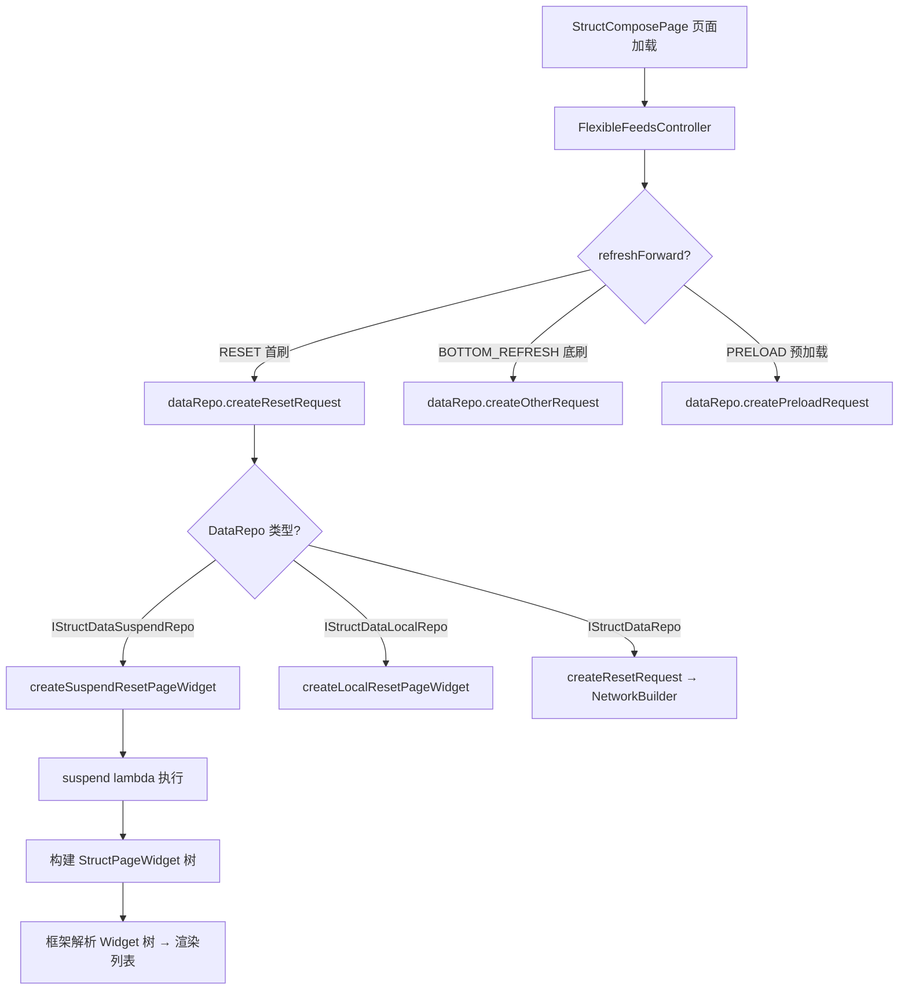

# Skill: Struct DataRepo 开发指南

## 目标
指导开发者在 Struct 品字形页面中新增 DataRepo 数据源，涵盖三种模式选型、首屏加载、分页加载、Widget 树构建和与 PageWidget 的集成。

---

## 架构概览

DataRepo 是 Struct 品字形页面的数据源层，负责发起网络请求、解析数据、构建 `StructPageWidget` 树。框架通过 `IFlexibleFeedsController` 在合适的时机调用 DataRepo 的方法获取数据。

### 分层架构

```
qnFramework（框架层）
├── IStructDataRepo.kt                # 基础接口（同步 NetworkBuilder 模式）
├── IStructDataLocalRepo.kt           # 本地数据接口（无网络请求）
├── IStructDataSuspendRepo.kt         # 协程接口（推荐，支持 suspend）
├── StructPageWidget.kt               # Widget 树根节点，提供 buildPageWithManual 等构建 API
├── DataRequest.kt                    # 请求描述（含 createSuspend 工厂方法）

业务模块（逻辑实现层，如 wsDrama / wsUser / wsFeeds）
├── page/XxxDataRepo.kt              # DataRepo 实现类
├── model/XxxFeedVMItem.kt           # FeedsItem 数据模型（复杂场景继承 WsVMItem）
├── vm/XxxCellVM.kt                  # 卡片级 ViewModel（内部闭环处理交互逻辑）
```

### 运行时调用流程



---

## 三种模式选型

| 模式 | 接口 | 适用场景 | 网络请求方式 |
|------|------|----------|-------------|
| **Suspend 模式（推荐）** | `IStructDataSuspendRepo` | PB 协议、协程异步请求、需要并行请求 | `suspend` 函数 + `pb.send()` |
| **Local 模式** | `IStructDataLocalRepo` | 纯本地数据、占位页面、无需网络请求 | 无 |
| **NetworkBuilder 模式** | `IStructDataRepo` | JSON 接口、需要框架统一处理请求/解析 | `NetworkBuilder` + URL/params |

**推荐优先级**：`IStructDataSuspendRepo` > `IStructDataLocalRepo` > `IStructDataRepo`

---

## Suspend 模式开发步骤（推荐）

### Step 1：创建 DataRepo 类

**文件位置**：`ws{业务模块}/src/commonMain/kotlin/com/tencent/weishi/core/{业务域}/page/XxxDataRepo.kt`

```kotlin
package com.tencent.weishi.core.{业务域}.page

import com.tencent.news.core.list.api.IStructDataSuspendRepo
import com.tencent.news.core.list.api.SuspendPageWidget
import com.tencent.news.core.list.model.IKmmFeedsItem
import com.tencent.news.core.page.model.DataRequest
import com.tencent.news.core.page.model.StructPageWidget
import com.tencent.weishi.core.list.model.WsVMItem

class XxxDataRepo(
    private val pageArgs: XxxPageArgs,
) : IStructDataSuspendRepo {

    override fun createSuspendResetPageWidget(): SuspendPageWidget = {
        // 首屏请求
        val rsp = fetchData(attachInfo = "").getOrNull()

        if (rsp == null || rsp.items.isEmpty()) {
            StructPageWidget() // 空数据或失败，框架会展示错误态
        } else {
            val feedItems = rsp.items.toFeedsItems()

            StructPageWidget().buildPageWithManual {
                // 构建列表 数据
                buildPageWithItemList(newsList = feedItems)

                // 支持分页加载
                if (!rsp.isFinished) {
                    buildMainListLoadMore(DataRequest.createSuspend {
                        loadMorePage(rsp.attachInfo)
                    })
                }
            }
        }
    }

    /**
     * 分页加载
     */
    private suspend fun loadMorePage(attachInfo: String): StructPageWidget {
        val rsp = fetchData(attachInfo = attachInfo).getOrNull()

        return StructPageWidget().buildPageWithManual {
            if (rsp != null && rsp.items.isNotEmpty()) {
                buildPageWithItemList(rsp.items.toFeedsItems())

                if (!rsp.isFinished) {
                    buildMainListLoadMore(DataRequest.createSuspend {
                        loadMorePage(rsp.attachInfo)
                    })
                }
            }
        }
    }

    /**
     * 发起网络请求
     */
    private suspend fun fetchData(attachInfo: String): Result<XxxRsp> {
        return XxxReq(
            id = pageArgs.id,
            attachInfo = attachInfo,
        ).send(XxxRsp.ADAPTER)
    }

    /**
     * PB 数据转换为 FeedsItem 列表
     * 使用 WsVMItem 包装 CellVM，CellVM 内部闭环处理交互逻辑
     */
    private fun List<XxxItem>.toFeedsItems(): List<IKmmFeedsItem> {
        return mapIndexed { index, item ->
            WsVMItem(
                idStr = item.id.ifBlank { "xxx_$index" },
                vm = XxxCellVM(data = item)
            )
        }
    }
}
```

### Step 2：在 PageWidget 中使用

```kotlin
class XxxPageWidget(pageArgs: XxxPageArgs) : StructPageWidget2(
    StructPageConfig(
        dataRepo = XxxDataRepo(pageArgs),
        defaultChannelInfo = KmmChannelInfo.createQnInstance(
            channelKey = "xxx",
            channelName = "页面名"
        ),
        fixTitleBarAboveContent = true,  // 根据需要配置
    )
)
```

---

## 常见场景模板

### 场景一：简单列表 + 分页加载

最基础的场景：首屏加载一页数据，滑到底部自动加载下一页。

```kotlin
class SimpleListDataRepo : IStructDataSuspendRepo {

    override fun createSuspendResetPageWidget(): SuspendPageWidget = { _ ->
        buildListPage(attachInfo = "")
    }

    private suspend fun buildListPage(
        attachInfo: String,
    ): StructPageWidget {
        val result = repository.fetchList(attachInfo).getOrElse { throw it }
        val feedsItems = result.items.toFeedsItems()

        return StructPageWidget().buildPageWithManual {
            buildPageWithItemList(newsList = feedsItems)

            if (!result.isFinished && result.attachInfo.isNotBlank()) {
                buildMainListLoadMore(DataRequest.createSuspend {
                    buildListPage(attachInfo = result.attachInfo)
                })
            }
        }
    }
}
```

### 场景二：带 TitleBar + Header 的完整页面

构建包含 TitleBar、Header、悬停组件和列表内容的完整品字形页面。

```kotlin
class FullPageDataRepo(
    private val pageArgs: XxxPageArgs,
) : IStructDataSuspendRepo {

    override fun createSuspendResetPageWidget(): SuspendPageWidget = {
        val rsp = fetchData(attachInfo = "").getOrNull()

        if (rsp == null) {
            StructPageWidget()
        } else {
            StructPageWidget().buildPageWithManual {
                // TitleBar
                titleBar = CommonTitleBarWidget.createFixTopStyle(
                    title = "页面标题",
                    isBarIconDark = true,
                    isTransparentBg = true,
                )

                // Header（品字形上面的'口'）
                header = XxxHeaderWidget(rsp.headerData)

                // 悬停组件（Header 折叠后吸顶）
                titleHanging = XxxHangingWidget()

                // 列表内容
                buildContent(rsp)
            }
        }
    }

    private fun StructPageWidget.buildContent(rsp: XxxRsp) {
        buildPageWithItemList(newsList = rsp.items.toFeedsItems())

        if (!rsp.isFinished) {
            buildMainListLoadMore(DataRequest.createSuspend {
                val loadMoreRsp = fetchData(rsp.attachInfo).getOrNull()
                StructPageWidget().buildPageWithManual {
                    if (loadMoreRsp != null) {
                        buildContent(loadMoreRsp)
                    }
                }
            })
        }
    }
}
```

### 场景三：双向分页（向下 + 向上翻页）

适用于从中间位置进入列表的场景（如短剧从第 N 集开始播放）。

```kotlin
class BidirectionalDataRepo(
    private val pageArgs: XxxPageArgs,
    private val channelWidget: ChannelWidget,
) : IStructDataSuspendRepo {

    override fun createSuspendResetPageWidget(): SuspendPageWidget = {
        val rsp = fetchData(
            curId = pageArgs.feedId,
            attachInfo = "",
            refresh = 0
        ).getOrNull()

        if (rsp == null || rsp.items.isEmpty()) {
            StructPageWidget()
        } else {
            val feedItems = rsp.items.toFeedsItems()

            // 定位初始索引
            val initIndex = rsp.items.indexOfFirst {
                it.id == pageArgs.feedId
            }.takeIf { it >= 0 } ?: 0
            channelWidget.status.initIndex = initIndex

            StructPageWidget().buildPageWithManual {
                buildPageWithItemList(newsList = feedItems)

                // 向下翻页
                if (!rsp.isFinished) {
                    buildLoadMore(rsp.attachInfo)
                }

                // 向上翻页（从中间进入时，前面还有数据）
                if (needTopMore(rsp)) {
                    buildTopMore(rsp.attachInfo)
                }
            }
        }
    }

    private fun needTopMore(rsp: XxxRsp): Boolean {
        if (pageArgs.feedId.isBlank()) return false
        val firstNum = rsp.items.firstOrNull()?.num ?: 0
        return firstNum > 1
    }

    private fun StructPageWidget.buildLoadMore(attachInfo: String) {
        buildMainListLoadMore(DataRequest.createSuspend {
            val rsp = fetchData(curId = "", attachInfo = attachInfo, refresh = 0).getOrNull()
            StructPageWidget().buildPageWithManual {
                if (rsp != null && rsp.items.isNotEmpty()) {
                    buildPageWithItemList(rsp.items.toFeedsItems())
                    if (!rsp.isFinished) {
                        buildLoadMore(rsp.attachInfo)
                    }
                }
            }
        })
    }

    private fun StructPageWidget.buildTopMore(attachInfo: String) {
        buildMainListTopMore(DataRequest.createSuspend {
            val rsp = fetchData(curId = "", attachInfo = attachInfo, refresh = 1).getOrNull()
            StructPageWidget().buildPageWithManual {
                if (rsp != null && rsp.items.isNotEmpty()) {
                    buildPageWithItemList(rsp.items.toFeedsItems())
                    if (!rsp.isFinished) {
                        buildTopMore(rsp.attachInfo)
                    }
                }
            }
        })
    }
}
```

### 场景四：并行请求多个接口

首屏需要同时请求多个接口（如分类 + 列表数据），使用 `coroutineScope` + `async` 并行。

```kotlin
class ParallelRequestDataRepo(
    private val pageArgs: XxxPageArgs,
) : IStructDataSuspendRepo {

    override fun createSuspendResetPageWidget(): SuspendPageWidget = {
        // 并行请求
        val (headerData, listRsp) = coroutineScope {
            val headerDeferred = async { fetchCategories() }
            val listDeferred = async { fetchList(attachInfo = "") }
            headerDeferred.await() to listDeferred.await()
        }

        if (headerData == null || listRsp?.items.isNullOrEmpty()) {
            StructPageWidget()
        } else {
            StructPageWidget().buildPageWithManual {
                titleBar = CommonTitleBarWidget.createFixTopStyle(title = "页面标题")
                header = XxxHeaderWidget(headerData)

                buildPageWithItemList(listRsp!!.items.toFeedsItems())

                if (!listRsp.isFinished) {
                    buildMainListLoadMore(DataRequest.createSuspend {
                        loadMorePage(listRsp.attachInfo)
                    })
                }
            }
        }
    }
}
```

### 场景五：多 Tab 页面（双 Tab Pager）

构建包含多个 Tab 的页面，每个 Tab 有独立的数据源和分页逻辑。

```kotlin
class MultiTabDataRepo(
    private val pageArgs: XxxPageArgs,
) : IStructDataSuspendRepo {

    companion object {
        private const val TAB_A = "tab_a"
        private const val TAB_B = "tab_b"
    }

    override fun createSuspendResetPageWidget(): SuspendPageWidget = {
        // 并行请求两个 Tab 的首屏数据
        val (rspA, rspB) = coroutineScope {
            val deferredA = async { fetchTabData(isTabB = false, attachInfo = "") }
            val deferredB = async { fetchTabData(isTabB = true, attachInfo = "") }
            deferredA.await() to deferredB.await()
        }

        StructPageWidget().buildPageWithManual {
            titleBar = XxxTitleBarWidget.create()

            header = XxxHeaderWidget()

            // 构建双 Tab
            val channelA = ChannelWidget.create(TAB_A, "Tab A")
            val channelB = ChannelWidget.create(TAB_B, "Tab B")

            // 填充 Tab A 内容
            rspA.getOrNull()?.let { rsp ->
                channelA.buildTabContent(rsp, isTabB = false)
            }

            // 填充 Tab B 内容
            rspB.getOrNull()?.let { rsp ->
                channelB.buildTabContent(rsp, isTabB = true)
            }

            pager = PagerWidget().apply {
                channelBar = ChannelBarWidget.createByChannels(
                    channels = listOf(channelA, channelB),
                    defaultTab = TAB_A
                )
                channels = mutableListOf(channelA, channelB)
                mainChannel = channelA
            }
        }
    }

    private fun ChannelWidget.buildTabContent(rsp: XxxRsp, isTabB: Boolean) {
        val listWidget = NewsListWidget.create(rsp.items.toFeedsItems())

        if (!rsp.isFinished) {
            listWidget.buildLoadMoreAction(DataRequest.createSuspend {
                val loadMoreRsp = fetchTabData(isTabB, rsp.attachInfo).getOrNull()
                StructPageWidget().buildPageWithManual {
                    if (loadMoreRsp != null) {
                        buildPageWithItemList(loadMoreRsp.items.toFeedsItems())
                    }
                }
            })
        }

        content = mutableListOf(listWidget)
    }
}
```

### 场景六：CellVM 内部闭环 + 组件间通信

CellVM 的交互逻辑（如点击跳转、上报、触发弹窗等）应在 VM 实现类内部闭环完成，**禁止通过工厂函数注入回调**。当 CellVM 需要访问页面级状态或触发其他组件操作时，使用 `findSingleWidgetVM` / `findStructPageVM` 等组件间通信 API。

```kotlin
internal class XxxDataRepo(
    private val repository: XxxRepository = XxxRepositoryImpl(),
) : IStructDataSuspendRepo {

    override fun createSuspendResetPageWidget(): SuspendPageWidget = { _ ->
        val result = repository.fetchList().getOrElse { throw it }
        val feedsItems = result.items.map { item ->
            // 直接构造 CellVM，交互逻辑在 VM 内部闭环
            WsVMItem(
                idStr = item.id,
                vm = XxxCellVM(data = item),
            )
        }

        StructPageWidget().buildPageWithManual {
            buildPageWithItemList(newsList = feedsItems)
        }
    }
}

// CellVM 实现类：交互逻辑内部闭环，跨组件通信使用 findSingleWidgetVM
class XxxCellVM(
    private val data: XxxDataModel,
) : IXxxCellVM {

    // item 引用由 WsVMItem 自动绑定，用于组件间通信
    private lateinit var item: ILogicContextHolder

    override val title: String get() = data.title
    override val coverUrl: String get() = data.coverUrl

    override fun onClick() {
        // 路由跳转：直接在 VM 内部完成
        AppRouterEx.toComposePage(
            pageName = ComposeViewKey.Xxx.DETAIL_PAGE,
            pageArgs = XxxDetailPageArgs(id = data.id)
        )
    }

    override fun onShareClick() {
        // 触发弹窗：通过 findSingleWidgetVM 查找目标组件
        item.findStructPageWidget()
            ?.findSingleWidgetVM<IShareDialogVM>()
            ?.showShareDialog(data.shareInfo)
    }

    override fun onLikeClick() {
        // 访问 PageVM：通过 findStructPageVM 获取页面级状态
        val pageVM = item.findStructPageVM() as? IXxxPageViewModel ?: return
        pageVM.onItemLiked(data.id)
    }
}
```

**核心原则**：
- ❌ **禁止**通过 `cellVMFactory` / 构造函数 lambda 注入交互回调
- ✅ CellVM 内部直接处理路由跳转、上报等操作
- ✅ 需要跨组件通信时，使用 `findSingleWidgetVM<T>()` 查找目标组件 VM
- ✅ 需要访问页面级状态时，使用 `findStructPageVM()` 获取 PageVM
- 详细的组件间通信 API 参考 `struct-dev-widget-interact` 开发指南

---

## Local 模式开发步骤

适用于纯本地数据、占位页面或无需网络请求的场景。

```kotlin
class XxxLocalDataRepo : IStructDataLocalRepo {

    override fun createLocalResetPageWidget(): StructPageWidget {
        return StructPageWidget().buildPageWithManual {
            // 直接构建本地数据
            buildPageWithItemList(newsList = buildLocalItems())
        }
    }

    private fun buildLocalItems(): List<IKmmFeedsItem> {
        return listOf(
            WsVMItem(idStr = "1", vm = XxxCellVM(localData1)),
            WsVMItem(idStr = "2", vm = XxxCellVM(localData2)),
        )
    }
}
```

---

## NetworkBuilder 模式开发步骤

适用于 JSON 接口、需要框架统一处理请求和解析的场景。

```kotlin
class XxxNetworkDataRepo : IStructDataRepo {

    override fun createResetRequest(
        defaultRequest: DataRequest,
        dataEnv: StructDataEnv
    ): NetworkBuilder<*> {
        return NetworkBuilder(
            url = AppHost.READ_HOST.concatUriPath("/api/xxx"),
            parser = null,  // 使用框架默认解析
            useJsonPost = false,
            params = mapOf(
                "channel_id" to dataEnv.channelInfo.channelKey,
                "page_size" to "20"
            )
        )
    }

    /**
     * 拦截 JSON 响应，手动构建 Widget 树
     * 当后台返回的不是标准结构化协议时使用
     */
    override fun buildStructPageWidgetWithJson(
        dataEnv: StructDataEnv,
        originJson: String,
    ): StructPageWidget? {
        // 解析 JSON 并构建 Widget 树
        val data = parseJson(originJson) ?: return null
        return StructPageWidget().buildPageWithManual {
            buildPageWithItemList(data.toFeedsItems())
        }
    }
}
```

---

## StructPageWidget 构建 API 速查

### 核心构建方法

| 方法 | 说明 | 使用场景 |
|------|------|----------|
| `buildPageWithManual {}` | 手动构建 Widget 树（最灵活） | 非结构化接口、自定义页面结构 |
| `buildPageWithItemList(newsList, channel?)` | 快速构建单列表页面 | 简单列表页 |
| `buildPageWithListWidget(listWidget, channel?)` | 使用已构建的 ListWidget | 需要预配置 ListWidget 的场景 |
| `buildPageWithContent(channel, content)` | 构建指定 Channel 的内容 | 多 Tab 场景 |

### 分页加载方法

| 方法 | 说明 | 触发时机 |
|------|------|----------|
| `buildMainListLoadMore(request)` | 设置向下翻页请求 | 滑到列表底部时自动触发 |
| `buildMainListTopMore(request)` | 设置向上翻页请求 | 滑到列表顶部时自动触发 |

### Widget 树槽位

| 属性 | 类型 | 说明 |
|------|------|------|
| `titleBar` | `CommonTitleBarWidget?` | 顶部导航条 |
| `header` | `HeaderWidget?` | 头部区域（品字形上面的'口'） |
| `hanging` | `StructWidget?` | 悬停区域（Header 折叠后吸顶） |
| `titleHanging` | `StructWidget?` | TitleBar 下方悬停区域 |
| `pager` | `PagerWidget?` | 内容区（支持多 Tab） |
| `bottomBar` | `BottomBarWidget?` | 底部导航条 |
| `bg` | `StructWidget?` | 背景组件 |

### DataRequest 工厂方法

| 方法 | 说明 |
|------|------|
| `DataRequest.createSuspend { suspend lambda }` | 创建协程方式的请求（推荐） |
| `DataRequest.create(cgi, params)` | 创建标准网络请求 |

---

## 分页加载模式详解

### 链式分页（推荐）

每次分页请求返回的 `StructPageWidget` 中，如果还有更多数据，继续设置下一页的 `buildMainListLoadMore`，形成链式调用：

```kotlin
private fun StructPageWidget.buildLoadMore(attachInfo: String) {
    buildMainListLoadMore(DataRequest.createSuspend {
        val rsp = fetchData(attachInfo).getOrNull()

        StructPageWidget().buildPageWithManual {
            if (rsp != null && rsp.items.isNotEmpty()) {
                buildPageWithItemList(rsp.items.toFeedsItems())

                // 链式：如果还有更多数据，继续设置下一页
                if (!rsp.isFinished) {
                    buildLoadMore(rsp.attachInfo)
                }
            }
        }
    })
}
```

**关键点**：
- 分页请求的 lambda 返回一个新的 `StructPageWidget`，框架会自动将新数据追加到列表
- 每次分页都创建新的 `StructPageWidget().buildPageWithManual {}`，不要复用首屏的实例
- `buildMainListLoadMore` 是设置在当前 Widget 上的，框架会在滑到底部时自动触发

### ListWidget 级别的分页

当使用多 Tab 或需要更精细控制时，可以直接在 `NewsListWidget` 上设置分页：

```kotlin
val listWidget = NewsListWidget.create(feedItems)

// 在 ListWidget 上直接设置分页
listWidget.buildLoadMoreAction(DataRequest.createSuspend {
    val rsp = fetchData(attachInfo).getOrNull()
    StructPageWidget().buildPageWithManual {
        if (rsp != null) {
            buildPageWithItemList(rsp.items.toFeedsItems())
        }
    }
})

// 将 ListWidget 设置为 Channel 的内容
channel.content = mutableListOf(listWidget)
```

---

## IStructDataRepo 接口方法速查

| 方法 | 默认实现 | 说明 |
|------|----------|------|
| `createResetRequest(defaultRequest, dataEnv)` | 无（必须实现） | 首刷请求 |
| `createLocalResetPageWidget()` | `null` | 本地构建首页数据（优先于 createResetRequest） |
| `createOtherRequest(defaultRequest, dataEnv)` | `null` | 其他分页请求 |
| `createPreloadRequest(defaultRequest, dataEnv)` | `null` | 预加载请求 |
| `useJsonPost()` | `null` | 是否使用 JSON POST（null 使用默认） |
| `checkRet()` | `null` | 是否校验 ret!=0 |
| `getMajorAdLoid()` | `AdLoid.NONE` | 主广告位 loid |
| `buildStructPageWidgetWithJson(dataEnv, json)` | `null` | 拦截 JSON 响应自定义解析 |

### IStructDataSuspendRepo 额外方法

| 方法 | 默认实现 | 说明 |
|------|----------|------|
| `createSuspendResetPageWidget()` | 无（必须实现） | 协程方式创建首刷数据 |
| `createSuspendOtherPageWidget()` | `null` | 协程方式创建其他请求数据 |

---

## 与 StructPageConfig 的集成

DataRepo 通过 `StructPageConfig` 传递给 `StructPageWidget2`：

```kotlin
class XxxPageWidget(pageArgs: XxxPageArgs) : StructPageWidget2(
    StructPageConfig(
        dataRepo = XxxDataRepo(pageArgs),
        defaultChannelInfo = KmmChannelInfo.createQnInstance(
            channelKey = "xxx_page",
            channelName = "页面名称"
        ),
        // 以下为可选配置
        fixTitleBarAboveContent = true,     // TitleBar 固定在顶部
        fixChannelBarBelowTitleBar = false, // ChannelBar 固定在 TitleBar 下
        forceHideTitleBarArea = false,      // 强制隐藏 TitleBar
        forceHideHeaderArea = false,        // 强制隐藏 Header
    )
)
```

---

## 完整示例：短剧二级页 DataRepo

以下是一个完整的 Suspend 模式 DataRepo 开发示例，展示首屏加载、双向分页、PB 数据转换的全流程。

### DataRepo 实现

```kotlin
// wsDrama/.../drama/play/page/DramaPlayDataRepo.kt
class DramaPlayDataRepo(
    private val pageArgs: DramaPlayPageArgs,
    private val channelWidget: ChannelWidget,
) : IStructDataSuspendRepo {

    override fun createSuspendResetPageWidget(): SuspendPageWidget = {
        // 首屏请求
        val rsp = fetchDramaFeeds(
            curFeedId = pageArgs.feedId,
            attachInfo = "",
            refresh = 0
        ).getOrNull()

        if (rsp == null || rsp.dramaFeeds.isEmpty()) {
            StructPageWidget()
        } else {
            val feedItems = rsp.dramaFeeds.toFeedsItem(rsp)

            val baseIndex = rsp.dramaFeeds.indexOfFirst {
                it.feed?.id == pageArgs.feedId
            }.takeIf { it >= 0 } ?: 0

            val initIndex = if (pageArgs.playNext) {
                (baseIndex + 1).coerceAtMost(feedItems.size - 1)
            } else {
                baseIndex
            }

            StructPageWidget().buildPageWithManual {
                buildPageWithItemList(newsList = feedItems)
                channelWidget.status.initIndex = initIndex

                if (!rsp.isFinished) {
                    buildLoadMore(rsp.attachInfo)
                }

                if (needTopMore(rsp)) {
                    buildTopMore(rsp.attachInfo)
                }
            }
        }
    }

    private fun needTopMore(rsp: stGetDramaFeedsRsp): Boolean {
        if (pageArgs.feedId.isBlank()) return false
        val firstNum = rsp.dramaFeeds.firstOrNull()?.num ?: 0
        return firstNum > 1
    }

    private fun StructPageWidget.buildLoadMore(attachInfo: String) {
        buildMainListLoadMore(DataRequest.createSuspend {
            val rsp = fetchDramaFeeds(curFeedId = "", attachInfo = attachInfo, refresh = 0).getOrNull()
            StructPageWidget().buildPageWithManual {
                if (rsp != null && rsp.dramaFeeds.isNotEmpty()) {
                    buildPageWithItemList(rsp.dramaFeeds.toFeedsItem(rsp))
                    if (!rsp.isFinished) {
                        buildLoadMore(rsp.attachInfo)
                    }
                }
            }
        })
    }

    private fun StructPageWidget.buildTopMore(attachInfo: String) {
        buildMainListTopMore(DataRequest.createSuspend {
            val rsp = fetchDramaFeeds(curFeedId = "", attachInfo = attachInfo, refresh = 1).getOrNull()
            StructPageWidget().buildPageWithManual {
                if (rsp != null && rsp.dramaFeeds.isNotEmpty()) {
                    buildPageWithItemList(rsp.dramaFeeds.toFeedsItem(rsp))
                    if (!rsp.isFinished) {
                        buildTopMore(rsp.attachInfo)
                    }
                }
            }
        })
    }

    private suspend fun fetchDramaFeeds(
        curFeedId: String,
        attachInfo: String,
        refresh: Int
    ): Result<stGetDramaFeedsRsp> {
        return stGetDramaFeedsReq(
            dramaID = pageArgs.dramaId,
            curFeedID = curFeedId,
            refresh = refresh,
            attachInfo = attachInfo,
        ).send(stGetDramaFeedsRsp.ADAPTER)
    }

    private fun List<stDramaFeed>.toFeedsItem(rsp: stGetDramaFeedsRsp): List<IKmmFeedsItem> {
        return map { dramaFeed ->
            DramaFeedVMItem(dramaFeed = dramaFeed, drama = rsp.drama)
        }
    }
}
```

---

## 注意事项与最佳实践

### 数据转换

1. **禁止将 PB/DTO 直接暴露给 UI 层**：必须通过 `toFeedsItems()` 转换为 `IKmmFeedsItem` 列表
2. **FeedsVMItem 的 `idStr` 必须唯一**：用于列表 diff 和复用，重复会导致渲染异常
3. **使用 `WsVMItem` 构造列表项**：简单场景直接 `WsVMItem(idStr, vm)`，复杂场景继承 `WsVMItem` 封装条件分发逻辑
4. **CellVM 内部闭环处理交互**：点击跳转、上报等操作在 CellVM 实现类内部完成，不通过构造函数注入回调
5. **跨组件通信使用 Widget 树查找**：CellVM 需要触发弹窗或访问 PageVM 时，使用 `findSingleWidgetVM<T>()` / `findStructPageVM()`

### 分页加载

4. **分页返回新的 StructPageWidget**：每次分页都 `StructPageWidget().buildPageWithManual {}`，不要复用
5. **链式设置下一页**：在分页回调中判断 `isFinished`，未完成则继续 `buildLoadMore`
6. **空数据不要设置分页**：`if (rsp != null && rsp.items.isNotEmpty())` 再构建

### 错误处理

7. **首屏失败返回空 StructPageWidget**：`StructPageWidget()` 框架会自动展示错误态
8. **分页失败返回空 StructPageWidget**：`StructPageWidget().buildPageWithManual {}` 空内容即可
9. **使用 `getOrNull()` 而非 `getOrThrow()`**：避免未捕获异常导致页面崩溃

### 性能优化

10. **并行请求使用 `coroutineScope` + `async`**：首屏多接口并行，减少等待时间
11. **避免在 `toFeedsItems()` 中做耗时操作**：数据转换应尽量轻量
12. **合理设置 `ChannelWidget.status`**：如 `initIndex`、`normalListConfig` 等

---

## Checklist

开发完成后，对照以下清单检查：

- [ ] DataRepo 实现了正确的接口（`IStructDataSuspendRepo` / `IStructDataLocalRepo` / `IStructDataRepo`）
- [ ] `createSuspendResetPageWidget` 返回的 lambda 正确处理了空数据和失败场景
- [ ] FeedsVMItem 的 `idStr` 保证唯一性
- [ ] 分页加载使用链式模式，每次返回新的 `StructPageWidget`
- [ ] 分页判断了 `isFinished` 和数据非空
- [ ] PB/DTO 数据经过转换，未直接暴露给 UI 层
- [ ] 网络请求使用 `pb.send()` 或 `quickRequest`，未直接使用平台 API
- [ ] DataRepo 已在 `StructPageConfig` 中正确配置
- [ ] PageWidget 的 `defaultChannelInfo` 设置了合理的 channelKey 和 channelName
- [ ] 如需 TitleBar / Header / Hanging 等槽位，已在 `buildPageWithManual {}` 中正确设置
- [ ] 如需多 Tab，已正确构建 `PagerWidget` + `ChannelBarWidget` + 多个 `ChannelWidget`
- [ ] CellVM 交互逻辑在 VM 实现类内部闭环，未通过工厂函数注入回调
- [ ] 跨组件通信使用 `findSingleWidgetVM` / `findStructPageVM`，未通过 PageVM 中转
- [ ] FeedsVMItem 使用 `WsVMItem(idStr, vm)` 或继承 `WsVMItem` 构造
