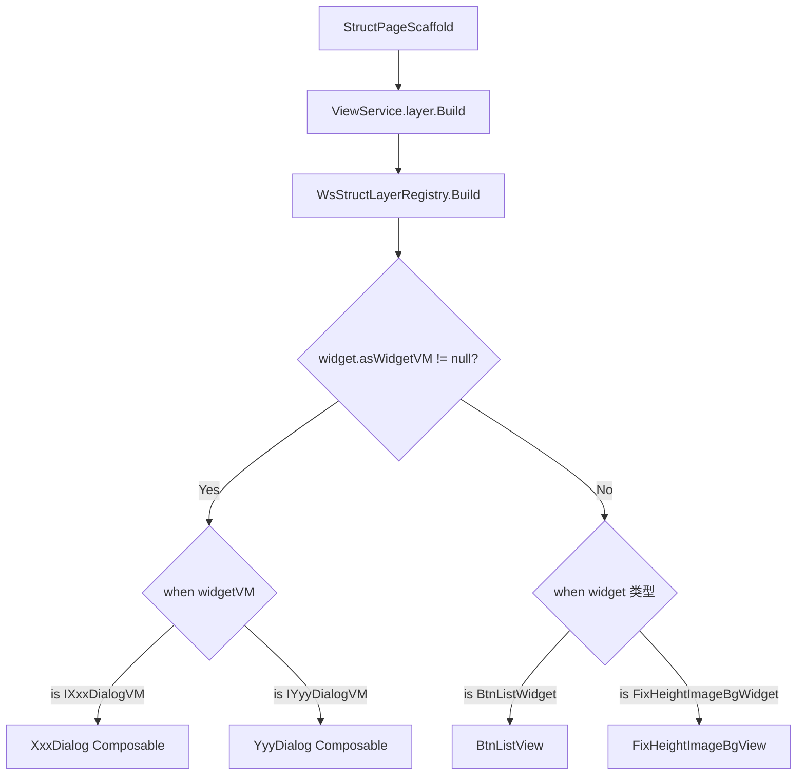

# Skill: Struct Dialog（弹窗/浮层）开发指南

## 目标
指导开发者在 Struct 品字形页面中新增自定义 Dialog（弹窗/浮层）组件，涵盖 VM 接口定义、DialogWidget 创建、Compose 弹窗视图实现和注册流程。

---

## 架构概览

Dialog 是 Struct 品字形页面中的全屏浮层组件，挂载在 `StructPageWidget.layers` 槽位。框架通过 `WsStructLayerRegistry` 根据 **VM 类型** 分发到对应的 Composable 渲染。

### 分层架构

```
wsCore（契约层）
├── vm/IXxxDialogVM.kt                # Dialog VM 接口（继承 IStructDialogVM）

业务模块（逻辑实现层，如 wsDrama / wsUser / wsFeeds）
├── widget/XxxDialogWidget.kt         # Widget 类（继承 StructVMWidget<IXxxDialogVM>，内部实现 VM）

wsCompose（UI 层）
├── xxx/dialog/XxxDialog.kt           # Compose 弹窗视图（@Composable 函数，入参为 VM 接口）
├── setup/WsStructLayerRegistry.kt    # 注册分发（when 分支添加 VM 类型映射）
```

### 运行时分发流程



### 关键基础设施

| 组件 | 位置 | 说明 |
|------|------|------|
| `IStructDialogVM` | `qnFramework/.../page/vm/IStructDialogVM.kt` | Dialog VM 基础接口，提供 `showDialogState`、`showDialog()`、`dismissDialog()` |
| `StructVMWidget<T>` | `qnFramework/.../page/model/StructWidget.kt` | 带 VM 的 Widget 基类，通过 `asWidgetVM` 暴露 VM 实例 |
| `BottomAnimatedDialog` | `qnView/.../compose/view/BottomAnimatedDialog.kt` | 底部弹出动画弹窗容器，提供半透明遮罩 + 点击遮罩关闭 |
| `LayersWidget` | `qnFramework/.../page/model/LayerWidget.kt` | 浮层容器，通过 `buildFullScreen()` 工厂方法创建 |
| `WsStructLayerRegistry` | `wsCompose/.../setup/WsStructLayerRegistry.kt` | 浮层/弹窗注册分发中心 |

---

## IStructDialogVM 接口说明

所有 Dialog VM 接口必须继承 `IStructDialogVM`，它提供了弹窗显隐的标准协议：

```kotlin
// qnFramework/.../page/vm/IStructDialogVM.kt
interface IStructDialogVM : IStructWidgetVM {
    val showDialogState: StateFlow<Boolean>  // 弹窗显隐状态
    fun showDialog()                          // 显示弹窗
    fun dismissDialog()                       // 关闭弹窗
}
```

**设计要点**：
- `showDialogState` 是 `StateFlow<Boolean>`，Compose 视图通过 `collectAsState()` 订阅
- `showDialog()` / `dismissDialog()` 控制弹窗的显隐
- 业务自定义的 Dialog VM 接口在此基础上扩展业务方法

---

## BottomAnimatedDialog 组件说明

`BottomAnimatedDialog` 是框架提供的底部弹出动画弹窗容器，直接接收 `IStructDialogVM` 实例，内部自动处理弹窗的显隐控制：

```kotlin
// qnView/.../compose/view/BottomAnimatedDialog.kt
@Composable
fun BottomAnimatedDialog(
    vm: IStructDialogVM,              // Dialog VM 实例，内部自动订阅 showDialogState
    content: @Composable () -> Unit   // 弹窗内容
)
```

**内部行为**：
- 自动订阅 `vm.showDialogState`，当状态为 `true` 时通过 `LocalDialogController` 显示弹窗
- 内部创建 `IDialog` 包装对象，`showType` 为 `DialogShowType.BottomSheet`（底部弹出动画）
- 点击遮罩区域自动调用 `vm.dismissDialog()` 关闭弹窗
- 当 `showDialogState` 变为 `false` 时，自动通过 `DialogController.dismissDialog()` 关闭弹窗
- 弹窗的半透明遮罩、底部弹出动画等由框架的 `BottomSheetDialog` 统一提供

**使用要点**：
- 不需要手动订阅 `showDialogState`，组件内部已自动处理
- 不需要手动调用 `dismissDialog()`，遮罩点击关闭已自动绑定
- `content` 只需关注弹窗内容本身的 UI 渲染

---

## 开发步骤

### Step 1：定义 Dialog VM 接口（wsCore）

在 `wsCore` 模块中定义 Dialog VM 接口，继承 `IStructDialogVM`。

**文件位置**：`wsCore/src/commonMain/kotlin/com/tencent/weishi/core/{业务域}/vm/IXxxDialogVM.kt`

```kotlin
package com.tencent.weishi.core.{业务域}.vm

import com.tencent.news.core.page.vm.IStructDialogVM

/**
 * {弹窗名称} VM 接口
 * {简要说明弹窗的职责}
 */
interface IXxxDialogVM : IStructDialogVM {
    // 在 IStructDialogVM 基础上扩展业务方法
    // showDialogState / showDialog() / dismissDialog() 已由基类提供

    // 示例：用户确认操作
    fun onConfirm()

    // 示例：暴露额外状态
    // val inputText: StateFlow<String>
}
```

**设计要点**：
- 必须继承 `IStructDialogVM`，自动获得 `showDialogState`、`showDialog()`、`dismissDialog()`
- 只需扩展业务特有的方法和状态
- 方法命名体现动作语义，如 `onConfirm()`、`onUserAgreed()`、`onClickSend()`

---

### Step 2：创建 DialogWidget（业务模块）

继承 `StructVMWidget<IXxxDialogVM>`，在内部类中实现 VM。

**文件位置**：`ws{业务模块}/src/commonMain/kotlin/com/tencent/weishi/core/{业务域}/widget/XxxDialogWidget.kt`

```kotlin
package com.tencent.weishi.core.{业务域}.widget

import com.tencent.news.core.compose.scaffold.findStructPageVM
import com.tencent.news.core.page.model.StructVMWidget
import com.tencent.news.core.page.model.StructWidget
import com.tencent.weishi.core.{业务域}.vm.IXxxDialogVM
import kotlinx.coroutines.flow.MutableStateFlow
import kotlinx.coroutines.flow.update

/**
 * {弹窗名称} Widget
 * 继承 StructVMWidget，内部实现 IXxxDialogVM
 */
class XxxDialogWidget : StructVMWidget<IXxxDialogVM>() {

    override val asWidgetVM: IXxxDialogVM by lazy { VM(this) }

    private class VM(val widget: StructWidget) : IXxxDialogVM {

        // 如需访问页面级 VM，可通过 findStructPageVM() 获取
        // private val pageVM get() = widget.findStructPageVM() as? IXxxPageViewModel

        override val showDialogState = MutableStateFlow(false)

        override fun showDialog() {
            showDialogState.update { true }
        }

        override fun dismissDialog() {
            showDialogState.update { false }
        }

        override fun onConfirm() {
            // 业务逻辑：如通知页面 VM、发起请求等
            // pageVM?.doSomething()
            dismissDialog()
        }
    }
}
```

**关键点**：
- 继承 `StructVMWidget<IXxxDialogVM>`，泛型参数为 VM 接口类型
- `asWidgetVM` 通过 `by lazy` 延迟创建 VM 实例
- VM 实现为 `private class`，接收 `StructWidget` 引用
- 通过 `widget.findStructPageVM()` 可访问页面级 ViewModel，实现弹窗与页面的通信
- `showDialogState` 使用 `MutableStateFlow(false)`，初始不显示
- `showDialog()` / `dismissDialog()` 通过 `update` 修改状态

---

### Step 3：编写 Compose 弹窗视图（wsCompose）

创建 `@Composable` 函数，入参为 VM 接口类型，使用 `BottomAnimatedDialog` 作为容器。

**文件位置**：`wsCompose/src/commonMain/kotlin/com/tencent/weishi/compose/{业务域}/dialog/XxxDialog.kt`

```kotlin
package com.tencent.weishi.compose.{业务域}.dialog

import androidx.compose.runtime.Composable
import com.tencent.kuikly.compose.foundation.background
import com.tencent.kuikly.compose.foundation.clickable
import com.tencent.kuikly.compose.foundation.layout.Column
import com.tencent.kuikly.compose.foundation.layout.fillMaxWidth
import com.tencent.kuikly.compose.foundation.layout.height
import com.tencent.kuikly.compose.foundation.shape.RoundedCornerShape
import com.tencent.kuikly.compose.ui.Modifier
import com.tencent.kuikly.compose.ui.draw.clip
import com.tencent.kuikly.compose.ui.platform.LocalConfiguration
import com.tencent.kuikly.compose.ui.text.font.FontWeight
import com.tencent.kuikly.compose.ui.unit.dp
import com.tencent.kuikly.compose.ui.unit.sp
import com.tencent.news.core.compose.scaffold.modifiers.Button
import com.tencent.news.core.compose.scaffold.modifiers.margin
import com.tencent.news.core.compose.scaffold.theme.QNTheme
import com.tencent.news.core.compose.view.BottomAnimatedDialog
import com.tencent.news.core.compose.view.QnText
import com.tencent.weishi.core.{业务域}.vm.IXxxDialogVM

/**
 * {弹窗名称}
 * 使用 BottomAnimatedDialog 作为底部弹出容器
 */
@Composable
fun XxxDialog(vm: IXxxDialogVM) {
    // BottomAnimatedDialog 内部自动订阅 vm.showDialogState，
    // 并在遮罩点击时自动调用 vm.dismissDialog()，无需手动处理
    BottomAnimatedDialog(vm) {
        XxxDialogContent(
            onConfirm = { vm.onConfirm() },
            onCancel = { vm.dismissDialog() }
        )
    }
}

/**
 * 弹窗内容（纯 UI，不依赖 VM）
 */
@Composable
private fun XxxDialogContent(
    onConfirm: () -> Unit,
    onCancel: () -> Unit
) {
    val safeAreaInsetBottom = ComposeUtils.rememberSafeAreaBottomHeight()

    Column(
        modifier = Modifier
            .background(QNTheme.colorScheme.bgBlock)
            .fillMaxWidth()
            .clip(
                RoundedCornerShape(
                    topStart = 8.dp,
                    topEnd = 8.dp,
                    bottomEnd = 0.dp,
                    bottomStart = 0.dp
                )
            )
            .clickable { } // 拦截点击事件，防止穿透到遮罩
    ) {
        // 标题
        QnText(
            text = "弹窗标题",
            modifier = Modifier
                .margin(start = 24.dp, top = 28.dp)
                .fillMaxWidth(),
            fontSize = 24.sp,
            color = QNTheme.colorScheme.t1,
            fontWeight = FontWeight.SemiBold
        )

        // 内容区域
        QnText(
            text = "弹窗描述内容",
            modifier = Modifier
                .margin(start = 24.dp, end = 24.dp, top = 16.dp)
                .fillMaxWidth(),
            fontSize = 16.sp,
            color = QNTheme.colorScheme.t2
        )

        // 确认按钮
        Button(
            onClick = onConfirm,
            modifier = Modifier
                .margin(start = 24.dp, end = 24.dp, top = 24.dp)
                .background(QNTheme.colorScheme.bNormal)
                .fillMaxWidth()
                .height(48.dp)
                .clip(RoundedCornerShape(24.dp))
        ) {
            QnText(
                text = "确认",
                color = QNTheme.colorScheme.t4,
                fontSize = 16.sp
            )
        }

        // 取消按钮（带安全区适配）
        Button(
            onClick = onCancel,
            modifier = Modifier
                .margin(
                    start = 24.dp,
                    end = 24.dp,
                    top = 16.dp,
                    bottom = if (safeAreaInsetBottom > 0f) {
                        (16f + safeAreaInsetBottom).dp
                    } else {
                        34.dp
                    }
                ),
        ) {
            QnText(
                text = "取消",
                color = QNTheme.colorScheme.t2,
                fontSize = 14.sp
            )
        }
    }
}
```

**布局要点**：
- 外层使用 `BottomAnimatedDialog(vm) { ... }`，直接传入 VM 实例，内部自动处理显隐和遮罩关闭
- 不需要手动订阅 `showDialogState`，不需要手动绑定 `onDismiss`
- 弹窗内容 Column 设置顶部圆角（`topStart = 8.dp, topEnd = 8.dp`）
- 弹窗内容 Column 添加 `.clickable { }` 拦截点击，防止穿透到遮罩触发关闭
- 底部按钮需适配安全区（`safeAreaInsets.bottom`）
- 将弹窗内容拆分为独立的 `private @Composable` 函数，保持外层函数简洁
- 文本使用 `QnText`，`fontSize` 用 `.sp`，`lineHeight` 用浮点数
- 颜色使用 `QNTheme.colorScheme.xxx`

---

### Step 4：注册到 WsStructLayerRegistry（wsCompose）

在 `WsStructLayerRegistry` 的 `when (widgetVM)` 分支中添加映射。

**文件位置**：`wsCompose/src/commonMain/kotlin/com/tencent/weishi/compose/setup/WsStructLayerRegistry.kt`

```kotlin
// 在 when (widgetVM) 分支中添加：
is IXxxDialogVM -> XxxDialog(widgetVM)
```

**完整上下文示例**：

```kotlin
internal object WsStructLayerRegistry : IStructLayerRegistry {
    @Composable
    override fun Build(boxScope: BoxScope, widget: StructWidget) {
        val widgetVM = widget.asWidgetVM
        if (widgetVM != null) {
            when (widgetVM) {
                // 已有注册...
                is ICommentPanelLayerVM -> BoxScopeCommentPanelLayerView(widgetVM)

                // 新增：
                is IXxxDialogVM -> XxxDialog(widgetVM)

                // todo 【架构说明】：新增组件，都建议按vm模式开发，在这里添加：
            }
            return
        }
        // ...
    }
}
```

---

### Step 5：在 DataRepo 中挂载到 LayersWidget

在 DataRepo 的页面构建逻辑中，将 DialogWidget 添加到 `layers` 槽位。

**使用 `LayersWidget.buildFullScreen()`**：

```kotlin
override fun createLocalResetPageWidget(): StructPageWidget {
    return StructPageWidget().buildPageWithManual {
        titleBar = createTitleBar()

        // ... 其他槽位

        // 挂载弹窗到浮层
        this.layers = LayersWidget.buildFullScreen(
            XxxDialogWidget(),          // 自定义弹窗
            // YyyDialogWidget(),       // 可同时挂载多个弹窗
        )
    }
}
```

**或在已有 layers 基础上追加**：

```kotlin
this.layers = LayersWidget(
    fullScreen = mutableListOf(
        XxxDialogWidget(),
        BtnListWidget(/* 悬浮按钮 */),
    )
)
```

---

### Step 6：触发弹窗显示

弹窗默认不显示（`showDialogState` 初始为 `false`）。需要在业务逻辑中调用 `showDialog()` 触发显示。

**方式一：通过页面 VM 触发**

```kotlin
// 页面 VM 持有 Dialog VM 的引用
class XxxPageViewModel : IXxxPageViewModel {
    // Dialog Widget 的 VM 可通过 findStructWidget 获取
    private val dialogVM: IXxxDialogVM?
        get() = findStructWidget<XxxDialogWidget>()?.asWidgetVM

    fun onNeedShowDialog() {
        dialogVM?.showDialog()
    }
}
```

**方式二：通过 Widget 间通信触发**

```kotlin
// 在 DialogWidget 的 VM 中，通过 findStructPageVM() 获取页面 VM
private class VM(val widget: StructWidget) : IXxxDialogVM {
    private val pageVM get() = widget.findStructPageVM() as? IXxxPageViewModel

    // 其他 Widget 的 VM 也可以通过类似方式获取 Dialog VM 并调用 showDialog()
}
```

**方式三：在其他 Widget 中直接查找并触发**

```kotlin
// 在 BottomBar Widget 的 VM 中
class BottomBarVM(val widget: StructWidget) : IBottomBarVM {
    fun onPayClick() {
        // 查找同级的 Dialog Widget 并触发显示
        val dialogWidget = widget.findStructPageWidget()
            ?.layers?.fullScreen
            ?.filterIsInstance<XxxDialogWidget>()
            ?.firstOrNull()
        dialogWidget?.asWidgetVM?.showDialog()
    }
}
```

---

## 参考实现：QnCore SponsorPrivacyAgreementDialog

以下是 QnCore 中隐私协议弹窗的完整实现，作为标准参考。

### 1. VM 接口（qnCore）

```kotlin
// qnCore/.../pay/sponsor/vm/SponsorVMRegistry.kt
interface ISponsorPrivacyAgreementDialogVM : IStructDialogVM {
    fun onUserAgreed()  // 用户同意隐私协议
}
```

### 2. DialogWidget（qnUser）

```kotlin
// qnUser/.../pay/sponsor/widget/SponsorPrivacyAgreementDialogWidget.kt
class SponsorPrivacyAgreementDialogWidget : StructVMWidget<ISponsorPrivacyAgreementDialogVM>() {

    override val asWidgetVM: ISponsorPrivacyAgreementDialogVM by lazy { VM(this) }

    private class VM(val widget: StructWidget) : ISponsorPrivacyAgreementDialogVM {
        private val pageVM get() = widget.findStructPageVM() as? ISponsorPageViewModel

        override val showDialogState = MutableStateFlow(false)

        override fun onUserAgreed() {
            pageVM?.updateAgreePrivacy(true)
            pageVM?.payment()
            dismissDialog()
        }

        override fun showDialog() {
            showDialogState.update { true }
        }

        override fun dismissDialog() {
            showDialogState.update { false }
        }
    }
}
```

### 3. Compose 视图（qnCompose）

```kotlin
// qnCompose/.../pay/sponsor/dialog/SponsorPrivacyAgreementDialog.kt
@Composable
fun SponsorPrivacyAgreementDialog(vm: ISponsorPrivacyAgreementDialogVM) {
    BottomAnimatedDialog(vm) {
        PrivacyAgreementDialog(
            onAgree = { vm.onUserAgreed() },
            onDisagree = { vm.dismissDialog() }
        )
    }
}

@Composable
private fun PrivacyAgreementDialog(
    onAgree: () -> Unit,
    onDisagree: () -> Unit
) {
    val safeAreaInsetBottom = ComposeUtils.rememberSafeAreaBottomHeight()
    Column(
        modifier = Modifier
            .background(QNTheme.colorScheme.bgBlock)
            .fillMaxWidth()
            .clip(RoundedCornerShape(topStart = 8.dp, topEnd = 8.dp))
            .clickable { }
    ) {
        QnText(text = "请阅读并同意以下条款", ...)
        // 协议链接
        QnText(text = "《腾讯新闻支持TA服务协议》", color = QNTheme.colorScheme.tlink, ...)
        // 同意按钮
        Button(onClick = onAgree, ...) { QnText(text = "同意", ...) }
        // 不同意按钮（带安全区适配）
        Button(onClick = onDisagree, ...) { QnText(text = "不同意", ...) }
    }
}
```

### 4. 注册（StructLayerRegistry）

```kotlin
// StructLayerRegistry.kt
is ISponsorPrivacyAgreementDialogVM -> SponsorPrivacyAgreementDialog(widgetVM)
```

### 5. DataRepo 挂载

```kotlin
// SponsorDataRepo.kt
this.layers = LayersWidget.buildFullScreen(
    SponsorPrivacyAgreementDialogWidget(),  // 隐私同意
    SponsorTextInputDialogWidget(),         // 编辑留言
)
```

---

## 常见弹窗模式

### 模式一：确认/取消弹窗

最常见的模式，包含标题、描述、确认按钮和取消按钮。

```kotlin
interface IConfirmDialogVM : IStructDialogVM {
    fun onConfirm()
}
```

### 模式二：输入弹窗

包含输入框，用户输入后提交。

```kotlin
interface ITextInputDialogVM : IStructDialogVM {
    fun onClickSend(inputText: String)
}
```

### 模式三：列表选择弹窗

包含可选项列表，用户选择后关闭。

```kotlin
interface ISelectDialogVM : IStructDialogVM {
    val options: StateFlow<List<String>>
    val selectedIndex: StateFlow<Int>
    fun onSelect(index: Int)
}
```

### 模式四：纯展示弹窗

只展示信息，点击遮罩或关闭按钮关闭。

```kotlin
interface IInfoDialogVM : IStructDialogVM {
    // 无额外方法，只使用基类的 showDialog/dismissDialog
}
```

---

## 安全区适配

弹窗底部需要适配安全区（刘海屏、圆角屏等），标准写法：

```kotlin
val safeAreaInsetBottom = ComposeUtils.rememberSafeAreaBottomHeight()

// 底部最后一个元素的 bottom margin
modifier = Modifier.margin(
    bottom = if (safeAreaInsetBottom > 0f) {
        (16f + safeAreaInsetBottom).dp  // 有安全区：间距 + 安全区高度
    } else {
        34.dp  // 无安全区：固定间距
    }
)
```

---

## Checklist

开发完成后，对照以下清单检查：

- [ ] VM 接口定义在 `wsCore`，继承 `IStructDialogVM`
- [ ] VM 接口只扩展业务方法，`showDialogState` / `showDialog()` / `dismissDialog()` 由基类提供
- [ ] DialogWidget 在业务模块中，继承 `StructVMWidget<IXxxDialogVM>`
- [ ] DialogWidget 的 `asWidgetVM` 返回正确的 VM 接口类型
- [ ] VM 实现为 Widget 的 `private class`，`showDialogState` 初始为 `false`
- [ ] Compose 视图入参为 VM 接口类型（非实现类）
- [ ] Compose 视图使用 `BottomAnimatedDialog(vm) { ... }` 作为容器，直接传入 VM 实例
- [ ] 不要手动订阅 `showDialogState`，`BottomAnimatedDialog` 内部已自动处理显隐
- [ ] 不要手动绑定 `onDismiss`，遮罩点击关闭已由 `BottomAnimatedDialog` 内部自动调用 `vm.dismissDialog()`
- [ ] 弹窗内容 Column 添加 `.clickable { }` 拦截点击穿透
- [ ] 弹窗内容设置顶部圆角（`topStart = 8.dp, topEnd = 8.dp`）
- [ ] 底部元素适配安全区（`safeAreaInsets.bottom`）
- [ ] Compose 视图使用 Kuikly 包导入（`com.tencent.kuikly.compose.*`），非 `androidx.compose.*`
- [ ] 文本使用 `QnText`，`fontSize` 用 `.sp`，`lineHeight` 用浮点数
- [ ] 颜色使用 `QNTheme.colorScheme.xxx` 或 `QnColor.xxx`
- [ ] 已在 `WsStructLayerRegistry` 的 `when (widgetVM)` 分支中注册 VM 类型映射
- [ ] 已在 DataRepo 中通过 `LayersWidget.buildFullScreen()` 挂载 DialogWidget
- [ ] 有明确的触发路径可以调用 `showDialog()` 显示弹窗
