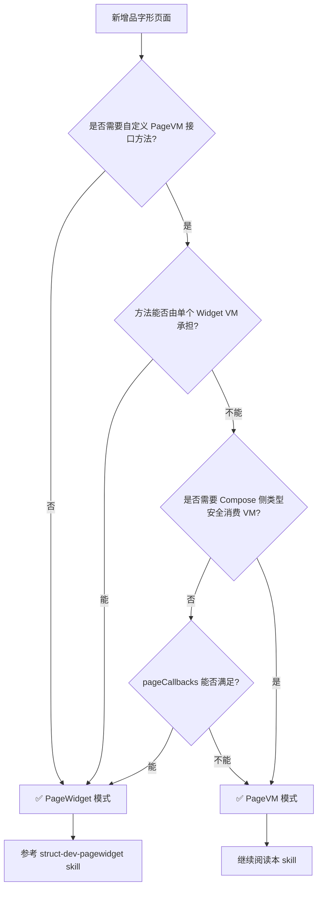
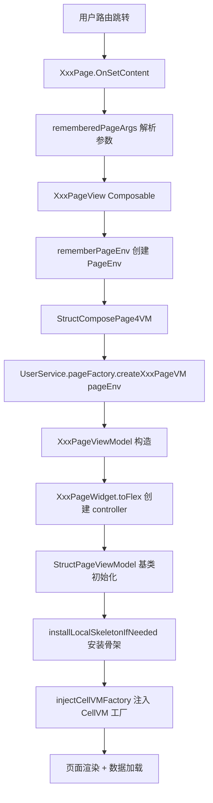
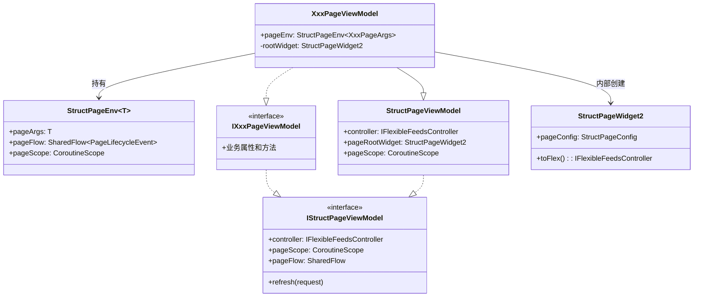

# Skill: Struct PageVM（页面级 ViewModel）开发指南

## 目标

指导开发者在 Struct 品字形架构中新增自定义 PageVM（页面级 ViewModel），涵盖 PageArgs 定义、
PageVM 接口设计、PageWidget 创建、PageVM 实现、IUserPageFactory 注册、Compose 页面入口编写和路由注册全流程。

---

## ⚠️ 前置判断：是否真的需要自定义 PageVM？

> **核心原则**：在采用 PageVM 模式之前，优先考虑是否有必要新增 PageVM。
> 组件拆分与互动设计得当的话，**绝大多数业务场景只需要采用 PageWidget 模式**。

### PageWidget 模式已具备的能力

以下能力在 PageWidget 模式下**已经支持**，不构成升级为 PageVM 的理由：

| 能力 | PageWidget 模式的实现方式 |
|------|--------------------------|
| 获取框架自动创建的 PageVM | 通过 `pageCallbacks` 的 `onPageViewModelCreated(vm)` 回调 |
| 登录态 / 条件变化后重建 | 通过 `WsStructComposePage` 的 `key` 参数控制重组 |
| 页面生命周期钩子 | 通过 `pageCallbacks` 的 `onAfterShowMainContent(vm)` / `onBeforeShowMainContent(data)` |
| 组件间通信 | 通过 `findSingleWidgetVM<T>()` |
| 自定义 UI（背景色等） | 通过 `uiCustomize` 参数 |

### 何时不需要自定义 PageVM

如果你的页面满足以下条件，**应该使用 PageWidget 模式**（参考 `struct-dev-pagewidget` skill）：

- 所有用户交互都可以在各 Widget VM（TitleBar、Cell、Dialog 等）中独立完成
- 组件间通信通过 `findSingleWidgetVM<T>()` 即可满足
- 不需要在 PageVM 接口上定义「页面级辅助方法」供多个组件消费
- 不需要在 Compose 侧通过自定义 VM 接口的类型安全方法消费页面状态

### 何时需要自定义 PageVM

只有当页面确实需要**在 `IStructPageViewModel` 基础上扩展自定义接口方法**时，才升级为 PageVM 模式：

1. **页面级辅助方法**：需要定义跨组件共享的数据查询方法（如 `getRefArticleIndexMap()`），且这些方法需要通过自定义 VM 接口暴露给组件
2. **Compose 侧类型安全消费**：需要在 Compose 侧将 VM 强转为自定义接口类型（如 `IXxxPageViewModel`），调用其特有方法渲染额外浮层
3. **自定义页面级生命周期逻辑**：需要 override `onAfterShowMainContent()` 在 VM 内部执行复杂的页面级协调逻辑（如 scheme 锚定跳转）

> ⚠️ **注意**：如果只是需要在 `onAfterShowMainContent` 中做简单操作（如上报），
> 通过 `pageCallbacks` 即可满足，无需自定义 PageVM。

### 决策流程



> 📖 **PageWidget 模式的完整开发指南**请参考 `struct-dev-pagewidget` skill。

---

## 架构概览

PageVM 是 Struct 品字形页面的核心控制器，负责：
- 创建并持有 `PageWidget`（页面 UI 结构描述）
- 通过 `StructPageViewModel` 基类驱动 feeds controller 管理列表数据
- 安装骨架（TitleBar / Header / Pager / Layers）
- 注入 CellVM 工厂到 DataRepo
- 管理页面级状态（批量操作、搜索等）
- 处理用户交互和上报

### 分层架构

```
qnFramework（框架层）
├── compose/scaffold/StructPageEnv.kt           # PageEnv / StructPageEnv 定义
├── compose/scaffold/IStructPageViewModel.kt    # IStructPageViewModel / PageVM 接口
├── compose/scaffold/vm/StructPageViewModel.kt  # StructPageViewModel 基类
├── compose/scaffold/rememberPageEnv.kt         # Compose 侧 rememberPageEnv
├── compose/page/StructComposePage4VM.kt        # StructComposePage4VM 渲染入口
├── list/extension/FlexControllerEx.kt          # StructPageWidget2.toFlex() 扩展
├── page/model/StructPageWidget2.kt             # PageWidget 基类
├── page/model/StructPageConfig.kt              # 页面配置

wsCore（契约层）
├── {业务域}/page/XxxPageArgs.kt                # 页面启动参数
├── {业务域}/vm/IXxxPageViewModel.kt            # PageVM 接口（继承 IStructPageViewModel）
├── {业务域}/api/IUserPageFactory.kt            # Factory 接口声明

业务模块（逻辑实现层，如 wsUser / wsDrama / wsFeeds）
├── {业务域}/page/XxxPageWidget.kt              # PageWidget 实现
├── {业务域}/page/XxxPageViewModel.kt           # PageVM 实现类
├── {业务域}/page/XxxDataRepo.kt                # 数据源
├── setup/UserPageFactoryImpl.kt                # Factory 实现

wsCompose（UI 层）
├── {业务域}/XxxPage.kt                         # @Page 入口（继承 ComposePage）
├── {业务域}/XxxPageView.kt                     # Composable 视图入口
```

### 运行时创建流程



### 核心类型关系



---

## 开发步骤

### Step 1：定义 PageArgs（wsCore）

页面启动参数，实现 `IComposePageArgs` 并标记 `@Serializable`。

**文件位置**：`wsCore/src/commonMain/kotlin/com/tencent/weishi/core/{业务域}/page/XxxPageArgs.kt`

```kotlin
package com.tencent.weishi.core.{业务域}.page

import com.tencent.news.core.compose.platform.IComposePageArgs
import kotlinx.serialization.Serializable

@Serializable
data class XxxPageArgs(
    val targetId: String = "",       // 业务 ID
    val source: String = "",         // 来源标识（用于上报）
) : IComposePageArgs {

    /** 是否为主态（当前登录用户自己的页面） */
    fun isHostPage(): Boolean {
        // 根据业务逻辑判断
        return targetId.isEmpty() || targetId == currentUserId()
    }

    /** 解析出实际使用的 ID */
    fun resolvedId(): String {
        return targetId.ifEmpty { currentUserId() }
    }
}
```

**设计要点**：
- 必须实现 `IComposePageArgs`（来自 `com.tencent.news.core.compose.platform.IComposePageArgs`）
- 必须标记 `@Serializable`（鸿蒙端跨语言传参需要）
- 所有字段提供默认值，避免反序列化失败
- 提供便捷方法（如 `isHostPage()`、`resolvedId()`）供 VM 使用

---

### Step 2：定义 PageVM 接口（wsCore）

PageVM 接口继承 `IStructPageViewModel`，**仅定义页面级必要的业务方法**。

> ⚠️ **核心原则**：PageVM 接口应保持极度轻量。用户交互应分发到页面的各个 Widget 组件中完成，
> 不要在 PageVM 中堆积交互逻辑。PageVM 仅保留「跨组件协调」或「页面级独有」的方法。

**文件位置**：`wsCore/src/commonMain/kotlin/com/tencent/weishi/core/{业务域}/vm/IXxxPageViewModel.kt`

#### 推荐写法：轻量接口

大多数页面的 PageVM 接口应该是这样的——极简、甚至为空：

```kotlin
package com.tencent.weishi.core.{业务域}.vm

import com.tencent.news.core.compose.scaffold.IStructPageViewModel

/**
 * {业务名}页 ViewModel 接口
 * 继承 IStructPageViewModel 以兼容 StructComposePage4VM 渲染
 */
interface IXxxPageViewModel : IStructPageViewModel
```

#### 仅在必要时添加页面级方法

只有当某个方法确实属于「页面级」且无法由单个 Widget 独立完成时，才在接口中声明：

```kotlin
interface IAIQAPageViewModel : IStructPageViewModel {

    // 仅保留页面级的辅助方法（如跨组件数据查询）
    fun getRefArticleIndexMap(ref: List<String>): Map<String, IKmmFeedsItem>
}
```

**设计要点**：
- **必须继承 `IStructPageViewModel`**（来自 `com.tencent.news.core.compose.scaffold`）
- **绝大多数情况下接口为空**，只继承 `IStructPageViewModel` 即可
- **禁止定义 `fun dispatch(action: XxxAction)` 集中式分发方法**
- **禁止在 PageVM 接口中堆积用户交互方法**（如 `onLikeClick()`、`onFollowClick()`）
- 用户交互应由各 Widget 的 VM（如 TitleBarVM、CellVM、DialogVM）各自承担
- 仅当方法属于「页面级协调」（如跨组件数据查询、scheme 跳转锚定）时才放入 PageVM
- 接口定义在 wsCore，供 UI 层（wsCompose）消费

---

### Step 3：创建 PageWidget（业务模块）

PageWidget 描述页面的 UI 结构配置，并持有 DataRepo。在 PageVM 模式下，PageWidget 由 PageVM 内部创建并通过 `.toFlex()` 传给父类。

**文件位置**：`ws{业务模块}/src/commonMain/kotlin/com/tencent/weishi/core/{业务域}/page/XxxPageWidget.kt`

#### 简要示例

```kotlin
class XxxPageWidget(pageArgs: XxxPageArgs) : StructPageWidget2(
    pageConfig = StructPageConfig(
        dataRepo = XxxDataRepo(pageArgs),
        defaultChannelInfo = IChannelInfo.new(
            channelKey = "xxx_channel",
            channelName = "频道名"
        ),
        fixTitleBarAboveContent = true,
        enableFooter = false,
    )
)
```

#### 在 PageVM 中的使用方式

PageWidget 在 PageVM 构造函数中创建并转换为 controller：

```kotlin
class XxxPageViewModel(
    val pageEnv: StructPageEnv<XxxPageArgs>,
) : StructPageViewModel(
    XxxPageWidget(pageEnv.pageArgs).toFlex(),  // 内部创建 PageWidget
    pageEnv.pageFlow,
    pageEnv.pageScope,
), IXxxPageViewModel { ... }
```

> 📖 **PageWidget 的完整开发指南**（包括 StructPageConfig 全部配置项、DataRepo 集成、多 Tab 配置、
> 骨架屏等）请参考 `struct-dev-pagewidget` skill。
>
> 📖 **DataRepo 的完整开发指南**请参考 `struct-dev-datarepo` skill，涵盖三种模式选型、首屏加载、分页加载、Widget 树构建等。

---

### Step 4：实现 PageVM（业务模块）

PageVM 实现类接收 `StructPageEnv`，内部创建 PageWidget 并驱动页面。

> ⚠️ **核心原则**：PageVM 实现类应保持精简。数据加载由 PageWidget 的 DataRepo 统一管理，
> 用户交互由各 Widget 的 VM 各自处理，PageVM 仅负责页面级协调逻辑。

**文件位置**：`ws{业务模块}/src/commonMain/kotlin/com/tencent/weishi/core/{业务域}/page/XxxPageViewModel.kt`

#### 标准写法（参考 AIQAPageViewModel）

```kotlin
package com.tencent.weishi.core.{业务域}.page

import com.tencent.news.core.compose.scaffold.StructPageEnv
import com.tencent.news.core.compose.scaffold.vm.StructPageViewModel
import com.tencent.news.core.list.extension.FlexControllerEx.toFlex
import com.tencent.weishi.core.{业务域}.vm.IXxxPageViewModel

class XxxPageViewModel(
    val pageEnv: StructPageEnv<XxxPageArgs>,
) : StructPageViewModel(
    XxxPageWidget(pageEnv.pageArgs).toFlex(),
    pageEnv.pageFlow,
    pageEnv.pageScope,
), IXxxPageViewModel {

    // ==================== 页面级辅助方法 ====================
    // 仅保留跨组件协调或页面级独有的逻辑

    override fun onAfterShowMainContent() {
        // 页面首次展示后的逻辑（如 scheme 锚定）
        checkJumpInitialIndex()
    }

    private fun checkJumpInitialIndex() {
        val initIndex = pageEnv.pageArgs.index
        if (initIndex <= 0) return
        pageScope.launch {
            delay(200)
            scrollToIndex(initIndex)
        }
    }
}
```

**设计要点**：

- **构造函数只接收 `StructPageEnv<XxxPageArgs>`**，不再接收 `rootWidget`、`pageFlow`、`pageScope` 等散参数
- **内部创建 PageWidget**：`XxxPageWidget(pageEnv.pageArgs).toFlex()` 传给父类
- `toFlex()` 扩展函数将 `StructPageWidget2` 转换为 `IFlexibleFeedsController`
- **PageVM 实现类应极度精简**，不要堆积交互逻辑
- **数据加载完全由 DataRepo 管理**（见 Step 3），PageVM 不需要额外定义加载流程或管理加载状态
- **用户交互由各 Widget VM 各自处理**，不要在 PageVM 中集中处理

---

### Step 5：注册到 IUserPageFactory（wsCore + 业务模块）

#### 5.1 在 IUserPageFactory 接口中声明（wsCore）

**文件位置**：`wsCore/src/commonMain/kotlin/com/tencent/weishi/core/user/profile/api/IUserPageFactory.kt`

```kotlin
interface IUserPageFactory {
    // 已有方法...
    fun createMineProfilePageVM(pageEnv: PageEnv<MineProfilePageArgs>): PageVM
    fun createProfileFansPageVM(pageEnv: PageEnv<ProfileFansPageArgs>): PageVM
    fun createFollowingPageVM(pageEnv: PageEnv<FollowingPageArgs>): PageVM

    // 新增：
    fun createXxxPageVM(pageEnv: PageEnv<XxxPageArgs>): PageVM
}
```

#### 5.2 在 UserPageFactoryImpl 中实现（业务模块）

**文件位置**：`wsUser/src/commonMain/kotlin/com/tencent/weishi/core/setup/UserPageFactoryImpl.kt`

```kotlin
override fun createXxxPageVM(pageEnv: PageEnv<XxxPageArgs>) =
    XxxPageViewModel(pageEnv)
```

**设计要点**：
- Factory 方法签名统一为 `fun createXxxPageVM(pageEnv: PageEnv<XxxPageArgs>): PageVM`
- `PageEnv<T>` 是 `StructPageEnv<T>` 的 typealias
- `PageVM` 是 `IStructPageViewModel` 的 typealias
- 实现一行式，直接构造 ViewModel

---

### Step 6：编写 Compose 页面入口（wsCompose）

#### 6.1 PageView Composable

**文件位置**：`wsCompose/src/commonMain/kotlin/com/tencent/weishi/compose/{业务域}/XxxPageView.kt`

```kotlin
package com.tencent.weishi.compose.{业务域}

import androidx.compose.runtime.Composable
import com.tencent.news.core.compose.page.StructComposePage4VM
import com.tencent.news.core.compose.scaffold.rememberPageEnv
import com.tencent.news.core.util.lifecycle.PageLifecycleEvent
import com.tencent.weishi.compose.login.InstallLocalLoginDialogLauncher
import com.tencent.weishi.core.service.UserService
import com.tencent.weishi.core.{业务域}.page.XxxPageArgs
import kotlinx.coroutines.flow.SharedFlow

@Composable
fun XxxPageView(
    pageArgs: XxxPageArgs,
    pageFlow: SharedFlow<PageLifecycleEvent>,
) {
    val pageEnv = rememberPageEnv(pageArgs, pageFlow)
    StructComposePage4VM(
        pageViewModel = {
            UserService.pageFactory.createXxxPageVM(pageEnv)
        },
    )
}
```

#### 6.2 Page 入口类

**文件位置**：`wsCompose/src/commonMain/kotlin/com/tencent/weishi/compose/{业务域}/XxxPage.kt`

```kotlin
package com.tencent.weishi.compose.{业务域}

import androidx.compose.runtime.Composable
import com.tencent.kuikly.core.annotations.Page
import com.tencent.news.core.compose.scaffold.ComposePage
import com.tencent.weishi.core.router.contants.ComposeViewKey
import com.tencent.weishi.core.{业务域}.page.XxxPageArgs

@Page(ComposeViewKey.Xxx.XXX_PAGE)
class XxxPage : ComposePage() {
    @Composable
    override fun OnSetContent() {
        val pageArgs = rememberedPageArgs<XxxPageArgs>() ?: return
        XxxPageView(
            pageArgs = pageArgs,
            pageFlow = pageLifecycleFlow.lifecycleFlow,
        )
    }
}
```

**设计要点**：
- `rememberPageEnv(pageArgs, pageFlow)` 创建 `StructPageEnv`，内部自动 `rememberCoroutineScope()`
- `StructComposePage4VM` 负责 Loading / Error / Success 态渲染
- `@Page` 注解注册路由，参数为 `ComposeViewKey` 中的常量
- `rememberedPageArgs<T>()` 从路由参数中反序列化 PageArgs

---

### Step 7：注册路由常量（wsCore）

在 `ComposeViewKey` 中注册页面路由常量。

**文件位置**：`wsCore/src/commonMain/kotlin/com/tencent/weishi/core/router/contants/ComposeViewKey.kt`

```kotlin
object ComposeViewKey {
    object Xxx {
        const val XXX_PAGE = "xxx_page"
    }
}
```

---

## 完整示例：AI 问答页（AIQAPage）— 标准 PageVM 写法

以下是一个**标准的精简 PageVM** 开发示例，展示了正确的职责分离：
- PageVM 极度精简，仅保留页面级辅助方法
- 数据加载完全由 DataRepo 管理
- 用户交互由各 Widget VM 各自处理
- 组件间通信使用 `findSingleWidgetVM`

### 1. PageArgs（qnCore）

```kotlin
// qnCore/.../compose/aiqa/AIQAPageArgs.kt
@Serializable
data class AIQAPageArgs(
    val eventId: String = "",
    val index: Int = 0,        // scheme 跳转锚定索引
) : IComposePageArgs {
    fun isFromScheme(): Boolean = index > 0
}
```

### 2. PageVM 接口（qnCore）— 极度轻量

```kotlin
// qnCore/.../aigc/qa/page/IAIQAPageViewModel.kt
interface IAIQAPageViewModel : IStructPageViewModel {
    // 仅保留页面级辅助方法（跨组件数据查询）
    fun getRefArticleIndexMap(ref: List<String>): Map<String, IKmmFeedsItem>
}
```

> 注意：没有 `dispatch(action)`，没有 `onXxxClick()`，没有 `isLoading` 状态。

### 3. PageWidget（qnUser）— 仅引用 DataRepo

```kotlin
// qnUser/.../aigc/qa/page/AIQAPageWidget.kt
class AIQAPageWidget(pageArgs: AIQAPageArgs) : StructPageWidget2(
    pageConfig = StructPageConfig(
        dataRepo = AIQADataRepo(pageArgs),  // DataRepo 负责一切数据加载
        defaultChannelInfo = KmmChannelInfo.createQnInstance(
            channelKey = "news_news_aiqa",
            channelName = "综合"
        ),
        enableFooter = false,
    )
)
```

### 4. DataRepo（qnUser）— 统一管理数据加载 + Widget 树构建

> 📖 DataRepo 的完整开发指南请参考 `struct-dev-datarepo` skill。
> 此处仅展示 PageWidget 如何引用 DataRepo，DataRepo 内部实现（网络请求、数据解析、Widget 树构建）不在本 skill 范围内。

### 5. PageVM 实现（qnUser）— 极度精简

```kotlin
// qnUser/.../aigc/qa/page/AIQAPageViewModel.kt
class AIQAPageViewModel(
    val pageEnv: StructPageEnv<AIQAPageArgs>
) : StructPageViewModel(
    AIQAPageWidget(pageEnv.pageArgs).toFlex(),
    pageEnv.pageFlow,
    pageEnv.pageScope
), IAIQAPageViewModel {

    // 页面级辅助方法：供 CellVM 查询引用来源数据
    override fun getRefArticleIndexMap(ref: List<String>): Map<String, IKmmFeedsItem> =
        aiqaDataRes?.getRefArticleIndexMap(ref) ?: emptyMap()

    // 页面首次展示后的锚定逻辑
    override fun onAfterShowMainContent() {
        checkJumpInitialIndex()
    }

    private fun checkJumpInitialIndex() {
        val initIndex = pageEnv.pageArgs.index
        if (initIndex <= 0) return
        pageScope.launch {
            delay(200)
            scrollToIndex(initIndex)
        }
    }

    private val aiqaDataRes: AIQADataRes?
        get() = controller.rootWidget.originNetData as? AIQADataRes
}
```

> **关键观察**：整个 PageVM 只有 ~30 行代码，没有任何用户交互处理、没有加载状态管理。

### 6. Factory 注册

```kotlin
// 接口声明
fun createAIQAPageVM(pageEnv: PageEnv<AIQAPageArgs>): PageVM

// 实现
override fun createAIQAPageVM(pageEnv: PageEnv<AIQAPageArgs>) =
    AIQAPageViewModel(pageEnv)
```

### 7. Compose 入口

```kotlin
@Composable
fun AIQAPageView(
    pageArgs: AIQAPageArgs,
    pageFlow: SharedFlow<PageLifecycleEvent>,
) {
    val pageEnv = rememberPageEnv(pageArgs, pageFlow)
    StructComposePage4VM(
        pageViewModel = { pageFactory.createAIQAPageVM(pageEnv) },
    )
}
```

---

## 进阶模式

### 模式 A：需要在 Compose 侧捕获 VM 实例

当页面有额外的 Compose 浮层需要消费 PageVM 时（如粉丝页的批量操作底栏）：

```kotlin
@Composable
fun XxxPageView(pageArgs: XxxPageArgs, pageFlow: SharedFlow<PageLifecycleEvent>) {
    val pageEnv = rememberPageEnv(pageArgs, pageFlow)
    var viewModel by remember { mutableStateOf<IXxxPageViewModel?>(null) }

    Box(modifier = Modifier.fillMaxSize()) {
        StructComposePage4VM(
            pageViewModel = {
                UserService.pageFactory.createXxxPageVM(pageEnv).also { vm ->
                    viewModel = vm as? IXxxPageViewModel
                }
            },
        )

        // 额外浮层
        viewModel?.let { vm ->
            XxxOverlay(viewModel = vm)
        }
    }
}
```

### 模式 B：登录态变化后重建 VM

当页面需要在用户切换账号后重新创建 VM 时（如个人页）：

```kotlin
@Composable
fun XxxPageView(pageArgs: XxxPageArgs, pageFlow: SharedFlow<PageLifecycleEvent>) {
    val pageEnv = rememberPageEnv(pageArgs, pageFlow)

    StructComposePage4VM(
        key = rememberLoginKey(),  // 登录态变化后 key 变化，触发 VM 重建
        pageViewModel = {
            UserService.pageFactory.createXxxPageVM(pageEnv)
        },
    )
}
```

### 模式 C：自定义页面 UI（背景色、下拉刷新等）

```kotlin
StructComposePage4VM(
    pageViewModel = { UserService.pageFactory.createXxxPageVM(pageEnv) },
    uiCustomize = StructPageUICustomize(
        pageModifier = Modifier.background(QNTheme.colorScheme.bgPage),
        enableRootPullRefresh = true,
    )
)
```

---

## 关键 API 速查

| API | 来源 | 说明 |
|-----|------|------|
| `StructPageEnv<T>` / `PageEnv<T>` | `qnFramework` | 页面环境，包含 pageArgs + pageFlow + pageScope |
| `IStructPageViewModel` / `PageVM` | `qnFramework` | 页面 VM 接口 |
| `StructPageViewModel` | `qnFramework` | 页面 VM 基类，驱动 feeds controller |
| `StructPageWidget2` / `PageWidget` | `qnFramework` | 页面 Widget 基类 |
| `StructPageConfig` | `qnFramework` | 页面配置（dataRepo、channelInfo、fixTitleBar 等） |
| `StructPageWidget2.toFlex()` | `qnFramework` | 将 Widget 转换为 IFlexibleFeedsController |
| `rememberPageEnv(pageArgs, pageFlow)` | `qnFramework` | Compose 侧创建 PageEnv |
| `StructComposePage4VM` | `qnFramework` | Compose 渲染入口，接收 pageViewModel lambda |
| `IStructDataRepo` | `qnFramework` | 数据源接口（网络请求 + Widget 树构建） |
| `IStructDataLocalRepo` | `qnFramework` | 骨架 DataRepo 接口（本地初始结构） |
| `findSingleWidgetVM<T>()` | `qnFramework` | 组件间通信：在 Widget 树中查找指定类型的 VM |
| `findStructPageVM()` | `qnFramework` | 在 Widget 中获取所属页面的 PageVM |
| `IUserPageFactory` | `wsCore` | 页面 Factory 接口 |
| `UserService.pageFactory` | `wsCore` | 获取 Factory 实例 |
| `ComposePage` | `qnFramework` | 页面基类，提供 `rememberedPageArgs` 和 `pageLifecycleFlow` |
| `@Page(name)` | `kuikly` | 页面路由注解 |
| `ComposeViewKey` | `wsCore` | 路由常量定义 |

---

## 反模式清单

| ❌ 不要这样做 | ✅ 正确做法 |
|---|---|
| PageVM 构造函数接收 `rootWidget`、`pageFlow`、`pageScope` 散参数 | 统一接收 `StructPageEnv<XxxPageArgs>` |
| 在 Factory 中手动创建 PageWidget 再传给 VM | VM 内部自己创建 PageWidget |
| 定义 `XxxPageAssembly` / `XxxPageViewModelProvider` 包装类 | 直接 `fun createXxxPageVM(pageEnv): PageVM` |
| Compose 侧手动 `rememberCoroutineScope()` + `remember { createAssembly }` | 使用 `rememberPageEnv` + `StructComposePage4VM` |
| PageVM 接口不继承 `IStructPageViewModel` | 必须继承，否则 `StructComposePage4VM` 无法渲染 |
| 在 Compose 侧直接 new ViewModel | 通过 `UserService.pageFactory.createXxxPageVM(pageEnv)` |
| 定义 `fun dispatch(action: XxxAction)` 集中式分发 | 交互由各 Widget VM 各自处理，PageVM 仅保留页面级方法 |
| 在 PageVM 中堆积 `onLikeClick()`、`onFollowClick()` 等交互方法 | 交互分发到对应的 CellVM / TitleBarVM / DialogVM 中 |
| 在 PageVM 中自定义数据加载流程（如 `loadData()`、`fetchList()`） | 数据加载统一由 PageWidget 的 DataRepo 管理 |
| 在 PageVM 中管理 `isLoading`、`isError` 等加载状态 | 加载状态由框架（StructComposePage4VM）自动管理 |
| 组件间直接持有引用或通过 PageVM 中转通信 | 使用 `findSingleWidgetVM<T>()` 进行组件间通信 |

---

## 组件间通信

> 📖 **组件间通信的完整开发指南**请参考 `struct-dev-widget-interact` skill，涵盖 `findSingleWidgetVM`、
> `findStructPageVM`、`findStructPageWidget` 等核心 API 的使用场景、典型示例和最佳实践。

**核心原则**：组件之间的通信**不通过 PageVM 中转**，而是使用 `findSingleWidgetVM<T>()` 方法直接查找目标组件的 VM。

---

## 数据加载规范

在 Struct 架构中，页面数据加载**统一由 PageWidget 的 DataRepo 管理**，PageVM 不应额外定义加载流程。

> 📖 **DataRepo 的完整开发指南**请参考 `struct-dev-datarepo` skill，涵盖三种模式选型（NetworkBuilder / LocalRepo / SuspendRepo）、
> 首屏加载、分页加载、Widget 树构建和与 PageWidget 的集成。

### 核心原则

- **DataRepo 负责一切数据加载**：网络请求、数据解析、Widget 树构建（TitleBar / Header / Layers / 列表数据）
- **PageWidget 仅引用 DataRepo**：通过 `StructPageConfig(dataRepo = XxxDataRepo(...))` 传入
- **PageVM 不管理加载状态**：框架（`StructComposePage4VM`）自动管理 Loading / Error / Success 状态
- **PageVM 不定义加载方法**：禁止在 PageVM 中出现 `loadData()`、`fetchList()` 等方法

### 禁止的做法

```kotlin
// ❌ 错误：在 PageVM 中自定义加载流程
class BadPageViewModel(...) : StructPageViewModel(...) {
    private val _isLoading = MutableStateFlow(false)  // ❌ 不要自己管理加载状态
    val isLoading: StateFlow<Boolean> = _isLoading

    fun loadData() {  // ❌ 不要自己定义加载方法
        _isLoading.value = true
        pageScope.launch {
            val result = repository.fetchData()
            _isLoading.value = false
            // ...
        }
    }
}
```

---

## Checklist

开发完成后，对照以下清单检查：

- [ ] PageArgs 定义在 `wsCore`，实现 `IComposePageArgs`，标记 `@Serializable`
- [ ] PageVM 接口定义在 `wsCore`，继承 `IStructPageViewModel`
- [ ] **PageVM 接口保持轻量**，没有 `dispatch(action)` 集中式分发方法
- [ ] **PageVM 接口中没有堆积用户交互方法**，交互由各 Widget VM 承担
- [ ] PageWidget 在业务模块中，继承 `StructPageWidget2`，通过 `StructPageConfig` 配置
- [ ] **数据加载完全由 DataRepo 管理**，PageVM 中没有额外的加载流程
- [ ] **PageVM 中没有自定义的 `isLoading` / `isError` 状态**，由框架自动管理
- [ ] PageVM 实现在业务模块中，构造函数只接收 `StructPageEnv<XxxPageArgs>`
- [ ] PageVM 内部创建 PageWidget 并调用 `.toFlex()` 传给父类
- [ ] **组件间通信使用 `findSingleWidgetVM<T>()`**，不通过 PageVM 中转
- [ ] `IUserPageFactory` 中声明 `fun createXxxPageVM(pageEnv: PageEnv<XxxPageArgs>): PageVM`
- [ ] `UserPageFactoryImpl` 中一行式实现 `override fun createXxxPageVM(pageEnv) = XxxPageViewModel(pageEnv)`
- [ ] Compose 入口使用 `rememberPageEnv` + `StructComposePage4VM`
- [ ] `@Page` 注解使用 `ComposeViewKey` 中的常量
- [ ] 没有多余的 Assembly / ViewModelProvider 包装类
- [ ] 没有在 Compose 侧手动 `rememberCoroutineScope()`（由 `rememberPageEnv` 内部处理）
