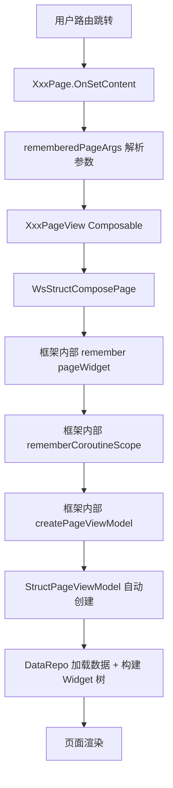
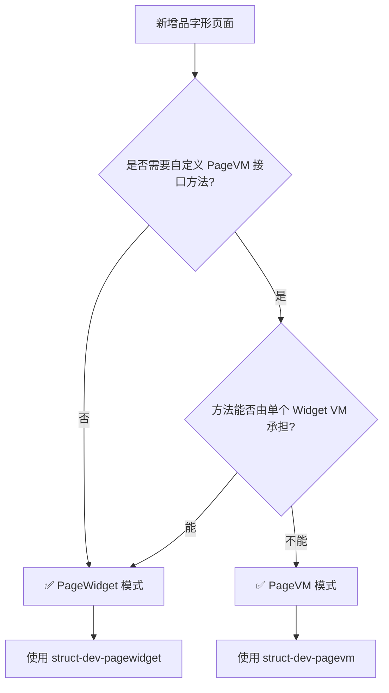

# Skill: Struct PageWidget 模式（无自定义 PageVM）开发指南

## 目标

指导开发者在 Struct 品字形架构中使用 **PageWidget 模式** 构建页面。该模式无需自定义 PageVM，
由框架自动创建内部 PageVM，开发者只需关注 PageWidget + DataRepo 即可完成页面开发。

**这是绝大多数业务场景的推荐模式。**

---

## 何时使用 PageWidget 模式

### ✅ 适用场景（绝大多数业务）

- 页面不需要在 `IStructPageViewModel` 基础上扩展自定义接口方法
- 所有用户交互都可以在各 Widget VM（TitleBar、Cell、Dialog 等）中独立完成
- 组件间通信通过 `findSingleWidgetVM<T>()` 即可满足
- 页面数据加载完全由 DataRepo 管理
- 需要获取框架 PageVM 时，通过 `pageCallbacks.onPageViewModelCreated(vm)` 即可
- 需要条件变化后重建时，通过 `key` 参数即可

### ❌ 需要升级为 PageVM 模式的场景

- 需要在 PageVM 接口上定义「页面级辅助方法」供多个组件消费（如 `getRefArticleIndexMap()`）
- 需要在 Compose 侧通过自定义 VM 接口的类型安全方法消费页面状态
- 需要在 VM 内部 override `onAfterShowMainContent()` 执行复杂的页面级协调逻辑（如 scheme 锚定跳转）

> ⚠️ **注意**：以下能力 PageWidget 模式已支持，不构成升级理由：
> - 获取 PageVM → 通过 `pageCallbacks` 的 `onPageViewModelCreated(vm)` 回调
> - 登录态/条件变化后重建 → 通过 `WsStructComposePage` 的 `key` 参数
> - 页面生命周期钩子 → 通过 `pageCallbacks` 的 `onAfterShowMainContent` / `onBeforeShowMainContent`

> 📖 如果确实需要自定义 PageVM，请参考 `struct-dev-pagevm` skill。

---

## 架构概览

### 与 PageVM 模式的对比

| 维度 | PageWidget 模式 | PageVM 模式 |
|------|----------------|-------------|
| 自定义 PageVM | ❌ 不需要 | ✅ 需要 |
| PageVM 接口 | ❌ 不需要 | ✅ 需要（继承 IStructPageViewModel） |
| PageVM 实现类 | ❌ 不需要 | ✅ 需要（继承 StructPageViewModel） |
| Compose 渲染入口 | `WsStructComposePage` | `StructComposePage4VM` / `WsStructComposePage4VM` |
| Factory 返回类型 | `StructPageWidget2` | `PageVM`（IStructPageViewModel） |
| 代码量 | 极少（3~4 个文件） | 较多（5~7 个文件） |
| 适用比例 | **~80% 的业务页面** | ~20% 需要页面级协调的页面 |

### 分层架构

```
wsCore（契约层）
├── {业务域}/page/XxxPageArgs.kt                # 页面启动参数
├── {业务域}/api/IDramaPageFactory.kt           # Factory 接口（返回 StructPageWidget2）

业务模块（逻辑实现层，如 wsDrama / wsUser / wsFeeds）
├── {业务域}/page/XxxPageWidget.kt              # PageWidget 实现
├── {业务域}/page/XxxDataRepo.kt                # 数据源（LocalRepo 或 NetworkRepo）
├── setup/XxxServiceRegistryImpl.kt             # Factory 实现

wsCompose（UI 层）
├── {业务域}/XxxPage.kt                         # @Page 入口 + Composable 视图
```

### 运行时创建流程



**关键区别**：框架自动创建 `StructPageViewModel`，开发者无需手动编写。

---

## 开发步骤

### Step 1：定义 PageArgs（wsCore）

页面启动参数，实现 `IComposePageArgs` 并标记 `@Serializable`。

**文件位置**：`wsCore/src/commonMain/kotlin/com/tencent/weishi/core/{业务域}/page/XxxPageArgs.kt`

```kotlin
package com.tencent.weishi.core.{业务域}.page

import com.tencent.news.core.compose.platform.IComposePageArgs
import com.tencent.news.core.extension.IKmmKeep
import kotlinx.serialization.Serializable

/**
 * Xxx 页面启动参数
 * @param targetId 业务 ID
 * @param source 来源标识（用于上报）
 */
@Serializable
data class XxxPageArgs(
    val targetId: String = "",
    val source: String = "",
) : IComposePageArgs, IKmmKeep
```

**设计要点**：
- 必须实现 `IComposePageArgs`
- 必须标记 `@Serializable`（鸿蒙端跨语言传参需要）
- 推荐同时实现 `IKmmKeep`（防止混淆）
- 所有字段提供默认值，避免反序列化失败

---

### Step 2：创建 PageWidget（业务模块）

PageWidget 描述页面的 UI 结构配置，持有 DataRepo。

**文件位置**：`ws{业务模块}/src/commonMain/kotlin/com/tencent/weishi/core/{业务域}/page/XxxPageWidget.kt`

```kotlin
package com.tencent.weishi.core.{业务域}.page

import com.tencent.news.core.list.model.new
import com.tencent.news.core.page.model.StructPageConfig
import com.tencent.news.core.page.model.StructPageWidget2
import com.tencent.news.qnchannel.api.IChannelInfo

/**
 * Xxx 页面 PageWidget
 * 描述页面配置：数据源、频道信息、TitleBar 行为等
 */
class XxxPageWidget(
    pageArgs: XxxPageArgs
) : StructPageWidget2(
    StructPageConfig(
        dataRepo = XxxLocalDataRepo(pageArgs),
        defaultChannelInfo = IChannelInfo.new(
            channelKey = "xxx_channel",
            channelName = "频道名"
        ),
        fixTitleBarAboveContent = true,   // TitleBar 固定在顶部
        forceHideHeaderArea = true,       // 不需要 Header
        enableFooter = false,             // 是否启用加载更多
    )
)
```

**设计要点**：
- 继承 `StructPageWidget2`，通过 `StructPageConfig` 描述页面配置
- DataRepo 直接传入 `StructPageConfig`
- PageWidget 保持极简，仅做配置声明
- 可选配置项参见 `StructPageConfig` 文档

---

### Step 3：创建 DataRepo（业务模块）

DataRepo 负责数据加载和 Widget 树构建。PageWidget 模式下通常使用 `IStructDataLocalRepo`（本地构建 Widget 树）。

**文件位置**：`ws{业务模块}/src/commonMain/kotlin/com/tencent/weishi/core/{业务域}/page/XxxDataRepo.kt`

#### 简要示例（LocalRepo 模式）

```kotlin
internal class XxxLocalDataRepo(
    val pageArgs: XxxPageArgs
) : IStructDataLocalRepo {

    override fun createLocalResetPageWidget() = StructPageWidget().buildPageWithManual {
        titleBar = XxxTitleBarWidget.create()
        pager = PagerWidget().apply {
            channels = mutableListOf(XxxChannelWidget(pageArgs))
        }
        layers = LayersWidget.buildFullScreen(
            XxxShareDialogWidget(),
            XxxMoreDialogWidget(),
        )
    }
}
```

#### 核心职责

- 通过 `buildPageWithManual` 构建页面骨架：`titleBar` + `pager` + `layers`
- 每个 Channel 对应一个子 Tab（Channel 内部有自己的 DataRepo 负责列表数据加载）
- Layers 挂载弹窗/浮层组件

> 📖 **DataRepo 的完整开发指南**（包括三种模式选型 NetworkBuilder / LocalRepo / SuspendRepo、
> 首屏加载、分页加载、Widget 树构建、错误处理等）请参考 `struct-dev-datarepo` skill。

---

### Step 4：注册到 PageFactory（wsCore + 业务模块）

#### 4.1 在 Factory 接口中声明（wsCore）

**文件位置**：`wsCore/src/commonMain/kotlin/com/tencent/weishi/core/{业务域}/api/IXxxPageFactory.kt`

```kotlin
package com.tencent.weishi.core.{业务域}.api

import com.tencent.news.core.page.model.StructPageWidget2

interface IXxxPageFactory {
    fun createXxxPageWidget(pageArgs: XxxPageArgs): StructPageWidget2
}
```

**关键区别**：
- PageWidget 模式的 Factory 返回 `StructPageWidget2`
- PageVM 模式的 Factory 返回 `PageVM`（`IStructPageViewModel`）

#### 4.2 在 ServiceRegistryImpl 中实现（业务模块）

**文件位置**：`ws{业务模块}/src/commonMain/kotlin/com/tencent/weishi/core/setup/XxxServiceRegistryImpl.kt`

```kotlin
private object XxxPageFactoryImpl : IXxxPageFactory {
    override fun createXxxPageWidget(pageArgs: XxxPageArgs) =
        XxxPageWidget(pageArgs)
}
```

---

### Step 5：编写 Compose 页面入口（wsCompose）

PageWidget 模式下，Page 入口和 PageView 通常合并在一个文件中。

**文件位置**：`wsCompose/src/commonMain/kotlin/com/tencent/weishi/compose/{业务域}/XxxPage.kt`

```kotlin
package com.tencent.weishi.compose.{业务域}

import androidx.compose.runtime.Composable
import com.tencent.kuikly.compose.foundation.background
import com.tencent.kuikly.compose.ui.Modifier
import com.tencent.kuikly.compose.ui.graphics.Color
import com.tencent.kuikly.core.annotations.Page
import com.tencent.news.core.compose.page.StructPageUICustomize
import com.tencent.news.core.compose.scaffold.ComposePage
import com.tencent.news.core.util.lifecycle.PageLifecycleEvent
import com.tencent.weishi.compose.view.WsStructComposePage
import com.tencent.weishi.core.{业务域}.page.XxxPageArgs
import com.tencent.weishi.core.router.contants.ComposeViewKey
import com.tencent.weishi.core.service.XxxService
import kotlinx.coroutines.flow.SharedFlow

/**
 * Xxx 页面 UI 入口
 */
@Page(ComposeViewKey.Xxx.XXX_PAGE)
class XxxPage : ComposePage() {
    @Composable
    override fun OnSetContent() {
        val pageArgs = rememberedPageArgs<XxxPageArgs>() ?: return
        XxxPageView(pageArgs, pageLifecycleFlow.lifecycleFlow)
    }
}

@Composable
fun XxxPageView(
    pageArgs: XxxPageArgs,
    pageFlow: SharedFlow<PageLifecycleEvent>
) {
    WsStructComposePage(
        pageWidget = { XxxService.pageFactory.createXxxPageWidget(pageArgs) },
        pageFlow = pageFlow,
        uiCustomize = StructPageUICustomize(
            pageModifier = Modifier.background(Color.White)
        )
    )
}
```

**设计要点**：
- 使用 `WsStructComposePage`（Widget 版本），而非 `WsStructComposePage4VM`（VM 版本）
- `pageWidget` 参数是 `LazyImpl<StructPageWidget2>` 类型（即 `() -> StructPageWidget2` lambda）
- 通过 Service 的 pageFactory 创建 PageWidget
- `uiCustomize` 可选，用于自定义页面背景等 UI 属性
- `pageCallbacks` 可选，用于监听页面生命周期和获取框架自动创建的 PageVM
- `key` 可选，用于条件变化后重建页面（如登录态切换）

#### 进阶：使用 pageCallbacks 获取 PageVM

```kotlin
@Composable
fun XxxPageView(
    pageArgs: XxxPageArgs,
    pageFlow: SharedFlow<PageLifecycleEvent>
) {
    WsStructComposePage(
        pageWidget = { XxxService.pageFactory.createXxxPageWidget(pageArgs) },
        pageFlow = pageFlow,
        pageCallbacks = object : IStructComposePageCallbacks {
            override fun onPageViewModelCreated(vm: IStructPageViewModel) {
                // 获取框架自动创建的 PageVM
            }
            override fun onAfterShowMainContent(pageVM: IStructPageViewModel) {
                // 页面 UI 构建完成后的回调
            }
        }
    )
}
```

#### 进阶：使用 key 控制重建

```kotlin
@Composable
fun XxxPageView(
    pageArgs: XxxPageArgs,
    pageFlow: SharedFlow<PageLifecycleEvent>
) {
    WsStructComposePage(
        pageWidget = { XxxService.pageFactory.createXxxPageWidget(pageArgs) },
        pageFlow = pageFlow,
        key = rememberLoginKey()  // 登录态变化后 key 变化，触发页面重建
    )
}
```

---

### Step 6：注册路由常量（wsCore）

在 `ComposeViewKey` 中注册页面路由常量。

**文件位置**：`wsCore/src/commonMain/kotlin/com/tencent/weishi/core/router/contants/ComposeViewKey.kt`

```kotlin
object ComposeViewKey {
    object Xxx {
        const val XXX_PAGE = "xxx_page"
    }
}
```

---

## 完整示例：短剧播放页（DramaPlayPage）

以下是一个**标准的 PageWidget 模式**开发示例：

### 1. PageArgs（wsCore）

```kotlin
// wsCore/.../drama/play/api/DramaPlayPageArgs.kt
@Serializable
data class DramaPlayPageArgs(
    val dramaId: String = "",
    val feedId: String = "",
    val playNext: Boolean = false,
    val scene: Int = 0,
    val dramaFrom: String = "",
    val pageDramaFrom: String = "",
    override val pageItem: IKmmFeedsItem? = null
) : IComposePageArgs, IKmmKeep
```

### 2. PageWidget（wsDrama）

```kotlin
// wsDrama/.../drama/play/page/DramaPlayPageWidget.kt
class DramaPlayPageWidget(
    pageArgs: DramaPlayPageArgs
) : StructPageWidget2(
    StructPageConfig(
        dataRepo = DramaPlayLocalDataRepo(pageArgs),
        defaultChannelInfo = IChannelInfo.new(),
        contentFullScreen = true,        // 全屏沉浸式
        forceHideHeaderArea = true,      // 无 Header
    )
) {
    init {
        loading = WsPureColorLoadingWidget()  // 自定义 Loading 样式
    }
}
```

### 3. DataRepo（wsDrama）— 本地构建 Widget 树

```kotlin
// wsDrama/.../drama/play/page/DramaPlayPageWidget.kt（同文件内）
private class DramaPlayLocalDataRepo(
    val pageArgs: DramaPlayPageArgs
) : IStructDataLocalRepo {

    override fun createLocalResetPageWidget() = StructPageWidget().buildPageWithManual {
        // TitleBar：透明背景，浮在视频上方
        titleBar = DramaPlayTitleBarWidget.create()

        // Pager：单频道竖滑播放
        pager = PagerWidget().apply {
            channels = mutableListOf(
                DramaPlayChannelWidget(pageArgs)
            )
        }

        // Layers：弹窗集合
        layers = LayersWidget.buildFullScreen(
            DramaCommentPanelLayerWidget(),       // 评论弹窗
            DramaSharePanelDialogWidget(),        // 分享弹窗
            DramaEpisodePanelDialogWidget(dramaId = pageArgs.dramaId), // 选集面板
            DramaSpeedPanelDialogWidget(speedKey = pageArgs.dramaId),  // 倍速弹窗
        )
    }
}
```

### 4. Factory 接口（wsCore）

```kotlin
// wsCore/.../drama/api/IDramaPageFactory.kt
interface IDramaPageFactory {
    fun createDramaPlayPageWidget(pageArgs: DramaPlayPageArgs): StructPageWidget2
    fun createFindDramaPageWidget(pageArgs: FindDramaPageArgs): StructPageWidget2
    fun createDramaRankListPageWidget(pageArgs: DramaRankListPageArgs): StructPageWidget2
    fun createDramaSquarePageWidget(pageArgs: DramaSquarePageArgs): StructPageWidget2
    fun createActorPageWidget(pageArgs: ActorAggregatePageArgs): StructPageWidget2
}
```

### 5. Factory 实现（wsDrama）

```kotlin
// wsDrama/.../setup/DramaServiceRegistryImpl.kt
private object DramaPageFactoryImpl : IDramaPageFactory {
    override fun createDramaPlayPageWidget(pageArgs: DramaPlayPageArgs) =
        DramaPlayPageWidget(pageArgs)

    override fun createFindDramaPageWidget(pageArgs: FindDramaPageArgs) =
        FindDramaPageWidget(pageArgs)

    // ... 其他页面
}
```

### 6. Compose 入口（wsCompose）

```kotlin
// wsCompose/.../drama/play/DramaPlayPage.kt
@Page(ComposeViewKey.Drama.PLAY_PAGE)
class DramaPlayPage : ComposePage() {
    @Composable
    override fun OnSetContent() {
        val pageArgs = rememberedPageArgs<DramaPlayPageArgs>() ?: return
        DramaPlayPageView(pageArgs, pageLifecycleFlow.lifecycleFlow)
    }
}

@Composable
fun DramaPlayPageView(
    pageArgs: DramaPlayPageArgs,
    pageFlow: SharedFlow<PageLifecycleEvent>
) {
    WsStructComposePage(
        pageWidget = { DramaService.pageFactory.createDramaPlayPageWidget(pageArgs) },
        pageFlow = pageFlow,
        uiCustomize = StructPageUICustomize(
            pageModifier = Modifier.background(Color(0xFF0D0D0D))  // 深色背景
        )
    )
}
```

---

## 进阶模式

### 模式 A：自定义 Loading 样式

```kotlin
class XxxPageWidget(pageArgs: XxxPageArgs) : StructPageWidget2(
    StructPageConfig(
        dataRepo = XxxLocalDataRepo(pageArgs),
        defaultChannelInfo = IChannelInfo.new(),
    )
) {
    init {
        // 自定义 Loading Widget（如纯色背景 Loading）
        loading = WsPureColorLoadingWidget()
    }
}
```

### 模式 B：全屏沉浸式页面

```kotlin
class XxxPageWidget(pageArgs: XxxPageArgs) : StructPageWidget2(
    StructPageConfig(
        dataRepo = XxxLocalDataRepo(pageArgs),
        defaultChannelInfo = IChannelInfo.new(),
        contentFullScreen = true,         // 内容全屏
        forceHideTitleBarArea = false,    // TitleBar 浮在内容上方
        forceHideHeaderArea = true,       // 无 Header
    )
)
```

### 模式 C：多 Tab 页面

```kotlin
private class XxxLocalDataRepo(val pageArgs: XxxPageArgs) : IStructDataLocalRepo {
    override fun createLocalResetPageWidget() = StructPageWidget().buildPageWithManual {
        titleBar = XxxTitleBarWidget.create()

        // 多 Tab：每个 Channel 对应一个子 Tab
        pager = PagerWidget().apply {
            channels = mutableListOf(
                XxxTabOneChannelWidget(pageArgs),
                XxxTabTwoChannelWidget(pageArgs),
                XxxTabThreeChannelWidget(pageArgs),
            )
        }

        layers = LayersWidget.buildFullScreen(
            XxxFilterDialogWidget(),
        )
    }
}
```

### 模式 D：无 TitleBar 的页面

```kotlin
class XxxPageWidget(pageArgs: XxxPageArgs) : StructPageWidget2(
    StructPageConfig(
        dataRepo = XxxLocalDataRepo(pageArgs),
        defaultChannelInfo = IChannelInfo.new(),
        forceHideTitleBarArea = true,     // 完全隐藏 TitleBar
        forceHideHeaderArea = true,       // 完全隐藏 Header
    )
)
```

---

## 关键 API 速查

| API | 来源 | 说明 |
|-----|------|------|
| `StructPageWidget2` | `qnFramework` | 页面 Widget 基类 |
| `StructPageConfig` | `qnFramework` | 页面配置（dataRepo、channelInfo、fixTitleBar 等） |
| `IStructDataLocalRepo` | `qnFramework` | 本地 DataRepo 接口（构建 Widget 树） |
| `StructPageWidget().buildPageWithManual {}` | `qnFramework` | 手动构建页面骨架 |
| `PagerWidget` | `qnFramework` | Pager 容器（持有多个 Channel） |
| `LayersWidget.buildFullScreen(...)` | `qnFramework` | 构建全屏弹窗层 |
| `WsStructComposePage` | `wsCompose` | Compose 渲染入口（Widget 版本，带登录兜底） |
| `StructComposePage` | `qnView` | Compose 渲染入口（Widget 版本，基础版） |
| `IStructComposePageCallbacks` | `qnView` | 页面回调接口（获取 PageVM、生命周期钩子） |
| `StructPageUICustomize` | `qnView` | 页面 UI 自定义（背景色、下拉刷新等） |
| `ComposePage` | `qnFramework` | 页面基类，提供 `rememberedPageArgs` 和 `pageLifecycleFlow` |
| `@Page(name)` | `kuikly` | 页面路由注解 |
| `ComposeViewKey` | `wsCore` | 路由常量定义 |
| `IChannelInfo.new()` | `qnFramework` | 创建频道信息 |

---

## 反模式清单

| ❌ 不要这样做 | ✅ 正确做法 |
|---|---|
| 为简单页面创建自定义 PageVM 接口和实现类 | 直接使用 PageWidget 模式，框架自动创建 PageVM |
| 使用 `StructComposePage4VM` / `WsStructComposePage4VM` 但没有自定义 PageVM | 使用 `WsStructComposePage`（Widget 版本） |
| 在 Factory 中返回 `PageVM` 但 VM 实现为空壳 | Factory 直接返回 `StructPageWidget2` |
| 创建只有继承没有任何方法的 PageVM 接口 | 不需要 PageVM，直接用 PageWidget 模式 |
| 在 Compose 侧手动 `rememberCoroutineScope()` 再传给 Widget | `WsStructComposePage` 内部自动处理 |
| 把 DataRepo 和 PageWidget 分开注册 | DataRepo 直接传入 `StructPageConfig` |
| 为每个页面都创建 Assembly / Provider 包装类 | 直接 `fun createXxxPageWidget(pageArgs): StructPageWidget2` |

---

## 与 PageVM 模式的选择决策



**经验法则**：如果你不确定是否需要 PageVM，那就不需要。先用 PageWidget 模式开发，
后续如果确实需要页面级协调方法，再升级为 PageVM 模式（成本很低）。

> ⚠️ 获取 PageVM、key 重建、生命周期钩子等能力 PageWidget 模式已通过 `pageCallbacks` 和 `key` 参数支持，
> 不构成升级为 PageVM 模式的理由。

---

## Checklist

开发完成后，对照以下清单检查：

- [ ] PageArgs 定义在 `wsCore`，实现 `IComposePageArgs`，标记 `@Serializable`
- [ ] PageWidget 在业务模块中，继承 `StructPageWidget2`，通过 `StructPageConfig` 配置
- [ ] DataRepo 实现 `IStructDataLocalRepo`（或 `IStructDataRepo`），负责 Widget 树构建
- [ ] Factory 接口定义在 `wsCore`，方法返回 `StructPageWidget2`
- [ ] Factory 实现在业务模块的 `setup/` 目录中
- [ ] Compose 入口使用 `WsStructComposePage`（Widget 版本）
- [ ] `@Page` 注解使用 `ComposeViewKey` 中的常量
- [ ] **没有创建多余的 PageVM 接口和实现类**
- [ ] **没有创建 Assembly / Provider 包装类**
- [ ] 组件间通信使用 `findSingleWidgetVM<T>()`（参考 `struct-dev-widget-interact` skill）
- [ ] 数据加载完全由 DataRepo 管理
