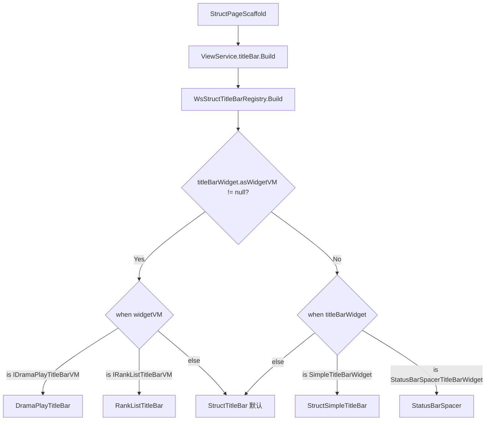

# Skill: Struct TitleBar 开发指南

## 目标
指导开发者在 Struct 品字形页面中新增自定义 TitleBar 组件，涵盖 VM 接口定义、Widget 创建、Compose 视图实现和注册流程。

---

## 架构概览

TitleBar 是 Struct 品字形页面的顶部导航条，位于 `StructPageWidget.titleBar` 槽位。框架通过 `WsStructTitleBarRegistry` 根据 **VM 类型** 或 **Widget 类型** 分发到对应的 Composable 渲染。

### 分层架构

```
wsCore（契约层）
├── vm/IXxxTitleBarVM.kt              # TitleBar VM 接口（继承 IStructWidgetVM）

业务模块（逻辑实现层，如 wsDrama / wsUser / wsFeeds）
├── vm/XxxTitleBarVM.kt               # VM 实现类
├── widget/XxxTitleBarWidget.kt       # Widget 类（继承 CommonTitleBarWidget，override asWidgetVM）

wsCompose（UI 层）
├── xxx/view/XxxTitleBar.kt           # Compose 视图（@Composable 函数，入参为 VM 接口）
├── setup/WsStructTitleBarRegistry.kt # 注册分发（when 分支添加 VM 类型映射）
```

### 运行时分发流程



---

## 两种开发模式

### 模式一：VM 模式（推荐）

适用于需要动态状态管理的自定义 TitleBar（如标题随滑动变化、背景色随 Tab 切换等）。

**优势**：UI 与逻辑解耦，VM 接口定义在 wsCore 契约层，Compose 视图只依赖接口，便于测试和复用。

### 模式二：Widget 类型模式

适用于纯静态配置的 TitleBar（如只需要标题 + 返回按钮，无动态状态）。

**优势**：无需定义 VM 接口和实现，直接使用 `CommonTitleBarWidget` 或其子类的工厂方法即可。

---

## VM 模式开发步骤（推荐）

### Step 1：定义 VM 接口（wsCore）

在 `wsCore` 模块中定义 TitleBar VM 接口，继承 `IStructWidgetVM`。

**文件位置**：`wsCore/src/commonMain/kotlin/com/tencent/weishi/core/{业务域}/vm/IXxxTitleBarVM.kt`

```kotlin
package com.tencent.weishi.core.{业务域}.vm

import com.tencent.news.core.page.model.IStructWidgetVM
import kotlinx.coroutines.flow.StateFlow

/**
 * {页面名} TitleBar VM 接口
 * {简要说明 TitleBar 的职责}
 */
interface IXxxTitleBarVM : IStructWidgetVM {
    /** 标题文字 */
    val title: StateFlow<String>

    // 根据业务需要添加其他状态和方法
    // val bgColor: StateFlow<Long>
    // fun onClickAction()
}
```

**设计要点**：
- 必须继承 `IStructWidgetVM`，这是 `asWidgetVM` 属性的类型约束
- 使用 `StateFlow` 暴露可观察状态，Compose 视图通过 `collectAsState()` 订阅
- 方法命名体现动作语义，如 `onClickSpeed()`、`updateTitle()`

**参考示例**：
- 简单场景：`IDramaPlayTitleBarVM`（集数标题 + 倍速按钮）
- 复杂场景：`IRankListTitleBarVM`（标题 + Tab 索引 + 动态背景色 + buildWidget）

---

### Step 2：实现 VM（业务模块）

在业务模块中实现 VM 接口。

**文件位置**：`ws{业务模块}/src/commonMain/kotlin/com/tencent/weishi/core/{业务域}/vm/XxxTitleBarVM.kt`

```kotlin
package com.tencent.weishi.core.{业务域}.vm

import kotlinx.coroutines.flow.MutableStateFlow
import kotlinx.coroutines.flow.StateFlow

/**
 * {页面名} TitleBar VM 实现
 */
class XxxTitleBarVM(
    initialTitle: String = "",
) : IXxxTitleBarVM {

    private val _title = MutableStateFlow(initialTitle)
    override val title: StateFlow<String> = _title

    // 实现接口方法
    fun updateTitle(newTitle: String) {
        _title.value = newTitle
    }
}
```

**参考示例**：
- `DramaPlayTitleBarVM`：简单状态管理
- `RankListTitleBarVM`：带 Tab 联动的复杂状态

---

### Step 3：创建 Widget（业务模块）

继承 `CommonTitleBarWidget`，通过 `asWidgetVM` 绑定 VM 实例。

**文件位置**：`ws{业务模块}/src/commonMain/kotlin/com/tencent/weishi/core/{业务域}/widget/XxxTitleBarWidget.kt`

```kotlin
package com.tencent.weishi.core.{业务域}.widget

import com.tencent.news.core.extension.IKmmKeep
import com.tencent.news.core.page.model.CommonTitleBarWidget
import com.tencent.weishi.core.{业务域}.vm.IXxxTitleBarVM
import com.tencent.weishi.core.{业务域}.vm.XxxTitleBarVM

/**
 * {页面名} TitleBar Widget
 * 继承 CommonTitleBarWidget，通过 asWidgetVM 绑定 IXxxTitleBarVM
 * 在 WsStructTitleBarRegistry 中通过 VM 路径分发渲染
 */
class XxxTitleBarWidget(
    title: String = "",
) : CommonTitleBarWidget(), IKmmKeep {

    override val asWidgetVM: IXxxTitleBarVM = XxxTitleBarVM(initialTitle = title)

    companion object {
        fun create(title: String = ""): XxxTitleBarWidget {
            return XxxTitleBarWidget(title).apply {
                // 配置 TitleBarWidgetUI
                ui.isHideBottomLine = true
                ui.isBarIconDark = true       // true=黑色图标（浅色背景），false=白色图标（深色背景）
                ui.alwaysShowCenter = true     // 始终展示中间标题
                ui.alwaysTransparentBg = false // 是否始终透明背景
                ui.hideBackBtn = false         // 是否隐藏返回按钮
                // ui.fixTitleBarAboveContent = true  // 固定在顶部，不随滑动变化
            }
        }
    }
}
```

**关键点**：
- 必须继承 `IKmmKeep`，防止混淆导致反序列化失败
- `asWidgetVM` 是分发的核心，Registry 通过它的类型做 `when` 匹配
- `companion object.create()` 工厂方法封装 UI 配置，供 DataRepo 调用

---

### Step 4：编写 Compose 视图（wsCompose）

创建 `@Composable` 函数，入参为 VM 接口类型。

**文件位置**：`wsCompose/src/commonMain/kotlin/com/tencent/weishi/compose/{业务域}/view/XxxTitleBar.kt`

```kotlin
package com.tencent.weishi.compose.{业务域}.view

import androidx.compose.runtime.Composable
import androidx.compose.runtime.collectAsState
import androidx.compose.runtime.getValue
import com.tencent.kuikly.compose.foundation.layout.Arrangement
import com.tencent.kuikly.compose.foundation.layout.Column
import com.tencent.kuikly.compose.foundation.layout.Row
import com.tencent.kuikly.compose.foundation.layout.fillMaxWidth
import com.tencent.kuikly.compose.foundation.layout.height
import com.tencent.kuikly.compose.foundation.layout.padding
import com.tencent.kuikly.compose.ui.Alignment
import com.tencent.kuikly.compose.ui.Modifier
import com.tencent.kuikly.compose.ui.text.font.FontWeight
import com.tencent.kuikly.compose.ui.unit.dp
import com.tencent.kuikly.compose.ui.unit.sp
import com.tencent.news.core.compose.scaffold.theme.QNTheme
import com.tencent.news.core.compose.scaffold.widgetbtns.BackBtn
import com.tencent.news.core.compose.scaffold.widgetbtns.DefaultTitlebarAreaHeight
import com.tencent.news.core.compose.scaffold.widgetbtns.StatusBarSpacer
import com.tencent.news.core.compose.scaffold.widgetbtns.TitleBarHeight
import com.tencent.news.core.compose.view.QnText
import com.tencent.weishi.core.{业务域}.vm.IXxxTitleBarVM

/**
 * {页面名} TitleBar
 * - 左侧：返回按钮 + 标题
 * - 右侧：操作按钮（如有）
 */
@Composable
internal fun XxxTitleBar(vm: IXxxTitleBarVM) {
    Column(
        modifier = Modifier.fillMaxWidth().height(DefaultTitlebarAreaHeight)
    ) {
        // 状态栏占位
        StatusBarSpacer()

        // TitleBar 内容区
        Row(
            modifier = Modifier
                .fillMaxWidth()
                .height(TitleBarHeight)
                .padding(start = 13.dp, end = 16.dp),
            verticalAlignment = Alignment.CenterVertically,
            horizontalArrangement = Arrangement.SpaceBetween
        ) {
            // 左侧
            Row(
                verticalAlignment = Alignment.CenterVertically,
                horizontalArrangement = Arrangement.spacedBy(4.dp)
            ) {
                BackBtn()

                val titleText by vm.title.collectAsState()
                QnText(
                    text = titleText,
                    fontSize = 16.sp,
                    lineHeight = 22f,
                    color = QNTheme.colorScheme.t1,
                    fontWeight = FontWeight.W500,
                    maxLines = 1
                )
            }

            // 右侧操作区（根据需要添加）
        }
    }
}
```

**布局要点**：
- 外层 `Column` 高度使用 `DefaultTitlebarAreaHeight`（= 状态栏 + TitleBar 高度）
- 第一个子元素是 `StatusBarSpacer()`，撑开状态栏区域
- 内容区高度使用 `TitleBarHeight`
- 返回按钮使用 `BackBtn()`（可传 `color` 参数控制颜色）
- 文本使用 `QnText`，`fontSize` 用 `.sp`，`lineHeight` 用浮点数
- 颜色使用 `QNTheme.colorScheme.xxx` 或 `QnColor.xxx`

---

### Step 5：注册到 WsStructTitleBarRegistry（wsCompose）

在 `WsStructTitleBarRegistry` 的 `when (widgetVM)` 分支中添加映射。

**文件位置**：`wsCompose/src/commonMain/kotlin/com/tencent/weishi/compose/setup/WsStructTitleBarRegistry.kt`

```kotlin
when (widgetVM) {
    // 已有注册...
    is IDramaPlayTitleBarVM -> DramaPlayTitleBar(widgetVM)
    is ICommentPanelTitleBarVM -> CommentPanelTitleBar(widgetVM)
    is IRankListTitleBarVM -> RankListTitleBar(widgetVM)
    // 新增：
    is IXxxTitleBarVM -> XxxTitleBar(widgetVM)
    else -> StructTitleBar(titleBarWidget)
}
```

---

### Step 6：在 DataRepo 或 PageWidget 中使用

在 DataRepo 的 `buildPageWithManual {}` 中设置 TitleBar：

```kotlin
override fun createLocalResetPageWidget(): StructPageWidget {
    return StructPageWidget().buildPageWithManual {
        titleBar = XxxTitleBarWidget.create(title = "页面标题")
        // ... 其他槽位
    }
}
```

或在 PageWidget 构造时直接设置：

```kotlin
class XxxPageWidget : StructPageWidget2(
    StructPageConfig(
        dataRepo = XxxDataRepo(),
        defaultChannelInfo = IChannelInfo.new(),
        fixTitleBarAboveContent = true,  // 根据需要配置
    )
)
```

---

## Widget 类型模式开发步骤

适用于无需动态状态的简单 TitleBar。

### 方式 A：直接使用内置 Widget

框架已提供以下内置 Widget，无需额外开发：

| Widget | 说明 | 使用场景 |
|--------|------|----------|
| `CommonTitleBarWidget.create(title)` | 基础 TitleBar，左中右三区域 | 通用页面 |
| `CommonTitleBarWidget.createFixTopStyle(title)` | 固定顶部样式 | 设置页、表单页 |
| `SimpleTitleBarWidget.create(title)` | 简单标题 + 返回按钮 | 工具类页面 |
| `StatusBarSpacerTitleBarWidget()` | 仅撑开状态栏高度 | 全屏页面 |

```kotlin
// 在 DataRepo 中使用
titleBar = SimpleTitleBarWidget.create(title = "设置")

// 或
titleBar = CommonTitleBarWidget.createFixTopStyle(title = "我的页面")
```

### 方式 B：自定义 Widget 子类（无 VM）

如果需要自定义按钮组合但不需要动态状态：

```kotlin
class XxxTitleBarWidget : CommonTitleBarWidget(), IKmmKeep {
    companion object {
        fun create(title: String): XxxTitleBarWidget {
            return XxxTitleBarWidget().apply {
                ui.isHideBottomLine = true
                ui.isBarIconDark = true

                leftBtns = mutableListOf(TitleBtnWidget.create(title))
                actionBtns = mutableListOf(ShareBtnWidget(), SettingBtnWidget())

                data = TitleBarWidgetData().apply {
                    this.title = title
                }
            }
        }
    }
}
```

然后在 `WsStructTitleBarRegistry` 的 `when (titleBarWidget)` 分支中注册：

```kotlin
when (titleBarWidget) {
    is XxxTitleBarWidget -> XxxTitleBar(titleBarWidget)
    // ...
}
```

---

## TitleBarWidgetUI 配置速查

`TitleBarWidgetUI` 控制 TitleBar 的视觉和行为：

| 属性 | 类型 | 默认值 | 说明 |
|------|------|--------|------|
| `isBarIconDark` | Boolean | false | true=黑色图标（浅色背景页面），false=白色图标（深色背景页面） |
| `alwaysShowCenter` | Boolean | false | true=无论 Header 折叠展开，始终展示 center_btns |
| `alwaysTransparentBg` | Boolean | false | true=背景始终透明（覆盖在视频等内容上方时使用） |
| `isHideBottomLine` | Boolean | false | true=隐藏底部分割线 |
| `hideBackBtn` | Boolean | false | true=隐藏返回按钮（由自定义 TitleBar 自行渲染） |
| `fixTitleBarAboveContent` | Boolean | false | true=TitleBar 固定在页面上方，不随滑动变化 |

---

## 与 Header 折叠联动

当 TitleBar 需要根据 Header 折叠状态改变样式时（如背景色渐变、标题显隐），可通过以下方式获取折叠状态：

```kotlin
@Composable
fun XxxTitleBar(vm: IXxxTitleBarVM) {
    // 获取 Header 折叠状态
    val isHeaderCollapsed by LocalHeaderCollapseStatus.current

    // 根据折叠状态切换背景色
    val bgColor = if (isHeaderCollapsed) QNTheme.colorScheme.bgPage else Color.Transparent

    // ...
}
```

**复用默认 TitleBar 渲染**：如果折叠后的样式与默认 TitleBar 一致，可以构造临时 Widget 交给 `ThemedStructTitleBar` 渲染：

```kotlin
if (isHeaderCollapsed) {
    val widget = vm.buildWidget(titleText)
    TitleBarTheme {
        val customTheme = LocalTitleBarTheme.current.copy(
            titleBarBgColor = Color.Transparent,
            isHeaderCollapsed = true,
        )
        CompositionLocalProvider(LocalTitleBarTheme provides customTheme) {
            widget.ui.alwaysTransparentBg = true
            ThemedStructTitleBar(widget, height, isHeaderCollapsed = true)
        }
    }
}
```

参考：`RankListTitleBar.kt`、`MineProfileTitleBar.kt`

---

## 常用工具组件

编写 TitleBar Compose 视图时常用的工具组件：

| 组件 | 来源 | 说明 |
|------|------|------|
| `StatusBarSpacer()` | `qnView` | 撑开状态栏高度的占位 |
| `BackBtn(color)` | `qnView` | 返回按钮，可指定颜色 |
| `TitleBarHeight` | `qnView` | TitleBar 内容区高度常量 |
| `DefaultTitlebarAreaHeight` | `qnView` | TitleBar 区域总高度（含状态栏） |
| `statusBarHeight()` | `qnView` | 获取状态栏高度 |
| `LocalHeaderCollapseStatus` | `qnView` | Header 折叠状态 CompositionLocal |
| `TitleBarTheme {}` | `qnView` | TitleBar 主题包裹器 |
| `ThemedStructTitleBar()` | `qnView` | 默认 TitleBar 渲染（左中右三区域） |
| `QnText` | `qnView` | 文本组件 |
| `QnIconFont` | `qnView` | 字体图标组件 |

---

## 完整示例：短剧二级页 TitleBar

以下是一个完整的 VM 模式 TitleBar 开发示例，展示从接口定义到注册的全流程。

### 1. VM 接口（wsCore）

```kotlin
// wsCore/.../drama/play/vm/IDramaPlayTitleBarVM.kt
interface IDramaPlayTitleBarVM : IStructWidgetVM {
    val episodeTitle: StateFlow<String>
    fun updateSelection(episode: Int)
    fun onClickSpeed()
}
```

### 2. VM 实现（wsDrama）

```kotlin
// wsDrama/.../drama/play/vm/DramaPlayTitleBarVM.kt
class DramaPlayTitleBarVM : IDramaPlayTitleBarVM {
    override val episodeTitle = MutableStateFlow("第1集")
    override fun updateSelection(episode: Int) {
        episodeTitle.update { "第${episode}集" }
    }
    override fun onClickSpeed() { debugToast("【待开发】切换倍速") }
}
```

### 3. Widget（wsDrama）

```kotlin
// wsDrama/.../drama/play/widget/DramaPlayTitleBarWidget.kt
class DramaPlayTitleBarWidget : CommonTitleBarWidget(), IKmmKeep {
    override val asWidgetVM: IDramaPlayTitleBarVM by lazy { DramaPlayTitleBarVM() }
    companion object {
        fun create() = DramaPlayTitleBarWidget().apply {
            ui.isHideBottomLine = true
            ui.alwaysTransparentBg = true
            ui.hideBackBtn = true
            ui.isBarIconDark = false
        }
    }
}
```

### 4. Compose 视图（wsCompose）

```kotlin
// wsCompose/.../drama/play/view/DramaPlayTitleBar.kt
@Composable
internal fun DramaPlayTitleBar(vm: IDramaPlayTitleBarVM) {
    Column(modifier = Modifier.fillMaxWidth().height(DefaultTitlebarAreaHeight)) {
        StatusBarSpacer()
        Row(
            modifier = Modifier.fillMaxWidth().height(TitleBarHeight)
                .padding(start = 13.dp, end = 16.dp),
            verticalAlignment = Alignment.CenterVertically,
            horizontalArrangement = Arrangement.SpaceBetween
        ) {
            Row(verticalAlignment = Alignment.CenterVertically,
                horizontalArrangement = Arrangement.spacedBy(4.dp)) {
                BackBtn(color = Color.White)
                val titleText by vm.episodeTitle.collectAsState()
                QnText(text = titleText, fontSize = 16.sp, lineHeight = 22f,
                    color = Color.White, fontWeight = FontWeight.W500, maxLines = 1)
            }
            Row(modifier = Modifier.preciseClickable { vm.onClickSpeed() },
                verticalAlignment = Alignment.CenterVertically,
                horizontalArrangement = Arrangement.spacedBy(2.dp)) {
                QnIconFont(modifier = Modifier.size(18.dp), name = IconFont.TIMING_REGULAR,
                    textStyle = TextStyle(color = Color.White, fontSize = 18.sp))
                QnText(text = "倍速", fontSize = 13.sp, lineHeight = 18f,
                    color = Color.White, fontWeight = FontWeight.W400, maxLines = 1)
            }
        }
    }
}
```
preciseClickable 需要 import com.tencent.news.core.compose.view.extension.preciseClickable

### 5. 注册（wsCompose）

```kotlin
// WsStructTitleBarRegistry.kt 中添加：
is IDramaPlayTitleBarVM -> DramaPlayTitleBar(widgetVM)
```

---

## Checklist

开发完成后，对照以下清单检查：

- [ ] VM 接口定义在 `wsCore`，继承 `IStructWidgetVM`
- [ ] VM 实现在业务模块（wsDrama / wsUser / wsFeeds 等）
- [ ] Widget 继承 `CommonTitleBarWidget` 和 `IKmmKeep`
- [ ] Widget 的 `asWidgetVM` 返回正确的 VM 接口类型
- [ ] Widget 的 `companion object.create()` 工厂方法配置了正确的 `TitleBarWidgetUI`
- [ ] Compose 视图入参为 VM 接口类型（非实现类）
- [ ] Compose 视图使用 `StatusBarSpacer()` + `TitleBarHeight` 正确布局
- [ ] Compose 视图使用 Kuikly 包导入（`com.tencent.kuikly.compose.*`），非 `androidx.compose.*`
- [ ] 文本使用 `QnText`，`fontSize` 用 `.sp`，`lineHeight` 用浮点数
- [ ] 颜色使用 `QNTheme.colorScheme.xxx` 或 `QnColor.xxx`
- [ ] 已在 `WsStructTitleBarRegistry` 中注册 VM 类型映射
- [ ] DataRepo 或 PageWidget 中正确创建并赋值 TitleBar Widget
