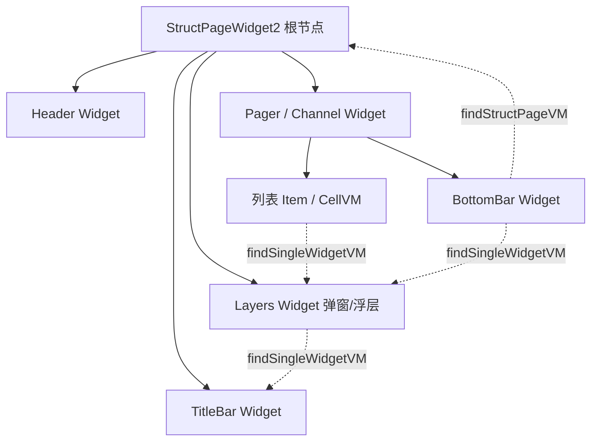

# Skill: Struct 组件间通信开发指南

## 目标

指导开发者在 Struct 品字形架构中实现组件间通信，涵盖核心 API 使用、典型场景示例和最佳实践。

---

## 核心原则

在 Struct 架构中，页面由多个 Widget 组成（TitleBar、Header、Cell、Dialog、BottomBar 等），
组件之间的通信遵循以下原则：

1. **不通过 PageVM 中转**：组件间通信使用 `findSingleWidgetVM<T>()` 直接查找目标组件的 VM
2. **不直接持有引用**：组件之间不互相持有引用，通过 Widget 树动态查找
3. **PageVM 保持轻量**：PageVM 不承担组件间通信的中转职责
4. **安全调用**：查找结果可能为 null（目标组件未挂载时），需要安全调用

---

## 架构概览

### Widget 树结构



### 通信方向

| 发起方 | 目标方 | 推荐 API |
|--------|--------|----------|
| CellVM（列表卡片） | DialogVM（弹窗） | `item.findStructPageWidget()?.findSingleWidgetVM<T>()` |
| CellVM（列表卡片） | PageVM（页面） | `item.findStructPageVM()` |
| Widget VM | 其他 Widget VM | `widget.findSingleWidgetVM<T>()` |
| Widget VM | PageVM | `widget.findStructPageVM()` |
| DataRepo | Widget VM | `pageWidget?.findSingleWidgetVM<T>()` |
| BottomBar | PageVM + Dialog | `widget.findStructPageVM()` + `widget.findSingleWidgetVM<T>()` |

---

## 核心 API

### 1. `findSingleWidgetVM<T>()`：查找目标组件的 VM

最常用的组件间通信 API，在 Widget 树中查找指定类型的 VM。

#### 从 StructWidget 调用

```kotlin
import com.tencent.news.core.page.model.StructWidgetEx.findSingleWidgetVM

// API 签名
inline fun <reified T : IStructWidgetVM> StructWidget.findSingleWidgetVM(
    noinline condition: WidgetCondition? = null,
): T?
```

**查找逻辑**：
1. 先在当前 pageWidget 树内查找
2. 如果当前是子 tab（`StructPageWidget2` 有 `parentRootWidget`），再从父页面树查找
3. 返回第一个匹配类型的 VM，或 null

#### 从 ILogicContextHolder（列表 Item）调用

```kotlin
import com.tencent.news.core.page.extension.StructPageWidgetEx.findSingleWidgetVM

// API 签名（ILogicContextHolder 扩展）
inline fun <reified T : IStructWidgetVM> ILogicContextHolder.findSingleWidgetVM(
    noinline condition: WidgetCondition? = null,
): T?
```

**说明**：`ILogicContextHolder` 是列表 Item（如 `WsVMItem`）实现的接口，
内部通过 `findStructPageWidget()` 获取所属的 pageWidget，再调用 `findSingleWidgetVM`。

#### 别名 API

```kotlin
// findWidgetVM 是 findSingleWidgetVM 的别名
inline fun <reified T : IStructWidgetVM> StructWidget.findWidgetVM(
    noinline condition: WidgetCondition? = null,
): T? = findSingleWidgetVM(condition)
```

---

### 2. `findStructPageVM()`：获取所属页面的 PageVM

#### 从 StructWidget 调用

```kotlin
import com.tencent.news.core.compose.scaffold.findStructPageVM

// API 签名
fun StructWidget?.findStructPageVM(): IStructPageViewModel?
```

#### 从 ILogicContextHolder（列表 Item）调用

```kotlin
import com.tencent.news.core.page.extension.StructPageWidgetEx.findStructPageVM

// API 签名
fun ILogicContextHolder?.findStructPageVM(): IStructPageViewModel?
```

#### 带类型转换的版本

```kotlin
import com.tencent.news.core.compose.scaffold.findPageVM

// 直接转换为具体的 PageVM 类型
inline fun <reified T : IStructPageViewModel> StructWidget?.findPageVM(): T?
```

---

### 3. `findStructPageWidget()`：获取所属的 PageWidget

#### 从 ILogicContextHolder（列表 Item）调用

```kotlin
import com.tencent.news.core.page.extension.StructPageWidgetEx.findStructPageWidget

// API 签名
fun ILogicContextHolder?.findStructPageWidget(): StructPageWidget2?
```

---

### 4. `findNextVMItem()`：查找相邻列表项

```kotlin
import com.tencent.news.core.page.extension.StructPageWidgetEx.findNextVMItem

// 查找当前 item 的下一个（或偏移 N 个）item
fun ILogicContextHolder?.findNextVMItem(offset: Int = 1): IFeedsVMItemStub?
```

---

## 典型使用场景

### 场景 1：CellVM 中触发弹窗

列表卡片点击某个按钮，触发页面级弹窗。

```kotlin
// 列表卡片点击'留言'，触发输入弹窗
internal class SponsorCommentSelectCardVM(val item: IListItem) : ISponsorCommentSelectCardVM {

    override fun onClickInputText() {
        // 通过 findSingleWidgetVM 找到弹窗 VM 并触发
        item.findStructPageWidget()
            ?.findSingleWidgetVM<ISponsorTextInputDialogVM>()
            ?.showDialog()
    }
}
```

**要点**：
- `item` 实现了 `ILogicContextHolder`，可以通过 `findStructPageWidget()` 获取 pageWidget
- 然后在 pageWidget 树中查找目标弹窗 VM
- 弹窗 VM 通常挂载在 `layers` 中

---

### 场景 2：BottomBar 中访问 PageVM 和 Dialog

底部栏需要同时访问 PageVM 的状态和触发弹窗。

```kotlin
// 底部栏点击支付，根据状态决定拉起支付或隐私弹窗
class SponsorBottomBarWidget : BottomBarWidget() {

    override val asWidgetVM: ISponsorBottomBarVM by lazy { VM(this) }

    private class VM(val widget: StructWidget) : ISponsorBottomBarVM {

        // 获取 PageVM
        private val pageVM get() = widget.findStructPageVM() as? ISponsorPageViewModel

        override fun onPayClick() {
            val pageVM = this.pageVM ?: return
            if (pageVM.isAgreePrivacy.value) {
                pageVM.payment()
            } else {
                // 通过 findSingleWidgetVM 找到隐私弹窗并展示
                widget.findSingleWidgetVM<ISponsorPrivacyAgreementDialogVM>()?.showDialog()
            }
        }
    }
}
```

**要点**：
- Widget 内部的 VM 通过 `widget` 引用进行查找
- 可以同时访问 PageVM（`findStructPageVM()`）和其他组件 VM（`findSingleWidgetVM<T>()`）
- 使用 `as?` 安全转换为具体的 PageVM 类型

---

### 场景 3：DataRepo 中更新其他组件状态

数据加载完成后，需要通知其他组件更新状态。

```kotlin
// 数据加载完成后，更新导航栏的未读数
pageWidget?.findSingleWidgetVM<IUserCenterNavBarVM>()?.updateMsgUnreadCount(messageCount)
```

**要点**：
- DataRepo 持有 `pageWidget` 引用，可以直接调用 `findSingleWidgetVM`
- 适用于数据加载后需要联动更新其他组件的场景

---

### 场景 4：CellVM 中获取 PageVM 数据

列表卡片需要访问页面级的数据或方法。

```kotlin
class AIQACellVM(val item: IListItem) : IAIQACellVM {

    override fun onRefClick(refs: List<String>) {
        // 通过 findStructPageVM 获取页面 VM，调用页面级方法
        val pageVM = item.findStructPageVM() as? IAIQAPageViewModel ?: return
        val refMap = pageVM.getRefArticleIndexMap(refs)
        // 使用 refMap 进行后续操作...
    }
}
```

**要点**：
- CellVM 通过 `item.findStructPageVM()` 获取 PageVM
- 使用 `as?` 安全转换为具体的 PageVM 接口类型
- 这是 PageVM 接口中保留页面级辅助方法的典型消费场景

---

### 场景 5：子 Tab 中查找父页面组件

在多 Tab 嵌套页面中，子 Tab 内的组件需要访问父页面的组件。

```kotlin
class SubTabCellVM(val item: IListItem) : ISubTabCellVM {

    override fun onShareClick() {
        // findSingleWidgetVM 会自动向上查找 parentRootWidget
        // 即使弹窗挂载在父页面的 layers 中，也能找到
        item.findStructPageWidget()
            ?.findSingleWidgetVM<IShareDialogVM>()
            ?.showShareDialog(shareData)
    }
}
```

**要点**：
- `findSingleWidgetVM` 内部已处理多 Tab 嵌套场景
- 先在当前子 Tab 的 pageWidget 树中查找
- 找不到时自动向上查找 `parentRootWidget`（父页面）树

---

### 场景 6：查找相邻列表项

需要获取当前卡片的上一个或下一个卡片信息。

```kotlin
class VideoCellVM(val item: IListItem) : IVideoCellVM {

    override fun onSwipeUp() {
        // 查找下一个 item
        val nextItem = item.findNextVMItem(offset = 1)
        val nextVM = (nextItem as? IFeedsVMItemStub)?.asItemVM as? IVideoCellVM
        nextVM?.let { preloadVideo(it.videoUrl) }
    }
}
```

---

## API 速查

| API | 来源 | 调用方 | 说明 |
|-----|------|--------|------|
| `StructWidget.findSingleWidgetVM<T>()` | `StructWidgetEx` | Widget | 在 Widget 树中查找指定类型的 VM |
| `StructWidget.findWidgetVM<T>()` | `StructWidgetEx` | Widget | `findSingleWidgetVM` 的别名 |
| `StructWidget?.findStructPageVM()` | `StructPageViewModelEx` | Widget | 获取所属页面的 PageVM |
| `StructWidget?.findPageVM<T>()` | `StructPageViewModelEx` | Widget | 获取并转换为具体 PageVM 类型 |
| `ILogicContextHolder.findSingleWidgetVM<T>()` | `StructPageWidgetEx` | 列表 Item | 从列表项查找目标组件 VM |
| `ILogicContextHolder?.findStructPageWidget()` | `StructPageWidgetEx` | 列表 Item | 获取所属的 PageWidget |
| `ILogicContextHolder?.findStructPageVM()` | `StructPageWidgetEx` | 列表 Item | 获取所属页面的 PageVM |
| `ILogicContextHolder?.findNextVMItem(offset)` | `StructPageWidgetEx` | 列表 Item | 查找相邻列表项 |
| `StructWidget.findAllDialogVM()` | `StructPageWidgetEx` | Widget | 查找所有弹窗 VM（含父页面） |

---

## 源码位置

| 文件 | 说明 |
|------|------|
| `qnFramework/.../page/model/StructWidget.kt` → `StructWidgetEx` | `findSingleWidgetVM`、`findWidgetVM` 核心实现 |
| `qnFramework/.../page/extension/StructPageWidgetEx.kt` | `ILogicContextHolder` 扩展（列表 Item 用） |
| `qnFramework/.../compose/scaffold/StructPageViewModelEx.kt` | `findStructPageVM`、`findPageVM` 实现 |

---

## 反模式清单

| ❌ 不要这样做 | ✅ 正确做法 |
|---|---|
| 组件间通过 PageVM 做中转（如 PageVM 持有所有子 VM 引用） | 使用 `findSingleWidgetVM<T>()` 直接查找 |
| 组件间直接持有对方引用（如构造函数注入其他 VM） | 通过 Widget 树动态查找，解耦组件 |
| 在 PageVM 中定义 `fun showDialog()`、`fun updateNavBar()` 等中转方法 | 发起方直接 `findSingleWidgetVM<IDialogVM>()?.showDialog()` |
| CellVM 通过回调 lambda 通知 PageVM 再转发给 Dialog | CellVM 直接 `item.findStructPageWidget()?.findSingleWidgetVM<T>()` |
| 在 Compose 侧通过 `LocalXxx` 传递 VM 引用给子组件 | 在逻辑层通过 Widget 树查找，不依赖 Compose 层传递 |

---

## 注意事项

1. **返回值可能为 null**：目标组件未挂载时返回 null，必须使用 `?.` 安全调用
2. **查找范围是整个 Widget 树**：可以跨层级查找（TitleBar、Header、Layers、列表等）
3. **多 Tab 自动向上查找**：子 Tab 内找不到时，会自动查找 `parentRootWidget`（父页面）
4. **性能考虑**：`findSingleWidgetVM` 是遍历查找，不要在高频调用路径（如 `onDraw`）中使用
5. **类型安全**：使用 `reified` 泛型 + `is` 类型检查，编译期保证类型安全
6. **import 注意**：
   - Widget 内使用：`import com.tencent.news.core.page.model.StructWidgetEx.findSingleWidgetVM`
   - 列表 Item 使用：`import com.tencent.news.core.page.extension.StructPageWidgetEx.findSingleWidgetVM`
   - 获取 PageVM：`import com.tencent.news.core.compose.scaffold.findStructPageVM`

---

## Checklist

- [ ] 组件间通信使用 `findSingleWidgetVM<T>()`，不通过 PageVM 中转
- [ ] 组件间不直接持有对方引用，通过 Widget 树动态查找
- [ ] 查找结果使用 `?.` 安全调用，处理目标组件未挂载的情况
- [ ] 正确选择 import 路径（Widget 内 vs 列表 Item）
- [ ] PageVM 中没有为组件间通信定义的中转方法
- [ ] 弹窗触发通过 `findSingleWidgetVM<IDialogVM>()?.showDialog()` 实现
- [ ] 多 Tab 场景下验证跨层级查找是否正常工作
