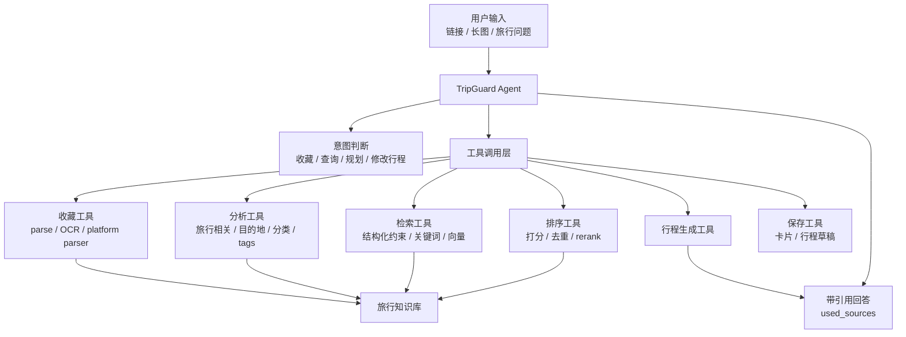

# TripGuard Agent 架构设计

## 背景

TripGuard 的长期目标不是只做一个“会聊天的旅行助手”，而是把用户收藏过的链接、分享文本、长图和平台内容沉淀成可检索、可引用、可持续扩展的个人旅行知识库。

如果把整个系统抽象成一个 Agent，它不应该是一个把所有事情都交给 LLM 的黑盒，而应该是一个旅行知识库编排层：

```text
Agent 负责决策和编排
后端工具负责确定性能力
知识库负责存储和检索
LLM 负责理解、归纳、生成
```

## 总体形态



Agent 的核心价值是判断当前应该调用哪些工具、工具结果是否足够、是否需要追问用户，以及最终答案是否满足“基于知识库、有引用、不编造”的约束。

## 知识库输入与 Canonical Entity

旅行知识库的输入不只来自用户端收藏。MVP 可以先以用户收藏为主，但完整架构需要同时支持两条输入线：

```text
用户收藏输入：链接 / 分享文本 / 长图 / 平台内容
合作方可信输入：地图 / 公众号 / 旅游局 / 官方渠道 / 合作方抓取
```

两条输入线最终都进入知识库，但不能直接把抓取结果当作最终知识。更稳的分层是：

```text
Raw Source Document
  -> Extracted Mention
  -> Canonical Knowledge Entity
  -> Entity Fact
  -> Retrieval Context
```

其中 `Canonical Knowledge Entity` 不是根分类，而是稳定身份层。它用来回答“这些不同来源说的是不是同一个对象或同一个知识主题”。`Destination Scope` 才是旅行知识库第一层确定边界，用来回答“这个知识和哪些国家、城市、区域有关”。

推荐原则：

```text
Destination 作为导航和检索入口
Entity 作为唯一知识对象
Relation 负责把 Entity 挂到一个或多个 Destination 下
Source Document 保留不同来源证据
Entity Fact 保存结构化、可版本化、可溯源的事实
```

因此，当一个知识同时属于多个目的地时，不复制多份实体，而是一个实体绑定多个目的地关系。比如“中国护照去日本旅游签证”同时挂到中国和日本，“东京到京都新干线”同时挂到东京和京都，但底层只有一个 `canonical_entity_id`。

详见 [Canonical Entity 演示文档](./tripguard-canonical-entity-demo.md)、[Canonical Entity 可视化演示页](./tripguard-canonical-entity-visual.html) 和 [后端架构可视化演示页](./tripguard-backend-architecture-visual.html)。

## Agent 不直接做所有事

不要让 Agent 自己完成网页抓取、OCR、数据库查询、排序、行程生成的全部逻辑。更稳的方式是把能力拆成可观测、可测试、可替换的工具。

推荐工具集合：

```text
collect_source(input)
parse_source(source_id)
analyze_travel_info(source_id)
search_knowledge(query_intent)
rank_candidates(candidates, preferences)
generate_itinerary(context, constraints)
save_itinerary(plan)
```

Agent 只负责做这些决策：

```text
当前用户要干什么？
需要调用哪些工具？
工具结果是否足够？
是否需要追问？
能不能生成答案？
答案有没有引用来源？
```

这样做的好处是系统可控。平台解析失败可以单独重试，检索质量差可以单独调参，模型生成不稳定也不会污染原始知识库。

## 核心循环

一次完整的 Agent 调用可以按下面的状态机执行：

```text
1. 理解用户输入
   - 是收藏链接、上传长图，还是询问行程？
   - 是新建行程，还是修改已有行程？
   - 是否缺少目的地、天数、人群、预算等必要信息？

2. 转成结构化任务
   - destination
   - days
   - people
   - categories
   - preferences
   - negative_preferences
   - required_sources

3. 调用工具
   - 收藏场景：collect_source -> parse_source -> analyze_travel_info -> save
   - 问答场景：search_knowledge -> rank_candidates -> generate_itinerary
   - 修改场景：读取已有行程 -> 检索补充资料 -> 重新生成局部内容

4. 判断资料是否足够
   - 足够：生成带引用的推荐
   - 不足：放宽检索条件，或追问用户，或说明知识库资料不足

5. 输出结果
   - 推荐行程
   - 推荐理由
   - used_sources
   - 可保存的行程草稿
```

## 检索工具设计

旅行知识库的检索不能只靠 embedding，也不能只靠结构化字段。推荐把检索工具设计成混合检索：

```text
候选召回 = hard filter + soft constraint + 关键词召回 + 向量召回 + exact match
```

其中：

- hard filter：有效数据、旅行相关、当前用户可访问、明确排除项。
- soft constraint：目的地、分类、tags、人群、预算、季节等可放宽条件。
- 关键词召回：店名、地点名、菜名、景点名、商圈名等精确词。
- 向量召回：语义相近但表达不一致的内容。
- exact match：标题、地点名、原始链接、source_id 等强匹配。

当第一层结构化条件没命中时，后续链路不应该直接停止，而应该进入放宽策略：

```text
1. 先保留 hard filter。
2. destination 从细粒度地点放宽到城市。
3. category 从强过滤改成排序加权。
4. tags 从必须命中改成加分项。
5. 合并关键词召回和向量召回结果。
6. 如果仍然没有候选，再返回资料不足。
```

排序由检索系统和后端规则先完成，LLM 只适合在小候选集上做精排：

```text
score =
  text_score
  + vector_score
  + destination_boost
  + category_boost
  + tag_boost
  + recency_boost
  - negative_preference_penalty
  - duplicate_source_penalty
```

## Tool Contract 草案

### collect_source

输入：

```json
{
  "input_type": "url",
  "content": "https://example.com/note",
  "source_platform": "xhs"
}
```

输出：

```json
{
  "source_id": "src_001",
  "status": "pending_parse"
}
```

### analyze_travel_info

输入：

```json
{
  "source_id": "src_001",
  "title": "东京表参道甜品店",
  "body_text": "这家店在表参道附近..."
}
```

输出：

```json
{
  "is_travel_related": true,
  "destination": "东京",
  "category": "eat",
  "location_name": "表参道",
  "normalized_tags": ["甜品", "拍照好看", "下午茶"],
  "confidence": 0.88
}
```

### search_knowledge

输入：

```json
{
  "destination": "东京",
  "days": 3,
  "categories": ["eat", "play"],
  "preferences": ["甜品", "拍照好看"],
  "negative_preferences": ["排队太久"],
  "top_k": 20
}
```

输出：

```json
{
  "candidates": [
    {
      "source_id": "src_001",
      "chunk_id": "chk_001_02",
      "title": "东京表参道甜品店",
      "chunk_text": "这家店在表参道附近，很适合下午茶...",
      "url": "https://example.com/note",
      "score": 0.86,
      "match_reasons": ["destination", "tag:甜品", "keyword:表参道"]
    }
  ],
  "relaxed_constraints": ["tags"]
}
```

### generate_itinerary

输入：

```json
{
  "query": "东京三天，想吃甜品和拍照",
  "constraints": {
    "destination": "东京",
    "days": 3,
    "preferences": ["甜品", "拍照好看"]
  },
  "context": [
    {
      "source_id": "src_001",
      "chunk_id": "chk_001_02",
      "title": "东京表参道甜品店",
      "chunk_text": "这家店在表参道附近，很适合下午茶...",
      "url": "https://example.com/note"
    }
  ]
}
```

输出：

```json
{
  "answer": "第一天下午可以安排表参道甜品和拍照路线...",
  "used_sources": [
    {
      "source_id": "src_001",
      "chunk_ids": ["chk_001_02"],
      "url": "https://example.com/note"
    }
  ],
  "confidence": 0.78
}
```

## Agent Prompt 约束

MVP 阶段的 Agent prompt 不需要追求复杂自治，先强调边界：

```text
你是 TripGuard 旅行知识库 Agent。
你只能基于工具返回的收藏资料回答。
如果资料不足，要明确说明资料不足，不要编造。
每个推荐点都必须关联 used_sources。
优先使用用户收藏过的资料。
当用户问题缺少目的地、天数或核心偏好时，先追问，不要直接生成完整行程。
```

## MVP 实现建议

第一版 Agent 可以很薄，只暴露一个接口：

```text
POST /agent/chat
```

第一阶段只做三件事：

```text
1. 判断用户是不是在问旅行行程。
2. 从已入库资料里检索相关卡片和正文 chunk。
3. 基于检索结果生成带 used_sources 的行程建议。
```

暂时不做：

- 自主联网补资料。
- 自动购买、预约、下单。
- 多 Agent 协作。
- 长期任务调度。
- 完整规划器和日历同步。

## 后续演进

等 MVP 跑通后，再把 Agent 拆成更清晰的专用能力：

- 收藏 Agent：自动解析、判断旅行相关、入库。
- 检索 Agent：决定如何放宽条件、如何组合关键词和向量。
- 规划 Agent：多轮询问行程、补充偏好、生成草稿。
- 校验 Agent：检查答案是否都有来源、是否编造。
- 任务 Agent：后台重试解析失败的平台内容。

这些 Agent 不一定要变成独立服务。更现实的做法是先用同一个后端服务承载不同的 prompt、tool set 和状态机，等边界稳定后再拆服务。

## 设计原则

1. Agent 是编排层，不是所有能力的实现层。
2. LLM 不直接读全库，必须通过检索工具拿候选资料。
3. 所有推荐都必须带 `used_sources`。
4. 结构化字段要用于约束和加权，但软条件不能把召回链路卡死。
5. 工具结果要可观测，便于调试解析失败、检索失败和生成失败。
6. MVP 先做工具调用型 Agent，不做全自动万能 Agent。
