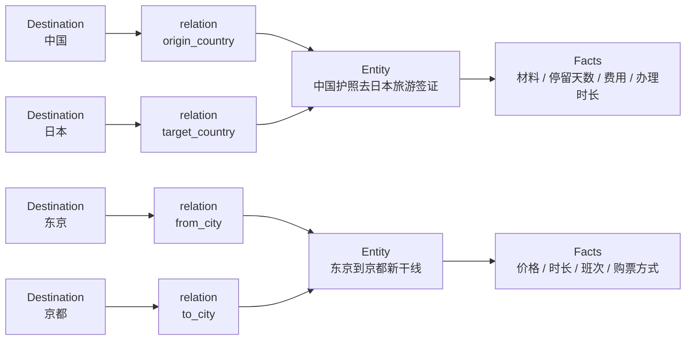
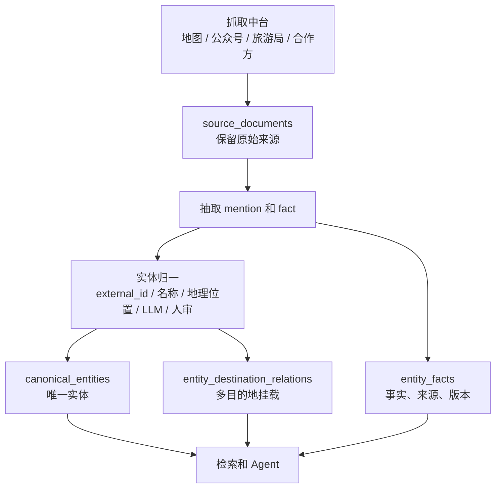

# TripGuard Canonical Entity 演示

可视化演示页：[TripGuard Canonical Entity Visual](./tripguard-canonical-entity-visual.html)

## 核心结论

旅行知识库可以把国家、城市、区域作为第一层确定边界，但不要把所有知识做成严格的单父级目录树。

更合适的模型是：

```text
一个知识实体，一个 canonical_entity_id
一个实体可以挂到多个 destination scope
每个挂载关系都要说明语义
不同来源不合并，作为证据保留
结构化事实挂在实体下面，并记录来源和版本
```

## 一图看懂



## 不推荐的方式

不要把跨目的地知识复制成多份：

```text
日本
  └─ 东京
      └─ 东京到京都新干线

日本
  └─ 京都
      └─ 东京到京都新干线
```

这种做法会造成：

```text
同一条路线有多个 id
更新价格和时长时需要改多处
检索去重困难
used_sources 容易重复
后续事实冲突难追溯
```

## 推荐的方式

底层只有一个实体，通过关系表挂到多个目的地：

```text
canonical_entities
- entity_id: route:jp:tokyo-kyoto:shinkansen
- entity_type: transport_route
- canonical_name: 东京到京都新干线

entity_destination_relations
- entity_id: route:jp:tokyo-kyoto:shinkansen
  destination_id: country:JP
  relation_type: country

- entity_id: route:jp:tokyo-kyoto:shinkansen
  destination_id: city:JP-TOKYO
  relation_type: from_city

- entity_id: route:jp:tokyo-kyoto:shinkansen
  destination_id: city:JP-KYOTO
  relation_type: to_city
```

产品上可以从东京看到它，也可以从京都看到它，但知识库只维护一份实体。

## 示例一：故宫

故宫是一个地点实体，地图、公众号、旅游局都可能抓到相关信息。

```text
canonical_entities
- entity_id: place:cn-beijing:palace_museum
- entity_type: place
- canonical_name: 故宫

entity_destination_relations
- 中国: country
- 北京: city
- 东城区: district

source_documents
- 地图抓取：地址、经纬度、POI ID
- 故宫公众号：开放时间、临时闭馆通知
- 旅游局页面：推荐玩法、游客提示

entity_facts
- address: 来自地图
- lat_lng: 来自地图
- opening_hours: 来自公众号
- ticket_policy: 来自官网或公众号
- travel_tips: 来自旅游局
```

这里的关键是：来源不同，但都指向同一个 `place:cn-beijing:palace_museum`。

## 示例二：中国护照去日本旅游签证

签证不是某个城市下面的知识，但仍然可以挂到 destination scope。

```text
canonical_entities
- entity_id: visa_policy:cn-jp:ordinary:tourism
- entity_type: visa_policy
- canonical_name: 中国护照去日本旅游签证

entity_destination_relations
- 中国: origin_country
- 日本: target_country

entity_facts
- visa_required: 是否需要签证
- stay_duration: 可停留天数
- required_documents: 所需材料
- processing_time: 办理时长
- fee: 费用
- valid_from / valid_to: 政策有效期
```

这样用户从“中国出境信息”能找到它，从“日本入境信息”也能找到它。

## 示例三：东京到京都新干线

跨城路线适合用一个实体、多目的地挂载。

```text
canonical_entities
- entity_id: route:jp:tokyo-kyoto:shinkansen
- entity_type: transport_route
- canonical_name: 东京到京都新干线

entity_destination_relations
- 日本: country
- 东京: from_city
- 京都: to_city

entity_facts
- transport_mode: rail
- duration: 约 2 小时 15 分
- departure_station: 东京站 / 品川站
- arrival_station: 京都站
- ticket_tips: 购票建议
```

用户查东京行程、京都行程、日本跨城交通时，都可以召回同一个实体。

## 最小表结构草案

```text
destinations
- destination_id
- type: country / region / city / district
- name
- parent_id
- country_code
- aliases
- external_ids

canonical_entities
- entity_id
- entity_type
- canonical_name
- identity_key
- status: candidate / active / merged / deprecated / rejected
- created_at
- updated_at

entity_destination_relations
- entity_id
- destination_id
- relation_type
- confidence

source_documents
- doc_id
- provider
- source_url
- crawl_job_id
- title
- raw_text
- raw_payload
- content_hash
- fetched_at
- published_at

entity_source_links
- entity_id
- doc_id
- match_confidence
- match_reason
- matched_by: rule / external_id / geo / llm / manual

entity_facts
- fact_id
- entity_id
- fact_key
- value_json
- value_text
- source_doc_id
- provider
- confidence
- priority
- valid_from
- valid_to
- last_seen_at
- status: active / expired / conflicted / superseded
```

## 入库流程



## 检索时的效果

```text
查东京
  -> 命中 destination: city:JP-TOKYO
  -> 找到 route:jp:tokyo-kyoto:shinkansen

查京都
  -> 命中 destination: city:JP-KYOTO
  -> 找到同一个 route entity

查中国
  -> 命中 destination: country:CN
  -> 找到 visa_policy:cn-jp:ordinary:tourism

查日本
  -> 命中 destination: country:JP
  -> 找到同一个 visa policy
```

## 设计原则

1. Destination 是第一层导航和检索边界。
2. Canonical Entity 是唯一知识对象，不是目录节点。
3. 一个 Entity 可以绑定多个 Destination。
4. Relation 必须表达语义，比如 `from_city`、`to_city`、`origin_country`、`target_country`。
5. Source Document 永远保留，不能被聚合结果覆盖。
6. Entity Fact 可版本化、可溯源、可处理冲突。
7. 产品上可以多处展示，底层不能复制实体。
