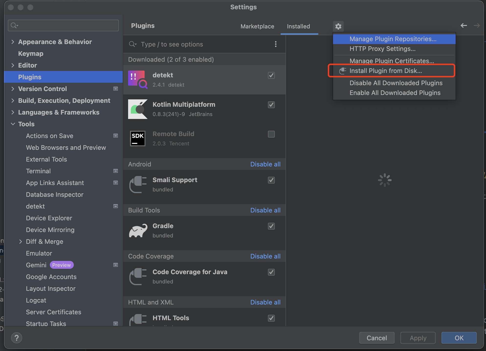
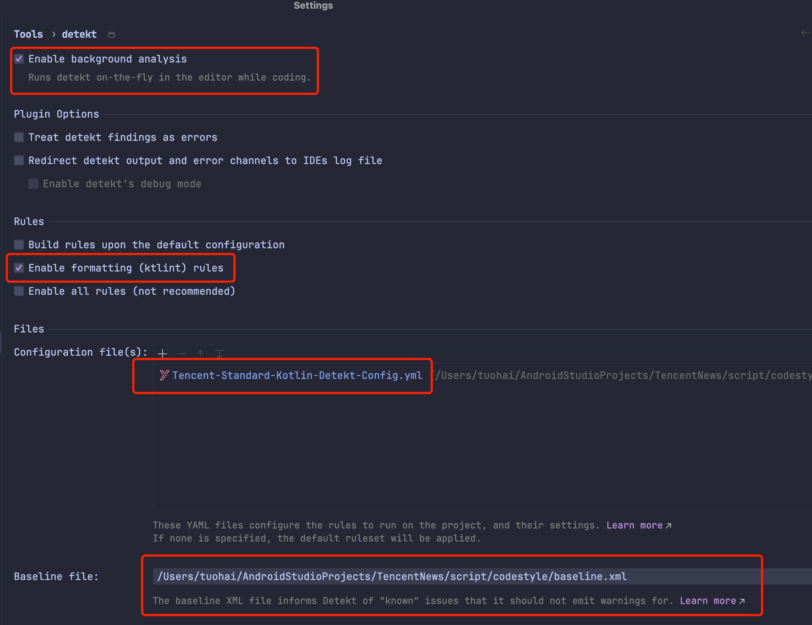
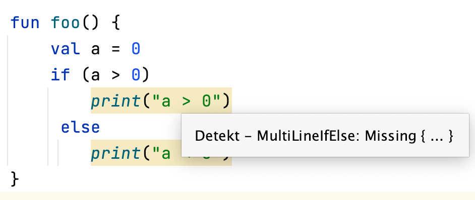

CodeStyle配置请参考：https://iwiki.woa.com/pages/viewpage.action?pageId=119392781

### Java语言：
> 公司Java代码规范官方：https://git.woa.com/standards/java
> Java Formatter使用说明：https://git.woa.com/standards/java/tree/master/code-style-formatter

--- 

### Kotlin语言：

> 公司Kotlin代码规范官方：https://git.woa.com/standards/kotlin

codecc使用的规则集:https://devops.woa.com/console/codecc/tencentnews/checkerset/qqnews_kotlin_standard/2147483647/manage

使用说明: 

1. 将工程中的[script/codestyle/Detekt.IntelliJ.Plugin-2.3.0.zip](./Detekt.IntelliJ.Plugin-2.3.0.zip) 
   在Settings->Plugin->设置icon->install Plugin From Disk来安装detekt插件：参照下图
   
2. 配置 detect 插件，勾选如下两个选项，并将路径配置为项目中的路径：script/codestyle/Tencent-Standard-Kotlin-Detekt-Config.yml
   
3. 查看 detekt 检查出来的错误
   

*REF:https://git.woa.com/standards/kotlin/tree/master/tool*

#### baseline生成
需要对应版本的detekt-formatting.jar,注意更改版本:https://mvnrepository.com/artifact/io.gitlab.arturbosch.detekt/detekt-formatting
brew install detekt
然后在项目根目录下
detekt -c script/codestyle/Tencent-Standard-Kotlin-Detekt-Config.yml -r xml:script/codestyle/baseline.xml --plugins script/codestyle/detekt-formatting-1.23.6.jar
detekt -c script/codestyle/Tencent-Standard-Kotlin-Detekt-Config.yml -b script/codestyle/baseline.xml -cb --plugins script/codestyle/detekt-formatting-1.23.6.jar
